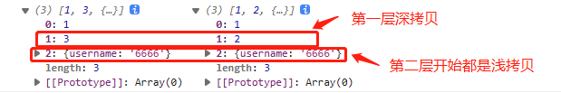
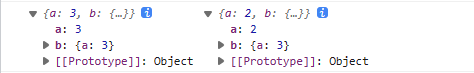
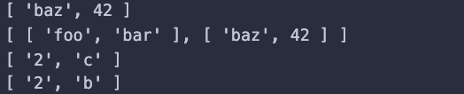
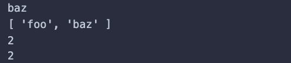
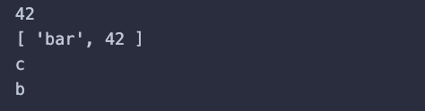
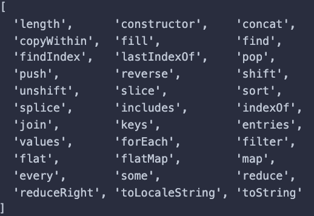
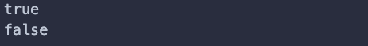
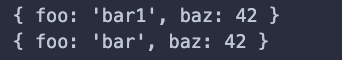
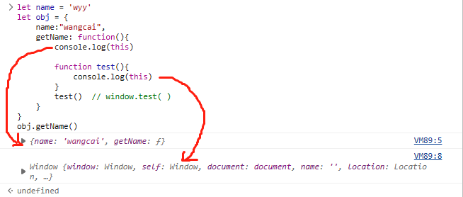

# javaScript-系统知识点

## 值类型 和 引用类型

### 1. typeof 能判断哪些类型

undefined、string、number、boolean、Symbol(ES6)

object、arrary、null、function

### 2. 何时使用 === 何时使用 ==

除了 判断等于 null 或者 undefined 使用 == 以外, 都使用 ===

### 3. 值类型和引用类型的区别

**场景题 (结果是什么?)**

```javascript
const obj1 = { x: 100, y: 200}
const obj2 = obj1
let x1 = obj1.x
obj2.x = 101
x1 = 102
console.log(obj1) // { x: 101 }
```

### 4. 手写深拷贝

注意要点

- 注意判断值类型和引用类型
- 注意判断是数组还是对象
- 递归


下面就是相关知识点

---


知识点:

- 值类型 vs 引用类型

- typeof 运算符

- 深拷贝


**(一)**

**值类型**

```javascript
let a = 100
let b = a
a = 200
console.log(b) // a
```


**引用类型**

```javascript
let a = { age: 20 }
let b = a
b.age = 21
console.log(a.age) // 21
```


**常见值类型**

undefined、string、number、boolean、Symbol(ES6)


**常用引用类型**

object、arrary、null、function


**值类型、引用类型分别存放在哪？**

值类型 存放在 栈中

引用类型 存放在 堆中


**引用类型为什么只存储引用地址, 不存值呢？**

因为, 考虑到性能问题, 一个对象可能很大, 所占内存多


>  【注】使用 `let` 才能定义 undefined, 不能用 `const`


**(二)**

**typeof 运算符**

- 识别所有值类型
- 识别函数
- 判断是否是引用类型 (不可再细分)


所有引用类型, 用 typeof 判断都是 object


> [扩展] - typeof 与 instanceof
>
> - `typeof`会返回一个变量的基本类型，`instanceof`返回的是一个布尔值
> - `instanceof` 可以准确地判断复杂引用数据类型，但是不能正确判断基础数据类型
> - 而`typeof` 也存在弊端，它虽然可以判断基础数据类型（`null` 除外），但是引用数据类型中，除了`function` 类型以外，其他的也无法判断e
>
> 额外可以使用 `Object.prototype.toString` , 比较通用都可以判断


**(三)**

**深拷贝 (手写)** 

实现深拷贝，需要考虑多种数据类型。包括对象、数组、函数

1. 

当然如果要写的更完善，需要考虑一些特殊的类型（Date、RegExp、Map、Set...）


```javascript
let onj2 = {}

const obj1 = {
    age: 20,
    name: 'xxx',
    address: {
        city: 'beijing'
    },
    arr: ['a', 'b', 'c']
}

const obj2 = deepClone(obj1)
obj2.address.city = ‘shanghai’
console.log(onj1.address.city)

/**
* 深拷贝
* @param { Object } obj 要深拷贝的对象
*/
function deepClone(obj = {}) {
    // 对 undefined、function、Symbol、bigint
    if (obj === null || typeof obj !== "object") {
        return obj;
    }
    
    // 初始化返回结果
    let result
    if (obj instanceof Array) { // instanceof 用于判断复杂数据类型 (引用类型)
        result = []
    } else {
        result = {}
    }
    
    for (let key of obj) {
        // 保证 key 不是原型的属性
        if (obj.hasOwnProperty(key)) {
            // 递归调用
            result[key] = deepClone(obj[key])
        }
    }
    
    // 返回结果
    return result
}
```


> [hasOwnProperty API 的使用](https://blog.csdn.net/a791226606/article/details/110679991)


**深拷贝还有哪些方法？**

1. 使用 JSON (最常见)

```javascript
JSON.parse(JSON.stringify(obj))
```

2. 一些库的 API 进行实现 (最完美)

```javascript
// lodash的_.cloneDeep()
var obj2 = _.cloneDeep(obj1)
```


(四)

**变量计算 - 类型转换 (最容易发生类型转换的地方)**

- 字符串拼接
- ==
- if 语句和逻辑运算


**什么时候用 ==, 什么时候用 === ?**

```javascript
// 除了 == null 之外, 其他都一律用 ===, 例如:
// 除了 判断等于 null 或者 undefined 使用 == 以外, 都使用 ===

const obj = { x: 100 }
if (obj.a == null ) { }
// 相当于:
// if ( obj.a === null || onj.a === undefined ) { }
```


**if 语句 和 逻辑运算**

truly 变量: !!a === true 的变量

falsely 变量: !!a === false 的变量

```javascript
// 以下是 falsely 变量。 除此之外都是 truly 变量
!!0 === false
!!NaN === false
!!'' === false
!!null === false
!!undefined === false
!!false === false
```

if 语句中的判断都是判断 truly、falsely 变量

```javascript
// truly 变量
const a = true
if (a) {
    // ...
}
const b = 100
if (b) {
    // ...
}
```

```javascript
// falsely 变量
const c = ''
if (c) {
    // ...
}
const d = null
if (d) {
    // ...
}
let e
if (e) {
    // ...
}
```

逻辑判断也是判断 truly、falsely 变量

```javascript
console.log(10 && 0) //0
console.log('' || 'abc') // 'abc'
console.log(!window.abc) // true
```


### 4.1 赋值、深拷贝、浅拷贝

#### 区别

- **直接赋值 (引用)：**其实就是对象的引用（别名）
- **浅拷贝：**拷贝父对象，不会拷贝对象的内部的子对象
- **深拷贝：**完全拷贝了父对象及其子对象


1. **b = a:** 赋值引用，a 和 b 都指向同一个对象

	

2. **b = a.copy():** 浅拷贝, a 和 b 是一个独立的对象，但他们的子对象还是指向统一对象（是引用）

	

3. **b = copy.deepcopy(a):** 深度拷贝, a 和 b 完全拷贝了父对象及其子对象，两者是完全独立的

	


#### 实现

**浅拷贝**

对象：Object.assign()

```javascript
var obj = {a:{a:"kobe",b:39}}
var initalObj = Object.assign({},obj)
initalObj.a.a = "wade"
console.log(obj.a.a) //wade
```

> object 只有一层的时候，是深拷贝


这个 API 还可用于 对象合并

```javascript
const ul = {name:"zhangsan"}
const u2 = {age: 12}

const u3 = Object.assign(ul，u2);

console.log(u3) // { name:'zhangsan'，age: 12 }
```


数组：concat、slice

```javascript
let arr1 = [ 1, 3, {
    username:'kobe'
}]

let arr2 = arr1.slice() // 或者 let arr2 = arr.concat()

arr2[1] = 2
arr2[2].username = '6666'
console.log(arr1, arr2)
```

	


> Array 的 slice 和 concat 方法不修改原数组，只会返回一个浅复制了原数组中的元素的一个新数组


`扩展运算符`，也可以进行 `浅拷贝`

```javascript
let a = { a:2, b:{a:2} }
let b = {...a}

b.b.a = 3
a.a = 3
console.log(a, b)
```

	


**深拷贝**

1. 序列化 JSON.parse(JSON.stringify())

> 缺点：虽然可以实现数组或对象深拷贝，但不能处理函数

2. 递归遍历

手写实现

```javascript
// 定义检测数据类型的功能函数
function checkedType(target){
    return Object.prototype.toString.call(target).slice(8,-1)
}

// 实现深度克隆---对象/数组
function clone(target){
    // 判断拷贝的数据类型
    // 初始化变量result 成为最终克隆的数据
    let result,targetType = checkedType(target)
    if(targetType === 'Object'){
        result = {}
    }else if(targetType === 'Array'){
        result = []
    }else{
        return target
    }
    // 遍历目标数据
    for(let i in target){
        // 获取遍历数据结构的每一项值
        let value=target[i]
        // 判断目标结构里的每一值是否存在对象/数组
        if(checkedType(value) === 'Object' || checkedType(value) === 'Array'){ //对象/数组里嵌套了对象/数组
            // 继续遍历获取到value值
            result[i] = clone(value)
        }else{ //获取到value值是基本的数据类型或者是函数
            result[i] = value;
        }
    }
    return result
}
```


> 原理：递归遍历所有对象、数组，直到都是基本数据类型，然后再去复制，就是深拷贝

3. 第三方函数库 `loadsh`


### 5. undefined 的三种情况（初级）

变量、对象、数组 只定义了, 未赋值

- ⼀个变量定义了却没有被赋值
- ⼀个对象上不存在的属性或者⽅法
- ⼀个数组中没有被赋值的元素


### 6. instanceof 和 typeof 的区别

`typeof`与`instanceof`都是判断数据类型的方法，区别如下：

- `typeof ` 会返回一个变量的基本类型，`instanceof`返回的是一个布尔值

- `instanceof` 可以准确地判断复杂引用数据类型，但是不能正确判断基础数据类型

- 而 `typeof` 也存在弊端，它虽然可以判断基础数据类型（`null` 除外），但是引用数据类型中，除了 `function` 类型以外，其他的也无法判断

  

可以看到，上述两种方法都有弊端，并不能满足所有场景的需求

如果需要通用检测数据类型，可以采用 `Object.prototype.toString`，调用该方法，统一返回格式`“[object Xxx]”`的字符串


### 7. var 和 let const 的区别?

**区别**

- var 是 ES5 语法, let const 是 ES6 语法, “没有变量提升”；var 有变量提升
- var 和 let 是变量. 可修改; const 是常量, 不可修改
- let const 有块级作用域, var 没有


**变量提升**

ES5 中, 执行代码前, 回去找 var 定义的变量, 会把 var定义的变量先赋值为 undefined

```javascript
// 变量提升
console.log(a) // undefined
var a = 200

// 等同于下面的例子
var a
console.log(a) // undefined
a = 200
```


**块级作用域**

var是函数作用域，let是块作用域

在函数中声明了var，整个函数内都是有效的，比如说在 **for循环** 内定义的一个 var变量，实际上其在for循环以外也是可以访问的

而 let由于是块作用域，所以如果在块作用域内定义的变量，比如说在for循环内，在其外面是不可被访问的

```javascript
// 全局作用域
for (let i = 0; i < 10; i++) {
    let j = i + 1
}
console.log(i, j) // 报错

// 块级作用域
for (var i = 0; i < 10; i++) {
   var j = i + 1
}
console.log(i, j) // 10 10
```

当然，在判断语句中，定义的变量外部也无法访问

```javascript
if (true) {
  var age = 33
}
console.log(age) // 33

if (true) {
  let name = '666'
}
console.log(name) // 报错
```

小结：块级作用域，在 `{}` 花括号中定义的变量外部都无法直接访问


**暂时性死区**

```javascript
const randomValue = 21

function getInfo() {
  console.log(randomValue)
  const randomValue = "Lydia Hallie"
}

getInfo() // Uncaught ReferenceError: Cannot access 'randomValue' before initialization

console.log(value)
const value = 21 // ReferenceError: value is not defined
```

为什么会这样，因为 let const 与 var 有类似的 “变量提升”，但是 var 不同的是其执行上下文的创建阶段，只会创建变量，而不会被初始化 (即定义为`undefined`)

并且 ES6 规定了其初始化过程中是执行上下文的执行阶段才被初始化，未被初始化，会报错 (`initialization`)


小结：简单来说，let const 无法未声明就被使用，如果先被使用，再定义，就会报错，这就是暂时性死区


**重复声明**

```javascript
var a = 233
var a = 322

let a = 233
let a = 322

// Uncaught SyntaxError: Identifier 'a' has already been declared

const a = 233
const a = 322

// Uncaught SyntaxError: Identifier 'a' has already been declared
```

var 可以重复声明，而 let、const 重复声明会报（已经变量已经声明）的错误！


**[特殊]**

浏览器控制的输出

```javascript
// 会不符合，直接代码执行的不同
let p = 233
// undefined
let p = 322
// undefined

// 但是 如果连续定义就会报错
let p = 233
let p = 322
// Uncaught SyntaxError: Identifier 'p' has already been declared
```


**[扩展]**

**const 不能赋值, 为什么其属性可以被修改?**

这是因为 const 声明的变量存储的是一个引用（也就是一个引用类型的内存地址指针），而不是对象本身。当我们修改 obj 的属性时，实际上是修改了对象本身，而不是修改了常量 obj 的值。因此，const 声明的变量仍然可以被修改，只是不能被重新赋值。

需要注意的是，如果我们尝试给 const 声明的变量重新赋值，就会抛出一个错误，例如：

```javascript
const obj = { name: 'Alice', age: 20 };
obj = { name: 'Bob', age: 21 }; // 抛出错误
```

在这个例子中，我们尝试给常量 obj 重新赋值，就会抛出一个错误，因为常量的值不能被重新赋值


**函数提升**

函数提升有两种：函数声明提升、函数表达式提升


函数声明提升

```javascript
function fun() {
	console.log('函数声明提升')
}
```

**js 在执行之前，会把 foo函数 提升到最前面**，所以我们在 fun函数 定义之前就可以使用 fun函数

```javascript
fun()
function fun() {
  console.log("aa")
}
```

打印结果为 aa，说明以函数声明来定义函数时，可以在定义函数之前访问到定义的函数


函数表达式提升

```javascript
var fun = function() {
    console.log('函数表达式')
}
```

此种声明方式我们可以理解为 **一个普通变量的提升**，在js代码执行之前会把fun提升带最前面，**在函数赋值之前，fun 是 undefined，如果调用fun(), 将会报错**

再举个栗子来理解下：

```javascript
fun()
var fun = function () {
    console.log("aa")
}
```

此时打印的结果为报错`Uncaught TypeError: fun is not a function`，因为在js代码执行之前，会把fun提升到最前面，值为 undefined

不是一个函数，以函数的形式来进行调用时将会报错

[变量提升与函数提升](https://blog.csdn.net/qq_43692768/article/details/117458927)


### 8. 列举强制类型转换和隐式转换

**强制**: parseInt、parseFloat、toString 等

**隐式**: if、逻辑运算、==、+拼接字符串


### 9. const 定义对象里面的属性值能不能改变?

可以改变的

```typescript
const obj = { a: 22 }
undefined
obj.a = 30
console.log(obj) // {a: 30}
```

为什么呢?

因为对象是引用类型的, P中保存的仅是对象的指针, 这就意味着, `const` 仅保证指针不发生改变, 修改对象的属性不会改变对象的指针, 所以是被允许的

也就是说 `const` 定义的引用类型只要指针不发生改变, 其他的不论如何改变都是允许的


> 而 `Vue3` 中定义响应式数据 `ref()` `reactive()` 就使用了 `const`
> 可以避免，响应式数据被重新赋值，从而失去响应式


### 10. JavaScript 有哪几种方法判断变量的类型?

**typeof**

只能判断基础数据类型, 复杂类型都为 object, 除了 function 返回 function

```javascript
console.log(typeof 10) // number
console.log(typeof New String('aaa')) // object
```


**instanceof**

适用复杂数据类型的判断, 对于 简单类型的 undefined、null、symbol 检测不出来

```javascript
let arr = []
console.log(arr instanceof Array) // true

```


**Object.prototype.toString.call()**

适用于所有类型的判断检测, 返回数据类型的字符串

```javascript
Object.prototype.toString.call(1) // '[object Number]'
```


**constructor**

用于检测引用数据类型

```javascript
let arr = [];
console.log(arr.constructor === Array) // true
```


[扩展]

[JS 判断数据类型的 8 种方式](https://juejin.cn/post/7200396667505704997)


## 原型 和 原型链

### 1. 什么是原型？什么是原型链？

js是面向对象的，每个实例对象都有一个`_proto_`属性指向它的原型对象，该实例的构造函数有一个原型属性`prototype`，与实例的`_proto_`属性指向同一个对象，同时，原型对象的`constructor`指向构造函数本身。

	

原型：每一个 `JavaScript` 对象（`null` 除外）在创建的时候就会与之关联另一个对象，这个对象就是我们所说的原型

原型链：

当一个对象在查找一个属性时，自身没有就会根据`_proto_`属性向它的原型进行查找，如果还是没有，则向它的原型的原型继续查找，直到查找到`Object.prototype._proto_`也就是`null`，这样就形成了原型链。

### 2. 如何准确判断一个变量是不是数组？

使用 instanceof 去判断即可

```javascript
a instanceof Array
```

### 3. class 的原型本质, 怎么理解？

- 原型和原型链的图示
- 属性和方法的执行规则


下面就是相关知识点

---


知识点:

- class 和 继承

- 类型判断 instanceof

- 原型和原型链


**(一)**

**class (基本使用)**

```javascript
// 类
class Student {
    constructor(name, number) {
        this.name = name
        this.number = number
        // this.gender = 'male'
    }
    sayHi() {
        console.log(
        	`姓名 ${this.name}, 学号 ${this.number}`
        )
    }
}

// 通过类 new 对象/实例
const xiaolu = new Student('夏洛', 100)
console.log(xiaolu.name)
console.log(xiaolu.name)
xiaolu.sayHi()

const madongmei = new Student('马冬梅', 101)
console.log(madongmei.name)
console.log(madongmei.number)
madongmei.sayHi()
```


**继承**

- extends (继承)
- super (传递参数给父类)
- 扩展或重写方法

```javascript
// 父类
class People {
    constructor(name) {
        this.name = name
    }
    eat() {
        console.log(`${this.name} eat something`)
    }
}

// 子类
class Student extends People {
    constructor(name, number) {
        super(name) // super 的作用, 是把 name 这个参数传递给 Pepole 这个 父类 中
        this.number = number
    }
    sayHi() {
        console.log(`姓名 ${this.name} 学号 ${this.number}`)
    }
}

// 子类
class Teacher extends People {
    constructor(name, major) {
        super(name)
        this.major = major
    }
    teach() {
        console.log(`${this.name} 教授 ${this.major}`)
    }
}

// 实例
const xialuo = new Student('夏洛', 100)
console.log(xialuo.name)
console.log(xialuo.number)
xialuo.sayHi()
xialuo.eat()

// 实例
const wanglaoshi = new Teacher('王老师', '语文')
console.log(wanglaoshi.name)
console.log(wanglaoshi.major)
wanglaoshi.teach()
wanglaoshi.eat()

```


**(二)**

**类型判断 - instanceof**

```javascript
// 判断 xiaoluo 由哪个父类构建出来的
// 前面的变量 是否由 后面变量 构建出来的
// 后面变量 是 前面的变量的一个父类
xiaolu instanceof Student // true xiaolu 是 Student 构建 (new) 出来的
xiaolu instanceof People // true People 是 xiaolu 的父类
xiaolu instanceof Object // true Object 是否所有对象的父类

[] instanceof Array // true
[] instanceof Object // true

{} instanceof Object // true
```


**原型**

```javascript
// class 实际上是函数, 可见是语法糖
typeof People // ’function‘
typeof Student // ’function‘

// 隐式原型 和 显示原型
console.log( xiaoluo.__proto__ ) // 隐式原型
console.log( xiaoluo.prototype ) // 显示原型
conosle.log( xiaoluo.__proto__ === xiaoluo.prototype ) // true
```


原型关系图 (Student 是 class, xiaoluo 是实例)


**原型关系**

- 每个 class 都有显示原型 `prototype`
- 每个实例都有隐式原型 `__proto__`
- 实例的 `_proto_` 指向对应 class 的 `prototype` (隐式原型 指向 显示原型)


**基于原型的执行规则**

- 获取属性 `xiaolu.name` 或执行方法 `xiaolu.sayhi() `时
- 先在自身属性和方法寻找
- 如果找不到则自动去 `__proto__` 中查找


**原型链**

```javascript
// Student 继承于 People
console.log( Student.prototype.__proto__ )
console.log( People.prototype )
console.log( People.prototype === Student.prototype.__proto__ )
```

xiaoluo -> Student -> People -> Object


**instanceof 原理**

instanceof 通过隐私原型 一层一层的向上寻找 父类的显示原型, 找到了就返回 true


> 【重要提示 !!! 】
>
> class 是 ES6 语法规范, 由 ECMA 委员会发布
>
> ECMA 只规定语法规则, 即我们代码的书写规范
>
> 以上实现方式都是 V8 引擎的实现方式, 也是主流的


### 4. new Object() 和 Object.create() 的区别

**区别**

- {} 等同于 new Object(), 原型 Object.prototype
- Object.create(null) 没有原型
- Object.cteate({...}) 可指定原型


**原理**

Object.create 创建一个空对象, 然后把空对象原型指向到传入的对像的隐式原型上


```javascript
const obj3 = Object.create(null)
const obj4 = new Object() // {}

const obj5 = Object.create({
    a: 10,
    b: 20,
    sum() {
        return this.a + this.b
    }
})
```


### 5. 如何用 JS 实现继承？


**各种方式**

- class 继承
- prototype 继承


## 作用域 和 闭包

### 1. this 的不同应用场景, 如何取值?

this 的五种情况, 在下面知识点已经解释了

### 2. 手写 bind 函数

```javascript
// 模拟 bind
Function.prototype.bind1 = function () {
  // 将参数拆解为数组 (列表 变成 数组)
  // arguments 可以直接获取, 传进来的所有参数
  const args = Array.prototype.slice.call(arguments);

  // 获取 this（数组第一项）
  const t = args.shift();

  // fn1.bind(...) 中的 fn1
  const self = this;

  // 返回一个函数
  return function () {
    return self.apply(t, args);
  };
};

function fn1(a, b, c) {
  console.log("this", this);
  console.log(a, b, c);
  return "this is fn1";
}

const fn2 = fn1.bind1({ x: 100 }, 10, 20, 30);
const res = fn2();
console.log(res);
```

> [扩展] - bind、apply、call 的使用场景
>
> - call 用于继承比较多
> - apply 用于获取数组最大最小值
> - bind 改变定时器 this 的指向

### 3. 实际开发中闭包的应用场景, 举例说明


**什么是闭包？**

函数的内部函数运行访问外部上下文，这就是闭包


**应用：**

1. 防抖、节流
2. 柯里化 (电商购物车，不常见)


应用场景: 隐藏数据

```javascript
// 闭包隐藏数据，只提供 API
function createCache() {
    const data = {} // 闭包中的数据，被隐藏，不被外界访问
    return {
        set: function (key, val) {
            data[key] = val
        },
        get: function (key) {
            return data[key]
        }
    }
}

const c = createCache()
c.set('a', 100)
console.log( c.get('a') )
```

### 4. 读代码

```javascript
// 创建 10 个 `<a>` 标签, 点击的时候弹出对应的序号
let i, a
for (i = 0; i < 10; i++) {
    a = document.createElement('a')
    a.innerHTML = i + '<br>'
    a.addEventListener('click', function (e) {
        e.preventDefault()
        alert(i)
    })
    document.body.appendChild(a)
}
// 输出结果 点击弹出窗 弹出都是 10
```

```javascript
// 如何 改写成  点击的时候弹出对应的序号, 如 点击1, 弹出 1
let a
for (let i = 0; i < 10; i++) {
    a = document.createElement('a')
    a.innerHTML = i + '<br>'
    a.addEventListener('click', function (e) {
        e.preventDefault()
        alert(i)
    })
    document.body.appendChild(a)
}
// 现在点击的时候弹出对应的序号
```


下面就是相关知识点

---


知识点:

- 作用域和自由变量

- 闭包

- this


**(一)**

**作用域**

- 全局作用域
- 函数作用域
- 块级作用域 ( ES6新增 `let `)

作用域代表了一个变量或者说某个变量的合理使用范围

	


**自由变量**

- 一个变量在当前作用域没有定义, 但被使用了
- 向上级作用域, 一层一层依次寻找, 直到找到为止
- 如果全局作用域都没找到, 则报错 `xx is not defined`
- `var` 是全局作用域, 全局对象 `window`


**(二)**

**闭包**

作用域应用的特殊情况, 有两种表现

- 函数作为参数 被传递
- 函数作为返回值 被返回

```javascript
// 函数作为返回值
function create() {
    let a = 100
    return function () {
        a += 1
        console.log(a)
    }
}

// const fn = create()
// fn() // 101
// fn() // 102
// fn() // 103

// 函数作为参数被传递
function print(fn) {
    const a = 200
    fn()
}
const a = 100
function fn() {
    console.log(a)
}
print(fn) // 100

// 所有的自由变量的查找，是在函数定义的地方，向上级作用域查找
// 不是在执行的地方！！！
```


闭包的产生原因：**内部的函数存在外部作用域的引用就会导致闭包**

[JS 闭包经典使用场景和含闭包必刷题](https://juejin.cn/post/6937469222251560990?searchId=20240526220618E6F0CB338DDACE5269F2#heading-12)


> 总结: 闭包就是一种特殊的函数,  分两种形式的闭包
>
> - 函数作为参数, 被传递
> - 函数作为返回值, 被返回


**(三)**

**this**

this 取什么值, 是在执行的时候确定的, 不是在函数定义时确定的, 适用于以下五种

- 作为普通函数 (返回 window)
- 使用 call、apply、bind (传入什么就绑定什么)
- 作为对象方法被调用 (返回对象本身)
- 在 class 方法中调用 (返回实例本身)
- 箭头函数 (由它的上级作用域决定)


**call、apply、bind**

call、bind 都会改变 this 的指向, 但是 bind 会返回一个函数, 需要重新运行这个函数

```javascript
// call
function fn1() {
    console.log(this)
}
fn1() //window

fn1.call({ x: 100 }) // { x: 100 }

// bind
const fn2 = fn1.bind({ x: 200 })
fn2() // { x: 200 }

// apply
const numbers = [5, 6, 2, 3, 7];
const max = Math.max.apply(null, numbers);

console.log(max);
// Expected output: 7
const min = Math.min.apply(null, numbers);
console.log(min);
// Expected output: 2
```


**箭头函数**

箭头函数 this 的值取它上级作用域的值

```javascript
// 使用 普通函数异步中 this 指向 window
const zhangsan = {
    name: ’张三‘,
    sayHi() {
        // this 即当前对象
        console.log(this)
    },
    wait() {
        setTimeout(function() {
            // this === windiow
            console.log(this)
        })
    }
}
```

```javascript
// 使用 箭头函数异步中 this 即当前对象
const zhangsan = {
    name: '张三',
    sayHi() {
        // this 即当前对象
        console.log(this)
    },
    waitAgain() {
        setTimeout(() => {
            // this 即当前对象
            console.log(this)
        })
    }
}
```


**class 方法中**

```javascript
class People {
    constructor(name) {
        this.name = name
        this.age = 20
    }
    sayHi() {
        console.log(this)
    }
}
const zhangsan = new People('张三')
zhangsan.sayHi() // zhangsan 对象
```


### 5. 防抖、节流

#### 防抖

**概念**

多次触发，在规定时间内，只有最后一次执行


**如何实现**


**应用场景**

窗口调整、搜索框实时联想、按钮频繁点击


#### 节流

**概念**

每隔一段时间，执行一次


**如何实现**


**应用场景**

页面滚动、DOM 元素拖拽、播放事件算进度


### 6. 闭包中变量如何释放？

```javascript
let fn = function(){
    let sum = 0
    return function(){
        sum++
        console.log(sum);
    }
}
fn1 = fn() 
fn1()   // 1
fn1()   // 2
fn1()   // 3
fn1 = null // fn1的引用fn被手动释放了
fn1=fn()  // num再次归零
fn1() // 1
```


### 7. 闭包是什么, 有什么特征? 有什么负面影响？

闭包:

在本质上，闭包就是将函数内部和函数外部连接起来的一座桥梁


特征:

作用域和自由变量


重点:

自由变量的查找, 要在函数定义的地方 (而非执行的地方)


影响:

变量会常驻内存, 得不到释放, 闭包不要乱用

可能会造成内存泄漏, 但是闭包中的数据, 我们不知道什么时候会被释放, 所以不算内存泄漏

内存泄漏是指, 内存中的变量一直没被使用, 常驻在内存中

```javascript
// 自由变量示例 —— 内存会被释放
let a = 0
function fn1() {
    let a1 = 100

    function fn2() {
        let a2 = 200

        function fn3() {
            let a3 = 300
            return a + a1 + a2 + a3
        }
        fn3()
    }
    fn2()
}
fn1()

// 闭包 函数作为返回值 —— 内存不会被释放
function create() {
    let a = 100
    return function () {
        console.log(a)
    }
}
let fn = create()
let a = 200
fn() // 100
```


开发过程中什么时候用到闭包?

1. 使用异步请求的时候, 异步请求以函数作为参数进行传递, 这就是一个闭包
2. 还有就是 我们写防抖节流函数, 也是需要使用保存局部变量进行计数, 然后返回回调函数, 这也是闭包的使用
3. 函数柯里化, 也是一种闭包的使用, 函数作为返回值


任何闭包的使用场景的目的:

- 创建私有变量
- 延长变量的生命周期


## 同步 和 异步

### 1. 同步和异步的区别？

基于 JS 是单线程语言

- 异步不会阻塞代码执行
- 同步会阻塞代码执行

### 1.1 什么是同步、异步?

同步: 按代码顺序执行

异步: 简单来说, 不按照代码顺序执行, 就是异步


### 1.2 为什么会有异步？

异步是为了解决, JS 单线程阻塞问题的


### 1.3 如何 异步 解决 JS 单线程阻塞问题？

通过 事件循环 来解决, 事件循环的执行流程, 同步任务会进入主线程执行, 而异步任务会进入任务队列, 等到主线程任务执行完, 任务队列的任务就会放入主线程执行, 如此循环反复


### 1.4 JS 如何实现异步?

异步在于创建宏任务和微任务, 通过事件循环机制实现异步机制

**宏任务**

- 定时器 setTimeout、setInterval
- 事件监听 (发布订阅 postMessage)
- 回调函数
- I/O

**微任务**

- Promise
- async/await


**标准回答 (按异步编程进化史来说)**

所有异步任务都是在同步任务执行结束之后，从任务队列中依次取出执行。 

回调函数是异步操作最基本的方法，比如 `AJAX`回调，回调函数的优点是简单、容易理解和实现，缺点是不利于代码的阅读和维护，各个部分之间高度耦合，使得程序结构混乱、流程难以追踪（尤其是多个回调函数嵌套的情况），而且每个任务只能指定一个回调函数。此外它不能使用 `try catch` 捕获错误

`return Promise` 包装了一个异步调用并生成一个 `Promise` 实例，当异步调用返回的时候根据调用的结果分别调用实例化时传入的`resolve` 和 `reject`方法，`then`接收到对应的数据，做出相应的处理。`Promise`不仅能够捕获错误，而且也很好地解决了回调地狱的问题，缺点是无法取消 `Promise`，错误需要通过回调函数捕获。 

`Generator`(迭代器) 函数是 `ES6` 提供的一种异步编程解决方案，`Generator` 函数是一个状态机，封装了多个内部状态，可暂停函数, `yield`可暂停，`next`方法可启动，每次返回的是`yield`后的表达式结果。优点是异步语义清晰，缺点是手动迭代`Generator`函数很麻烦，实现逻辑有点绕 

`async/await`是基于`Promise`实现的，`async/await`使得异步代码看起来像同步代码，所以优点是，使用方法清晰明了，缺点是`await` 将异步代码改造成了同步代码，如果多个异步代码没有依赖性却使用了 `await` 会导致性能上的降低，代码没有依赖性的话，完全可以使用 `Promise.all` 的方式。 

加分回答 `JS` 异步编程进化史：`callback -> promise -> generator/yield -> async/await`。 `async/await` 函数对 `Generator` 函数的改进

体现在以下三点： - 内置执行器。 `Generator` 函数的执行必须靠执行器，而 `async` 函数自带执行器。

也就是说，`async` 函数的执行，与普通函数一模一样，只要一行。 更广的适用性。 

`yield` 命令后面只能是 `Thunk` 函数或 `Promise` 对象，而 `async` 函数的 `await` 命令后面，可以跟 `Promise` 对象和原始类型的值（数值、字符串和布尔值，但这时等同于同步操作）, 更好的语义。 

`async` 和 `await`，比起 星号 和 `yield`，语义更清楚了

`async` 表示函数里有异步操作，`await` 表示紧跟在后面的表达式需要等待结果。 目前使用很广泛的就是 `promise` 和 `async/await`


### 2. 手写用 Promise 加载一张图片

```javascript
// 加载函数 ...
function loading (src) {
    return new Promise(
    	(resolve, reject) => {
            const img = document.createElement('img')
            img.onload = () => {
                resolve(img)
            }
            img.onerror = () => {
                const err = new Error(`图片加载失败 ${src}`)
                reject(err)
            }
            img.src = src
        }
    )
}

const url1 = 'https://img.com/img1.jpg'
const url2 = 'https://img.com/img2.jpg'

loadImg(url1).then(img1 => {
    console.log(img1.width)
    return img1 // 普通对象
}).then(img1 => {
    console.log(img1.height)
    return loadImg(url2) // promise 对象
}).then(img2 => {
    console.log(img2.width)
    return img2
}).then(img2 => {
    console.log(img2.height)
}).catch(ex => console.error(ex))
```

### 3. 前端使用异步的场景有哪些？

场景

- 网络请求
- 定时任务

### 4. 读代码

```javascript
// setTimeout 笔试题
console.log(1)
setTimeout(function() {
  	console.log(2)         
}, 1000)
console.log(3)
setTimeout(function() {
    console.log(4)
}, 0)
console.log(5)
// 执行结果 1 3 5 4 2
```


下面就是相关知识点

---


知识点:

- 单线程和异步

- 应用场景

- callback hell (回调地狱) 和 Promise


**(一)**

**单线程和异步**

- JS 是单线程语言, 只能同时做一件事儿
- 浏览器和 nodejs 已支持 JS 启动进程, 如 Web Worker
- JS 和 DOM 渲染共同一个线程, 因为 JS 可修改 DOM 结构
- 遇到等待 (网络请求, 定时任务) 不能卡住, 所以需要异步, 以回调 callback 函数形式

```javascript
// 异步
console.log(100)
setTimeout(function () {
    console.log(200)
}, 1000)
console.log(300)
// 输出结果 100、300、200
```

```javascript
// 同步
console.log(100)
aleart(200)
console.log(300)
// 输出结果 100、200、300
```


**(二)**

**异步的应用场景**

- 网络请求, 如 ajax 图片加载
- 定时任务, 如 setTimeout

网络请求

```javascript
// 网络请求 ajax
console.log('start')
$.get('./data1.json', function (data1) {
    console.log(data1)
})
console.log('end')
// 执行结果 start end data1
```

```javascript
// 图片懒加载
console.log('start')
let img = document.createElement('img')
img.onload = function() {
 	console.log('loaded')   
}
img.src = '/xxx.png'
console.log('end')
// 执行结果 start end loaded
```

定时任务

```javascript
// setTimeout
console.log(100)
setTimeout(function() {
    console.log(200)
}, 1000)
console.log(300)
// 执行结果 100 300 200
```

```javascript
// setInterval
console.log(100)
setInterval(function() {
    console.log(200)
}, 1000)
console.log(300)
// 执行结果 100 300 200 200 ...
```


**(三)**

**callback hell (回调地狱)**

```javascript
// 获取第一份数据
$.get(url1, (data1) => {
    console.log(data1)
    // 获取第二份数据
    $.get(url2, (data2) => {
        console.log(data2)
        // 获取第三份数据
        $.get(url3, (data3) => {
            console.log(data3) 
            // 还可能获取更多的数据
        })
    })
})
```

解决回调地狱的方案就是, Promise

```javascript
// Promise 定义
function getData(url) {
    return new Promise((resolve, reject) => {
        $.ajax({
            url,
            success(data) {
                resolve(data)
            },
            error(err) {
                reject(err)
            }
        })
    })
}
// Promise 使用
const url1 = '/data1.json'
const url2 = '/data2.json'
const url3 = '/data3.json'

getData(url1).then( data1 => {
    console.log(data1)
    return getData(url2)
}).then( data2 => {
    console.log(data2)
    return getData(url3)
}).then(data3 => {
    console.log(data3)
}).catch(err => console.error(err))
```

```javascript
let approvalProcess = (name. time) => {
  return new Promise((resolve, reject) => { 
    setTimeout(() => { // setTimeout 模拟异步
      let approvalRes = Math.random() >= 0.2 // 随机数模拟异步成功操作成功或失败
      if (approvalRes) {
        resolve(name+'已审核通过')
      } else {
        reject('审核不通过')
      }
    }, time)
  })
}

let boss = approvalProcess('老板', 1000)
let manager = approvalProcess('经理', 2000)

boss.then(res => {
	console.log(res)
  return manager
}).then(res => {
	console.log(res)
  return '老板和经理都通过了'
}).then(result => {
	console.log(result)
}).catch(err => {
	console.log(err)
})


```


> [扩展] - [promise 经典面试题](https://juejin.cn/post/6844903632203153415)


### 5. Promise

**Promise 的状态？**

Promise 有三种状态：pengding、fulfilled、rejected

Promise 的状态一经改变，便不可以修改

```javascript
var pro = new Promise( (resolve, reject) => {
    reject()
    resolve()
})

pro.then( () => { console.log('resolve1') }).
	catch( () => {console.log('catch1') }) // reject1
```


**Promise 链式调用**

Promise 的链式调用，有三个 `Promise.prototype.then()`、`Promise.prototype.catch()` 和 `Promise.prototype.finally()`


> `Promise.prototype.then()` then 方法可以接收两个回调函数作为参数，第一个参数 `resolve()` 返回的数据，第二个参数 `reject()` 返回的数据
>
> 当然了，异常也会被第二个参数接收


`.finally()` 一定会执行，但是它没有回调参数

`.then()` 可有多个，`.catch()` 也可以有多个，但是 `.then()` 或者 `.catch()` 必须返回一个 Promise 才可以这样做


数据的接收顺序

- then -> catch -> finally

```javascript
var pro = new Promise( (resolve, reject) => {
    reject()
    resolve()
})

pro.then(
    () => { console.log('resolve1') },
    () => { console.log('reject1') }).
	catch( () => {console.log('catch1') }
) // reject1
```


> 只有 `.then()` 的第二个参数传，`reject()` 返回的数据 或者是 异常才会进到 `.catch()` 中
>
> **[注意]** Promise 抛出异常是不会，直接中断的，会进入 `.then()` 的第二个参数，没有 `.then()` 的第二个参数才会 进入 `.catch()` 中


**Promise 如果接收错误**

1. catch
2. then 的第二个回调函数参数


**Promise 的一些方法**

- Promise.resolve() 返回 成功状态
- Promise.reject() 返回 失败状态
- Promise.finally() 不管什么状态都执行
- Promise.then() 成功回调
- Promise.catch() 错误回调

- Promise.all() 一个 `reject()`, 整个结束执行 (获取全部都成功，再返回)
- Promise.allSettled() 全部状态变更，才执行结束
- Promise.any() 一个 `resolve()`，整个再返回 (获取全部都失败，再返回)
- Promise.race() 那个状态先改变，那个先返回


> `await` 后面可以跟 Promise 对象、非 Promise 值以及另一个 `await` 表达式。
>
> `await` 后面也可以跟非 Promise 值，如基本数据类型（`number`、`string`、`boolean` 等）、对象、数组等。在这种情况下，`await` 会将该值直接返回，就好像该值被包装在一个已经解决的 Promise 中。
>
> [理解 JavaScript 的 async/await](https://www.nowcoder.com/discuss/353148496452722688?sourceSSR=users)


### 5.1 两个异步请求如何合并?

**使用 Promise**

```typescript
//定义两个http请求方法
const getList1 = ()=>{
    return new Promise((res,rej) =>{
        //省去get方法获取过程
        .then((json) => resolve(json))
    })
}

const getList2 = ()=>{
    return new Promise((res,rej) =>{
        //省去get方法获取过程
        .then((json) => resolve(json))
    })
}

Promise.all([getList1(),getList2()]).then(value => {
    //第一个请求的数据
    const x = value[0];

    //第二个请求的数据
    const y = value[1];

    //合并操作
    for(const i of x){
        for(const k of y){
          //Todo
        }
    }
})
```


### 5.2 Promise有哪几种状态，各个状态之间是如何进行转换的？

三种状态: `pending`、`fulfilled`、`rejected` (未决定，履行，拒绝)

1.初始化，状态：pending

2.当调用resolve(成功)，状态：pengding=>fulfilled

3.当调用reject(失败)，状态：pending=>rejected


### 5.3 Promise 解决哪些问题?

**回调地狱**

```typescript
const request = url => {
    return new Promise((resolve,reject) => {
        $.get(url,params => {
            resolve(params)
        })
    })
}

request(url).then(params1 => {
    return request(params1.url)
}).then(params2 => {
    return request(params2.url)
}).then(params3 => {
    console.log(params3)
}).catch(err => throw new Error(err))
```


### 5.4 Promise.all、Promise.any、Promise.race、Promise.allsettled

**Promise.all**

场景: 多个 Promise 请求, 如果只有一个出错的话, 那么整个就会抛出异常, 不会继续执行

```javascript
// 模拟异步操作
const request = (delay, flag = true) => {
  return new Promise((resolve, reject) => {
    setTimeout(() => {
      if (flag) {
        resolve(`成功了${delay}`)
      } else {
        reject(`失败了${delay}`)
      }
    }, delay)
  })
}

const fun = async (promises) => {
  Promise.all(promises)
    .then(res => {
      console.log('res', res)
    })
    .catch(error => {
      console.log('error', error)
    })
}

fun([request(1000), request(500)])
// res [ '成功了1000', '成功了500' ]
fun([request(1000), request(500, false)])
// error 失败了500
```

如果其中一个错误, 让成功的也能输出出来

```javascript
const fun = async (promises) => {
  Promise.all(
    promises.map(promise => {
      console.log(promise.catch(err => err))
      return promise.catch(err => err)
    })
  ).then(res => {
    console.log('res', res)
  })
}

fun([request(1000), request(500, false)])
// res [ '成功了1000', '失败了500' ]
```

使用 ES2020 (ES11) 的新语法 `Promise.allSettled`, 就能捕获正常和错误的返回

```javascript
const fun = async (promises) => {
  Promise.allSettled(promises)
    .then(res => {
      console.log('res', res)
    })
}

fun([request(1000), request(500, false)])
// res [
//   { status: 'fulfilled', value: '成功了1000' },
//   { status: 'rejected', reason: '失败了500' }
// ]
```


### 6. async await

**await 通常是添加一个 promise 函数嘛**

1. 那它可以添加一个普通函数吗，能正确执行吗？

   可以添加一个普通函数

2. 那可以添加一个值吗？

   可以的，直接返回那个值


**为什么 await 后面可以普通函数,或者值?**

因为`await` 后面跟的是一个 `Promise` 对象，如果不是，则会包裹一层 `Promise.resolve()`


	


**语法规则**

- `async` 是 `function` 的一个前缀，只有 `async` 函数中才能使用 `await` 语法
- `async` 函数是一个 `Promise` 对象，有无 `resolve` 取决于有无在函数中 `return` 值
- `await` 后面跟的是一个 `Promise` 对象，如果不是，则会包裹一层 `Promise.resolve()`


**async await 原理**

`async/await` 是由 `generator函数(迭代器)` 来实现的


**async await 如何捕获异常**

1. `try catch`

```javascript
async function fetchData() {
    try {
        const result = await fetch('...')
    } catch (err) {
        console.log(err)
    }
}

fetchData()
```

2. `await` 的 `catch`

`await` 返回一个 `Promise` 对象，`Promise` 对象有 `then、catch`，我们可以在 `catch` 中捕获错误

```javascript
fetchData().then().catch(err => console.log('发生错误：', err))
```


### 6.1 async/await 解决了什么问题?

解决了 异步问题, 可以 异步转同步

```typescript
// 使用async/await获取成功的结果
// 定义一个异步函数，3秒后才能获取到值(类似操作数据库)

function getSomeThing(){
    return new Promise((resolve,reject)=>{
        setTimeout(()=>{
            resolve('获取成功')
        },3000)
    })
}

async function test(){
    let a = await getSomeThing()
    console.log(a)
}
test() // 3秒后输出：获取成功
```


### 7. 事件循环

#### 什么是事件循环？

js 是单线程, 而为了解决这个问题, 引入了异步, 同步任务会进入主线程执行, 而异步任务会进入任务队列, 等到主线程任务执行完, 任务队列的任务就会放入主线程执行, 如此循环反复就是事件循环。

#### 事件循环中的异步任务？有哪些能举例吗？

异步任务可以分为微任务、宏任务

宏任务：定时器、请求、事件监听 (发布订阅 postMessage)、I/O

微任务：promise、async/await

#### 宏任务与微任务那个先执行？

在同一次循环中，微任务先执行，宏任务后执行

网上一些面试题，有些执行结果是 宏任务先给出结果，但其内部的微任务仍然会在该宏任务完成之前被优先执行

> Vue的`$nextTick`方法是微任务还是宏任务？
>
> `$nextTick`在Vue中的实现通常利用 `Promise` 的`then`方法来创建一个微任务

1. `Vue` 中 `watch` 与 `computer` 哪个是同步、哪个是异步？

   `computer` 是同步，`watch` 是异步

2. `watch` 与 `computer` 哪个先执行？

   需要根据实际情况决定，正常情况下是 `computer` 先执行

   如果 `watch` 设置了 `immediate: true` ，`watch` 先于 `computer` 执行


## 数组、对象、函数、字符串、数字

### 1. 数组 操作 API

```javascript
let arr = [2, 9, 5];
let arr1 = [6, 7, 3];

// 前面、后面插入
// arr.unshift("1");
// arr.push("3");

// 前面、后面删除
// arr.shift();
// arr.pop();

// 删除、复制、整合
// arr.splice(1, 1);
// console.log(arr.slice(0, 2));
// console.log(arr.concat(arr1));

// 遍历、反转、排序
// arr.sort();
// arr.reverse();

console.log(arr);
```


### 2. sort() 方法

 a - b < 0，那么 a 会被排列到 b 之前     

 a - b = 0，a 和 b 的相对位置不变       

 a - b > 0，那么 b 排列到 a 之前


> 升序排序 return a - b
> 降序排序 return b - a


### 4. 深浅拷贝

赋值： =

浅拷贝：拷贝第一层

深拷贝：拷贝所有层级


浅拷贝方法：

对象 - `Object.assign()`

数组 - `concat()、slice()、解构（...）`


深拷贝方法：

1. 序列化（`JSON.parse(JSON.stringify())`）- 无法拷贝函数


手写深拷贝

主要考察，面试者对数据类型的理解

深拷贝，简单实现需 递归对 对象、数组、函数进行判断并拷贝，如果要更完善加入对特殊类型进行判断处理（Date、正则、Map、Set）

```javascript
function deepClone(obj, clonedObjects = new WeakMap()) {
  // 对于 undefined、function、Symbol、bigint 的处理
  if (obj === null || typeof obj !== 'object') {
    return obj;
  }

  // 检查是否已经拷贝过该对象，避免循环引用导致无限递归
  if (clonedObjects.has(obj)) {
    return clonedObjects.get(obj);
  }

  let clone;

  // 处理数组
  if (Array.isArray(obj)) {
    clone = [];
    clonedObjects.set(obj, clone);
    for (let i = 0; i < obj.length; i++) {
      clone[i] = deepClone(obj[i], clonedObjects);
    }
  }
  
  // 处理对象
  else if (obj instanceof Object) {
    clone = {};
    clonedObjects.set(obj, clone);
    for (let key in obj) {
      if (obj.hasOwnProperty(key)) {
        clone[key] = deepClone(obj[key], clonedObjects);
      }
    }
  }

  return clone;
}
```


### 5. 数组的降维、升维？

降维：简单数组可以用 flat()，或者递归

升维：采用 对象引用 与 来进行遍历赋值

1. 初始化 一个数组、一个对象
2. 将数组 id、与元素 作为对象的key、value，并加入 child 属性，写入对象
3. 遍历一维数组，做两个判断
   1. 判断一：id 与 parentId 相等，将 parentId 所属于元素 赋值给 id 所属元素
   2. 判断二：将顶层的 parentId 为顶层的元素加入数组中

```typescript
function buildTree(replies) {  
    const tree = [];  
    const map = {};  
  
    // 初始化map，用于快速查找每个回复  
    replies.forEach(reply => {  
        map[reply.id] = { ...reply, children: [] };  
    });  
  
    // 构建树形结构  
    replies.forEach(reply => {  
        const parent = map[reply.parent];  
        if (parent) {  
            // 如果reply有parent，则将其添加到parent的children中
            // 这个巧妙的使用的了 对象的引用，而不是复制，所以修改parent.children，map[reply.id]也会改变
            parent.children.push(map[reply.id]);  
        } else {  
            // 如果没有parent（即parent为0），则将其添加到树的根级别  
            tree.push(map[reply.id]);  
        }  
    });  
  
    return tree;  
}  
  
const replies = [  
    { id: 1, content: '1. 真理惟一可靠的标准就是永远自相符合', parent: 0 },  
    { id: 2, content: '2. 我需要三件东西：爱情友谊和图书', parent: 0 },  
    { id: 3, content: '2-1 时间是一切财富中最宝贵的财富', parent: 2 },  
    { id: 4, content: '2-2 我读的书愈多，就愈亲近世界，愈明了生活的意义，愈觉得生活的重要', parent: 2 },  
    { id: 5, content: '2-1-1 任何事物都是在不断变化的', parent: 3 },  
    { id: 6, content: '2-1-2 真正的科学家应当是个幻想家', parent: 3 },  
    { id: 7, content: '3. 难得糊涂，耳不闻人之非，不信谣，不传谣', parent: 0 },  
];  
  
const tree = buildTree(replies);  
console.log(JSON.stringify(tree, null, 2));
```


### 6. 字符串的常见方法？

1. `length` 字符串长度
2. `indexOf` 返回一次出现的搜索字符的索引，未找到返回 `-1`
3. `replace` 替换第一个匹配的子字符串
4. `split` 分割字符串
5. `includes` 判断字符串是否存在子字符串
6. `slice` 返回截取的字符串
7. `trim` 去掉字符串两端空格


### 7. 数组的一些常见方法？


#### 改变原数组的方法

1. **push()** ：在数组尾部添加元素，并返回更新后的数组长度。
2. **pop()** ：删除数组的最后一个元素，并返回该元素的值。
3. **shift()** ：删除数组的第一个元素，并返回该元素的值。
4. **unshift()** ：在数组开头添加元素，并返回更新后的数组长度。
5. **splice()** ：添加、删除或替换数组中的元素。
6. **sort()** ：对数组进行排序。
7. **reverse()** ：反转数组中的元素顺序。
8. **fill()** ：用指定值填充数组。
9. **copyWithin()** ：将数组的一部分复制到其他位置。

#### 不改变原数组的方法

1. **concat()** ：连接两个或多个数组，并返回一个新的数组副本。
2. **slice()** ：截取数组的一部分，并返回一个新的数组副本。
3. **every()** ：检测数组中的所有元素是否都满足指定条件。
4. **some()** ：检测数组中的至少一个元素是否满足指定条件。
5. **map()** ：创建一个新数组，包含原数组每个元素调用函数处理后的值。
6. **filter()** ：创建一个新数组，包含通过所提供函数实现的测试的所有元素。
7. **reduce()** ：对数组中的每个元素执行一个函数，最终得到一个单一的值。
8. **forEach()** ：遍历数组中的每个元素，并执行一个函数。
9. **join()** ：将数组元素连接成一个字符串。
10. **toString()** ：将数组元素转换为字符串。


### 8. Map、Set、Object Array 的区别？

Map 与 Object

- Map 有序结构, key 任意类型; Object 无序结构, key 两种类型 (String、Symbol)
- Set 可以自动去重 (很多去重方法比较快的)
- Map 和 Set 比 Object Array 整体要执行更快


Map 与 Set 不同

- 初始化需要的值不一样，Map 需要的是一个二维数组，而 Set 需要的是一维 Array 数组

```javascript
let map = new Map([['user', '小如'], ['num', 99]])
console.log(map) // Map(2) {'user' => '小如', 'num' => 99}

let set = new Set([1,2,3,4,5,6])
console.log(set) // Set(6) {1, 2, 3, 4, 5, 6}
```

- Map 的键是不能修改，但是键对应的值是可以修改的；Set 不能通过迭代器来改变 Set 的值，因为 Set 的值就是键
- Map 是键值对的存在，值也不作为健；而 Set 没有 value 只有 key，value 就是 key


Map 与 Set 相同

- Map 和 Set 都不允许键重复


Map、Set 的主要语法有哪些？

都有的语法是 `add`、`has`、`delete`

Map 有 `get` 方法，`Set` 没有


Map 的基本使用

```javascript
//初始化`Map`需要一个二维数组(请看 Map 数据结构)，或者直接初始化一个空`Map` 
let map = new Map();

//添加key和value值
map.set('Amy','女')
map.set('liuQi','男')

//是否存在key，存在返回true, 反之为false
map.has('Amy') //true
map.has('amy') //false

//根据key获取value
map.get('Amy') //女

//删除 key为Amy的value
map.delete('Amy')
map.get('Amy') //undefined  删除成功
```


Set 的基本使用

```javascript
//初始化一个Set ，需要一个Array数组，要么空Set
var set = new Set([1,2,3,5,6]) 
console.log(set)  // {1, 2, 3, 5, 6}

//添加元素到Set中
set.add(7) //{1, 2, 3, 5, 6, 7}

//删除Set中的元素
set.delete(3) // {1, 2, 5, 6, 7}

//检测是否含有此元素，有为true，没有则为false
set.has(2) //true
```


使用 Set 去重

```javascript
var arr=[1,3,4,2,5,1,4]
// 这里原本是一个对象用了es6的语法 转化成了数组，就是转化数组之前已经过滤掉了重复的元素了
var arr2=[...new Set(arr)] //[1,3,4,2,5]
```


> **[注]**
>
> Map、Set 数据结构都是 ES6 语法


### 9. 截取数组的办法？

通过直接设置, 数组长度即可

```typescript
let arr = [1, 2, 6, 8]
arr.length = 2
console.log(arr) // [1, 2]
```


### 10. 手写深度比较, 模拟 lodash isEqual

```typescript
// 实现如下效果
const obj1 = { a: 10, b: { x: 100, y: 200 }}
const obj2 = { a: 10, b: { x: 100, y: 200 }}
// isEqual(obj1, obj2) === true
```

```typescript
// 判断是否是对象或数组
function isObject(obj) {
    return typeof obj === 'object' && obj !== null
}
// 全相等（深度）
function isEqual(obj1, obj2) {
    if (!isObject(obj1) || !isObject(obj2)) {
        // 值类型（注意，参与 equal 的一般不会是函数）
        return obj1 === obj2
    }
    if (obj1 === obj2) {
        return true
    }
    // 两个都是对象或数组，而且不相等
    // 1. 先取出 obj1 和 obj2 的 keys ，比较个数
    const obj1Keys = Object.keys(obj1)
    const obj2Keys = Object.keys(obj2)
    if (obj1Keys.length !== obj2Keys.length) {
        return false
    }
    // 2. 以 obj1 为基准，和 obj2 一次递归比较
    for (let key in obj1) {
        // 比较当前 key 的 val —— 递归！！！
        const res = isEqual(obj1[key], obj2[key])
        if (!res) {
            return false
        }
    }
    // 3. 全相等
    return true
}
```


### 11. split() 和 join() 的区别

Split() 方法是切割成数组的形式

Join()  方法是将数组转换成字符串


join()：方法用于把数组中的所有元素放入一个字符串

指定分隔符方法 join("#")，其中 # 可以是任意

```javascript
['a','b','c'].join('#') // 'a#b#c'
```


split()方法：用于把一个字符串分割成字符串数组，stringObject.split(a,b) 这是它的语法

```javascript
'a#b#c'.split('#') // ['a', 'b', 'c']
```


### 12. 数组哪些 API, 是纯函数

**纯函数**

- 不改变源数组 (没有副作用, 或者说不影响函数外部的数据)
- 返回一个数组

```javascript
const arr = [10, 20, 30, 40]
// concat
const arr1 = arr.concat([50, 60, 70])
// map
const arr2 = arr.map(num => num * 10)
// filter
const arr3 = arr.filter(num => num > 25)
// slice
const arr4 = arr.slice() // 类似于做了一个深拷贝, 剪切函数  

// 纯函数
let count = 1
function (a, b) {
    count++; // 多了这个影响外部函数, 不是纯函数了
    return a + b
}
```

**非纯函数**

push、pop、shift、unshift

forEach

some every

reduce


### 13. 数组 slice 和 splice 的区别？

**区别**

- 功能区别 (slice - 切片, splice - 剪切)
- 参数 和 返回值不同
- 是否纯函数？

```javascript
const arr = [10, 20, 30, 40, 50]

// slice 函数
const arr1 = arr.slice() // [10, 20, 30, 40, 50]
const arr2 = arr.slice(1, 4) // [30, 40, 50]
const arr3 = arr.slice(2) // [30, 40, 50]
const arr4 = arr.slice(-2) // [40, 50]

// splice 非纯函数
const spliceRes = arr.splice(1, 2, 'a', 'b', 'c')
console.log(spliceRes, arr) //  [20, 30] [10, 'a', 'b', 'c', 40, 50]
arr = [10, 20, 30, 40, 50]

const spliceRes1 = arr.splice(1, 2)
console.log(spliceRes1, arr) // undefined [10, 40, 50]
arr = [10, 20, 30, 40, 50]

const spliceRes2 = arr.splice(1, 0, 'a', 'b', 'c')
console.log(spliceRes2, arr) // [] [10, 'a', 'b', 'c', 20, 30, 40, 50]
```


### 14. 函数表达式 VS 函数声明（扩展）

**区别**

- 函数声明 function fn() {...}

- 函数表达式 const fn = function() {...}
- 函数声明会在代码执行前预加载 (类似变量提升), 而函数表达式不会

```javascript
// 函数声明
const res = sum(10, 20)
console.log(res) // 30
function sum(x, y) {
    return x + y
}

// 函数表达式
var res = sum(10, 20)
console.log(res) // 报错 res 没找到
var sum = function (x, y) {
    return x + y
}
```


### 15. call、apply、bind的区别？

相同: 都改变 this 的指向

不同：

- **是否返回函数**: bind 返回绑定 this 之后生成新函数, 便于稍后调用; apply、call 则是立即执行
- **第二个参数不同**: call、bind 第二个参数是可以分多次传入, 而 apply 必须是一个数组

```javascript
// 区别在于 第二个参数, call 是零散的传进去, 而 apply 是传一个集合
fn.call(this, p1, p2, p3)
fn.bind(this, p1, p2, p3)
fn.apply(this, [p1, p2, p3])
```


### 16. 数组拍平 (多维数组变一维)


**核心思想**

递归是解决多维数组扁平化问题的经典方法。其核心思路是遍历数组中的每个元素，如果元素是普通值（非数组），则直接将其添加到结果数组中；如果元素是数组，则对该子数组递归调用扁平化函数，直到子数组中的所有元素都被处理为普通值。

```typescript
function flat(arr) {
    // 验证 arr 中，还有没有深层数组 [1, 2, [3, 4]]
    const isDeep = arr.some(item => item instanceof Array)
    if (!isDeep) {
        return arr // 已经是 flatern [1, 2, 3, 4]
    }

    const res = Array.prototype.concat.apply([], arr)
    return flat(res) // 递归
}

const res = flat( [1, 2, [3, 4, [10, 20, [100, 200]]], 5] )
console.log(res) // [1, 2, 3, 4, 10, 20, 100, 200, 5]
```


### 17. 数组去重

两种方式

- 传统方式, 遍历元素挨个比较、去重, 注意计算效率
- 使用 Set

```typescript
// 传统方式 (需要遍历, 效率低)
function unique(arr) {
    const res = []
    arr.forEach(item => {
        if (res.indexOf(item) < 0) {
            res.push(item)
        }
    })
    return res
}

// 使用 Set (无序结构, 不能重复, 效率高, ES6 中才有)
function unique(arr) {
    const set = new Set(arr)
    return [...set]
}

const res = unique([30, 10, 20, 30, 40, 10])
console.log(res) // [30, 10, 20, 40]
```


### 18. 操作字符串有哪些 API?

**1. 检索 API (indexOf、lastIndexOf、includes)**

```javascript
// indexOf 检索子串首次出现的下标，没有该子串则返回-1
let str ="In order to be irreplaceable one must always be different"
let substr="order"
let id = str.indexOf(substr)
console.log(id) //输出3

// lastIndexOf 检索子串最后一次出现的下标
let str ="In order to be irreplaceable one must always be different"
let strId = str.indexOf("be")
console.log(strId) //输出12
console.log(str.indexOf("be",strId + 1)) //输出45
console.log(str.lastIndexOf("be")) //输出45

// includes 检索子串是否存在 (区分大小写)
let str = "To be, or not to be, that is the question."
console.log(str.includes("To be")) // true
console.log(str.includes("question")) // true
console.log(str.includes("nonexistent")) // false
console.log(str.includes("To be", 1)) // false
console.log(str.includes("TO BE")) // false
```

**2. 替换 API (replace、replaceAll)**

```javascript
// replace 把字符串中值中找到的第一个str1替换为str2，不会改变调用它的字符串值,返回一个被替换后的新字符串
let str = "To be, or not to be, that is the question."
console.log(str.replace("be","is")) // To is, or not to be, that is the question.

// replaceAll 把字符串中值中找到的全部str1替换为str2，不会改变调用它的字符串值,返回一个被替换后的新字符串
var str ="你烧饼你就是大烧饼"
var word = "烧饼"
function shield(str,word){
   return str.replaceAll(word,"**")
}
console.log(shield(str,word))//输出你是**你就是大**
```

**3. 截取 API (substring、split、slice、trim)**

```typescript
// substring(start,end) (包括start，不包括end) 返回索引start和索引end之间的部分
// substring(start) 返回索引start到字符串的末尾之间的部分
let str = "To be, or not to be"
str.substring(1,3) // 'o '
str.substring(1) // ’o be, or not to be‘

// split 将字符串划分为子串数组，返回该数组
let str = 'The quick brown fox'
let words = str.split(' ')
console.log(words) // ['The', 'quick', 'brown', 'fox']

// slice 提取字符串的一部分并将其作为新字符串返回，而不修改原始字符串
let str = 'The quick brown fox jumps over the lazy dog.'
console.log(str.slice(31)) // the lazy dog

// trim() 返回一个将str开头和结尾的空格都去掉的字符串
let str = ' The quick brown fox jumps over the lazy dog '
console.log(str.trim()) // The quick brown fox jumps over the lazy dog
```


### 19. 对比两个数组是否相等?

**法一 (循环比较)**

```typescript
let arr1 = [1,2,3,4,5], arr2 = [3,4,5,6]
for (let i = 0; i <= arr1.length; i++) {
     if (arr1[i] !== arr2[i]) {
         return false
     } else {
         continue
     }
 }    
return true
```

**法二 (转为字符串)**

```typescript
function (arr1, arr2) {
    return arr1.toString() == arr2.toString()
}
```


### 20. new函数() 和 普通函数() 的区别

区别：

1、new执行的函数，函数内部默认生成了一个对象
2、函数内部的this默认指向了这个new生成的对象
3、new执行函数生成的这个对象，是函数的默认返回值

```typescript
function fn() {
  console.log(this);
}

fn(); // this 指向 window

new fn(); // this 指向 fn  指向一个对象

function fn1() {
  this.name = "666";
}

var obj1 = fn1(); // 遇到等号先看右边，fn1 函数执行,执行完函数拿到最简结果（函数的返回值）才会进行赋值

var obj2 = new fn1();

console.log(obj1); // undefined, 因为函数没有返回值

console.log(obj2); // fn1 { name: '666' }
```


### 20.1 new 的过程？

`new` 一个对象的过程

- 创建一个空对象 `Obj`, 继承构造函数的原型
- 执行构造函数 (`obj` 作为 `this` 的上下文，或者说 将空对象赋值给构造函数的 `this`)
- 返回 `obj`

```typescript
// 模拟 new 实现过程
export function customNew<T>(constructor: Function, ...args: any[]): T {
    // 1. 创建一个空对象，继承 constructor 的原型
    const obj = Object.create(constructor.prototype)
    // 2. 将 obj 作为 this, 执行 constructor, 传入参数
    constructor.apply(obj, args)
    // 3. 返回 obj
    return obj
}

class Foo {
    // 属性
    name: string
    city: string
    
    constructor(name: string) {
        this.name = name
        this.city = '北京'
    }
    
    getName() {
        return this.name
    }
}

const f = customNew<Foo>(Foo, 'Lin')
console.log(f)
```


### 21. 获取对象 key 的方法，及区别

```typescript
// 获取 Symbol类型 做为对象 key
let name = Symbol('name');
let product = {
    [name]: "洗衣机",
    "price": 799
}
Reflect.ownKeys(product) // ['price', Symbol(name)]
Object.keys(product) // ['price']
```

结论：

`Object.keys()` 返回属性 key，但不包括不可枚举的属性

`Reflect.ownKeys()` 返回所有属性 key


### 22. Number 的操作方法有哪些？

`Math.round()` 四舍五入，返回一个四舍五入之后的整数

`Math.floor()` 向下取整，直接舍去小数部分

`Math.ceil()` 向上取整，小数部分直接舍去，并向正数部分进 1

`parseInt(string, radix)` 如果 radix 为空，默认转换为 10 进制》


> Number 中没有 `split` 方法


### 23. JS 操作数组有哪些 API?

**哪些 API (15种)**

操作：

- concat (连接两个数组)
- push (从后面追加一个)
- splice(index,长度,替换的片断)（数组的剪辑）
- pop (从后面删除一个)
- shift (从前面删除一个)
- unshift (从前面追加一个)
- join('-') (将数组元素拼接成一个字符串)
- slice(-1) (截取数组的某一部分, -1 表示截取最后一个) `split('-') 字符串转数组`

排序：

- sort (数组排序)

查找：

- indexOf (返回某个指定的字符串值在字符串中首次出现的位置)
- lastIndexOf (返回一个指定的字符串值最后出现的位置)

循环：

- forEach (循环遍历数组)
- map (创建一个新数组，这个新数组由原数组中的每个元素都调用一次提供的函数后的返回值组成)
- filter (数组过滤)
- reduce (对数组中的每个元素按序执行一个由您提供的 **reducer** 函数)


**哪些会改变数组本身**

- push
- splice 删除元素，并向数组添加新元素
- pop 删除并返回数组的最后一个元素
- shift 删除并返回数组的第一个元素
- unshift 向数组的开头添加一个或更多元素，并返回新的长度
- sort


--- map、filter、reduce 的使用 ---

```javascript
// map
/* 语法: Array.map(function(currentValue, index, arr), thisIndex)
*  currentValue：必须。当前元素的的值
*  index：可选。当前元素的索引
*  arr：可选。当前元素属于的数组对象
*/ 

var array = [1, 2, 3, 4, 5]

var newArray = array.map((item) => {
    return item * item
})

console.log(newArray) // [1, 4, 9, 16, 25]
```

```javascript
// filter
/* 语法: Array.filter(function(currentValue, indedx, arr), thisValue)
*  currentValue：必须。当前元素的的值
*  index：可选。当前元素的索引
*  arr：可选。当前元素属于的数组对象
*/ 

var nums = [1, 2, 3, 4, 5, 6, 7, 8, 9, 10]

var res = nums.filter((num) => {
  return num > 5
})

console.log(res)  // [6, 7, 8, 9, 10]
```

```javascript
// reduce
/* 语法: Arr.reduce(callback,[initialValue])
*  callback: 执行数组中每个值的函数，包含四个参数
*  	1、previousValue (上一次调用回调返回的值，或者是提供的初始值 initialValue)
*  	2、currentValue (数组中当前被处理的元素)
*  	3、index (当前元素在数组中的索引)
*  	4、array (调用 reduce 的数组)
*  initialValue: 作为第一次调用 callback 的第一个参数
*  reducer 函数规定必须是一个纯函数
*/ 

var arr = [1, 2, 3, 4]
var sum = arr.reduce((prev, cur, index, arr) => {
    console.log(prev, cur, index, arr)
    return prev + cur
})
// 1 2 1 [1, 2, 3, 4]
// 3 3 2 [1, 2, 3, 4]
// 6 4 3 [1, 2, 3, 4]
console.log(arr, sum) // [1, 2, 3, 4] 10
```

**注意**: reduce 回调函数中第一个参数就是上次返回的那个结果

### 24. JS 操作对象有哪些 API?

1.Object.entries()

Object.entries()方法返回一个给定对象自身可枚举属性的键值对数组，其排列与使用 for...in 循环遍历该对象时返回的顺序一致（区别在于 for-in 循环也枚举原型链中的属性）

```js
const object1 = { foo: 'bar', baz: 42 };
console.log(Object.entries(object1)[1]);
console.log(Object.entries(object1));
const object2 = { 0: 'a', 1: 'b', 2: 'c' };
console.log(Object.entries(object2)[2]);
const object3 = { 100: 'a', 2: 'b', 7: 'c' };
console.log(Object.entries(object3)[0]);
```

	


2.Object.keys()

返回键名组成的数组 不返回原型链上的可枚举属性。

```js
const object1 = { foo: 'bar', baz: 42 };
console.log(Object.keys(object1)[1]);
console.log(Object.keys(object1));
const object2 = { 0: 'a', 1: 'b', 2: 'c' };
console.log(Object.keys(object2)[2]);
const object3 = { 100: 'a', 2: 'b', 7: 'c' };
console.log(Object.keys(object3)[0]);
```

	


3.Object.values()

```js
const object1 = { foo: 'bar', baz: 42 };
console.log(Object.values(object1)[1]);
console.log(Object.values(object1));
const object2 = { 0: 'a', 1: 'b', 2: 'c' };
console.log(Object.values(object2)[2]);
const object3 = { 100: 'a', 2: 'b', 7: 'c' };
console.log(Object.values(object3)[0]);
```

	

4.Object.getOwnPropertyNames(obj)

返回一个由指定对象的所有自身属性的属性名（包括不可枚举属性但不包括Symbol值作为名称的属性）组成的数组。

```js
console.log(Object.getOwnPropertyNames(Array.prototype));
```

	

5.obj.hasOwnProperty(prop)

返回一个布尔值，指示对象自身属性中是否具有指定的属性。

```js
const object1 = { foo: 'bar', baz: 42 };
console.log(object1.hasOwnProperty('foo'));
console.log(object1.hasOwnProperty('bar'));
```

	

6.Object.freeze()

可以冻结一个对象，冻结指的是不能向这个对象添加新的属性，不能修改其已有属性的值，不能删除已有属性，以及不能修改该对象已有属性的可枚举值、可配置性、可写性。也就是说，这个对象永远是不可变的。该方法返回被冻结的对象。

```js
const object1 = { foo: 'bar', baz: 42 };
object1.foo = 'bar1';
console.log(object1);
const object2 = { foo: 'bar', baz: 42 };
Object.freeze(object2);
object2.foo = 'bar1';
console.log(object2);
```

	

### 25. JS 操作字符串有哪些 API?

1. 字符串转换。将任何类型的数据都转换为字符串。

`toString()`

```js
var num=24;
var mystr=num.toString();    //"24"
```

`String()`

```js
var num=24;
var mystr=String(num);    //"24"
```

`' '+sting`

```js
var num=24;
var mystr="" + num;    //"24"
```

2. 字符串分割

`slice(start,end)`可提取字符串的某个部分，并以新的字符串返回被提取的部分。str.slice(start,end)，截取str从start到end的所有字符（包含起始位置，不包含结束位置,)start和end都可以是负数，如果是负数，就从字符串的尾部开始算起，例如-1就是最后一个字符，-2就是倒数第二个字符，以此类推。如果未指定end参数，则截取从 start 到原字符串结尾的字符串。返回的是字符串。

```js
var str = 'abc&ABC&123';
console.log(str.slice(3));//&ABC&123
console.log(str.slice(3,7));//&ABC
console.log(str.slice(-2));//23
console.log(str.slice(-3,-1));//12
```

`substring(start,end)`用于提取字符串中介于两个指定小标之间的字符,两个参数都必须是非负整数.str.substring(start,end) 截取str从start到end的所有字符（包含起始位置,但不包含结束位置)，两个参数都必须是非负整数，如果参数start与end相等，那么该方法返回的就是一个空字符串，如果start比end大，那么该方法在提取字符串之前会先交换这两个参数，如果未指定end参数，则截取从start到原字符串结尾的字符串。

```js
var str = 'abc&ABC&123';
console.log(str.substring(3));//&ABC&123
console.log(str.substring(3,7));//&ABC
```

`substr(start,length)`可在字符串中抽取从start下标开始的指定数目的字符串。（ECMAscript 没有对该方法进行标准化，因此反对使用它。）str.substr(start,length)截取str从start开始的length个字符（包含起始位置）。start参数可以是任意整数，如果是负数，则从str的尾部开始算起，例如-1就是str的最后一个字符。length是可选的，如果没有，则表示截取从str开始的位置到字符串的尾部。

```js
var str = 'abc&ABC&123';
console.log(str.substr(3));//&ABC&123
console.log(str.substr(3,7));//&ABC&12
console.log(str.substr(-2));//23
console.log(str.substr(-5,4));//C&12
```

注：JavaScript 的字符串是不可变的（immutable），String 类定义的方法都不能改变字符串的内容。所以以上三种方法都不会改变原来的字符串，而是生成新的字符串


3. 字符串替换

`replace(regexp/substr,replacement)` 替换与正则表达式匹配的子串。*regexp/substr* 必需。规定子字符串或要替换的模式的 RegExp 对象。*replacement* 必需。一个字符串值。规定了替换文本或生成替换文本的函数。返回 一个新的字符串，是用 *replacement* 替换了 regexp 的第一次匹配或所有匹配之后得到的。

```js
var str = 'abc&ABC&123';
console.log(str.replace(1,','));//abc&ABC&,23  --srting
console.log(str.replace(/&/g,''));//abcABC123
```

4. 字符串分割成字符串数组

`split(separator,howmany)` 返回的是字符串数组 *separator*必需。字符串或正则表达式。*howmany*可选。该参数可指定返回的数组的最大长度 。返回值，一个字符串数组。

 

```js
var str = 'abc&ABC&123'; 
console.log(str.split(1,1));//["abc&ABC&"]
console.log(str.split(/&/g));//["abc", "ABC", "123"]console.log(str.split(''));// ["a", "b", "c", "&", "A", "B", "C", "&", "1", "2", "3"]
```

5. 查找字符串

`indexOf(searchvalue,fromindex)` 返回某个指定的字符串值在字符串中首次出现的位置。如果要检索的字符串值没有出现，则该方法返回 -1。indexOf() 方法对大小写敏感！searchvalue 必需。规定需检索的字符串值。 fromindex(0~str.len-1) 可选整数。规定在字符串中开始检索的位置。

```js
var str = 'abc&ABC&123';
console.log(str.indexOf(1));//8
console.log(str.indexOf(3,6));//10
console.log(str.indexOf(5,6));//-1
```

`match()`  `match()` 方法可在字符串内检索指定的值，或找到一个或多个正则表达式的匹配。类似 indexOf() 和 lastIndexOf()，但是它返回指定的值，而不是字符串的位置。.match(searchvalue) 必需。规定要检索的字符串值。  .match(regexp) 必需。规定要匹配的模式的 RegExp 对象 ---- 多用这种操作 返回需要的字符串数组

```js
var a = 'abc&CDE&啊啊啊';
var f = a.match(/[A-z]/g);
console.log(f);
["a", "b", "c", "C", "D", "E"]
```

 

`search()` 用于检索字符串中指定的子字符串，或检索与正则表达式相匹配的子字符串   *search(regexp) 该参数可以是需要在 stringObject 中检索的子串，也可以是需要检索的 RegExp对象。  如果没有找到任何匹配的子串，则返回 -1。*

```js
var a = 'abc&CDE&啊啊啊';
a.search('啊');//8
a.search(/[A-z]/g);//0
```

 

### 26. 深度优先遍历可以不用递归吗

可以用栈代替递归，因为递归的底层实现也是用栈


# JS-Web-API

**前言**

- vue 和 React 框架应用广泛, 封装了 DOM 操作
- 但 DOM 操作一直都会前端工程师的基础、必备知识
- 只会 vue 而不懂 DOM 操作的前端程序员, 不会长久


## DOM❌️

### 1. DOM 是哪种数据结构

DOM 是树形结构 ( DOM 树 )

### 2. DOM 操作的常用 API

获取 DOM 节点

- getElementById
- getElementsByTagName
- getElementsByClassName
- querySelectorAll

property 操作对象属性

attribute 操作 `HTML` 属性

### 3. attr 和 property 的区别

property 和 attribute 的区别

- property: 修改对象属性, 不会体现到 `HTML` 结构中
- attribute: 修改 `HTML` 属性, 会改变 `HTML` 结构
- 两者都有可能引起 DOM 重新渲染

### 4. 一次性插入多个 DOM 节点, 考虑性能

主要从两个方面

- 对 DOM 查询做缓存
- 将频繁操作改为一次性操作


下面就是相关知识点

---


知识点:

- DOM 本质

- DOM 节点操作

- DOM 结构操作

- DOM 性能


**(一)**

**DOM 本质**

`DOM` 的本质就是由 `HTML` 语言解析出来的一棵树 (树型结构)


**(二)**

**DOM 节点操作**

获取 DOM 节点

- getElementById
- getElementsByTagName
- getElementsByClassName
- querySelectorAll

```javascript
const div1 = document.getElementById("div1"); // 通过 id 获取元素
console.log("div1", div1);

const divList = document.getElementsByTagName("div"); // 通过标签名 获取元素集合
console.log("divList.length", divList.length);
console.log("divList[1]", divList[1]);

const containerList = document.getElementsByClassName("container"); // 通过 class 获取元素集合
console.log("containerList.length", containerList.length);
console.log("containerList[1]", containerList[1]);

// 指定一个或多个匹配 CSS 选择器的元素。可以通过 id, class, 类型, 属性, 属性值等作为选择器来获取元素
const pList = document.querySelectorAll("p"); // css 选择器
console.log("pList", pList);

// var x = document.querySelectorAll(".example")
const x = document.querySelectorAll(".example");
```

property

通过获取获取和修改 js 对象属性, 来改变页面样式的一种形式或方法

```javascript
// property 形式
const pList = document.querySelectorAll("p");
const p1 = pList[0];

p1.style.width = "100px";
console.log(p1.style.width);
p1.className = "red";

console.log(p1.className); 
console.log(p1.nodeName);
console.log(p1.nodeType); // 1
```

attribute 修改标签属性

- getAttribute
- setAttribute

```javascript
// attribute
p1.setAttribute("data-name", "imooc");
console.log(p1.getAttribute("data-name")); // imooc
p1.setAttribute("style", "font-size: 50px;");
console.log(p1.getAttribute("style")); // font-size: 50px;
```

property 和 attribute 的区别

- property: 修改对象属性, 不会体现到 `HTML` 结构中
- attribute: 修改 `HTML` 属性, 会改变 `HTML` 结构
- 两者都有可能引起 DOM 重新渲染


**(二)**

**DOM 结构操作**

- 新增/插入节点
- 获取子元素列表, 获取父元素
- 删除子元素

```javascript
const div1 = document.getElementById('div1')
const div2 = document.getElementById('div2')

// 新建节点
const newP = document.createElement('p')
newP.innerHTML = 'this is newP'
// 插入节点
div1.appendChild(newP)

// 移动节点
const p1 = document.getElementById('p1')  // 已经有这个元素了, 那么就是不是插入子节点了, 是移动了
div2.appendChild(p1)

// 获取父元素
console.log( p1.parentNode )

// 获取子元素列表
const div1ChildNodes = div1.childNodes
console.log( div1.childNodes )

// Array.prototype.slice.call 将 div1.childNodes 变成数组, 固定写法
// filter 过滤数组元素
const div1ChildNodesP = Array.prototype.slice.call(div1.childNodes).filter(child => {
    // child.nodeType === 1 用来判断是否是一个正常的 DOM 节点
    // 因为有可能获取的 Text 或者其他
    if (child.nodeType === 1) {
        return true
    }
    return false
})
console.log('div1ChildNodesP', div1ChildNodesP)

// 删除子元素
div1.removeChild( div1ChildNodesP[0] )
```


**(三)**

**DOM 性能**

- DOM 操作非常 “昂贵”, 避免频繁的 DOM 操作
- 对 DOM 查询做缓存
- 将频繁操作改为一次性操作


DOM 查询做缓存

```javascript
// 优化前
// 不缓存 DOM 查询结果
for (let i = 0; i < document.getElementsByTagName('p').length; i++) {
    // 每次循环, 都会计算 length, 频繁进行 DOM 查询
}

// 优化后
// 缓存 DOM 查询结果
const pList = document.getElementsByTagName('p')
const length = pList.length
for (let i = 0; i < length; i++) {
    // 缓存 length, 只进行一次 DOM 查询
}
```


将频繁操作改为一次性操作

```javascript
// 优化前
const list = document.getElementById('list')
for (let i = 0; i < 20; i++) {
    const li = document.createElement('li')
    li.innerHTML = `List item ${i}`
    // 先插入文本片段中
    list.appendChild(li)
}


// 优化后
// 基本思想就是, 先将要插入的结构, 插入一个空白文档中, 最后再一起插入 DOM 结构中去渲染
const list = document.getElementById('list')

// 创建一个文档片段, 此时还没有插入到 DOM 结构中
const frag = document.createDocumentFragment()

for (let i = 0; i < 20; i++) {
    const li = document.createElement('li')
    li.innerHTML = `List item ${i}`
   
    // 先插入文本片段中
    frag.appendChild(li)
}

// 都完成之后, 再统一插入到 DOM 结构中
list.appendChild(frag)

console.log(list)
```


## BOM❌️

### 1. 如何识别浏览器的类型

```javascript
navigator.userAgent.indexOf('Chrome') // 81, 不为 -1 就是存在
```

### 2. 分析拆解 url 各个部分

```javascript
console.log(location.href) // https://www.baidu.com/learn/index.html/?a=100&b=200#Anchor

console.log(location.protocol) // https:
console.log(location.host) // www.baidu.com
console.log(location.pathname) // /learn/index.html
console.log(location.search) // ?a=100&b=200
console.log(location.hash) // #Anchor
```


下面就是相关知识点

---


知识点: (主要考点在 navigator、location)

- navigator (浏览器信息)

- screen (屏幕信息)

- location (url信息)

- history (前进后退信息)


navigator 和 screen

```javascript
// navigator 这个属性获取并不准确, 只能大概判断
// 因为 navigator 在一个浏览器中获取到的可能是多个浏览器的信息
const ua = navigator.userAgent
const isChrome = ua.indexOf('Chrome') // 81
console.log(isChrome) // indexOf 没找到会返回 -1, 找到了会返回字符串中首次出现的位置

// screen
console.log(screen.width) // 1340
console.log(screen.height) // 876
```


location 和 history

```javascript
// location
console.log(location.href) // https://www.baidu.com/learn/index.html/?a=100&b=200#Anchor
console.log(location.protocol) // https:
console.log(location.host) // www.baidu.com
console.log(location.pathname) // /learn/index.html
console.log(location.search) // ?a=100&b=200
console.log(location.hash) // #Anchor

// history
history.back() // 执行后, 页面后退
history.forward() // 执行后, 页面前进
```


## 事件绑定❌️

### 1. 编写一个通用的事件监听函数

(四) 就是答案

- 判断是是否需要事件代理

### 2. 描述事件冒泡的流程

流程

- 基于 DOM 树形结构
- 事件会顺着触发元素向上冒泡
- 应用场景: 代理

### 3. 无限下拉的图片列表, 如何监听每个图片的点击？

也就是问怕瀑布流的实现

- 使用事件代理
- 用 e.target 获取触发元素
- 用 matches 来判断是否是触发元素


下面就是相关知识点

---


知识点: 

- 事件绑定
- 事件冒泡
- 事件代理


**(一)**

**事件绑定**

```javascript
const btn = document.getElementById('btn1')
btn.addEventListener('click', event => {
    console.log('clicked')
})

// 通用的绑定函数
function bindEvent(elem, type, fn) {
    elem.addEventListener(type, fn)
}

const a = document.getElementById('link1')
bindEvent(a, 'click', e => {
    console.log(e.target) // 获取触发的元素
    e.preventDefault() // 阻止默认行为
    alert('clicked')
})
```


**(三)**

**事件冒泡**

顺着 DOM 结构往上冒泡

```html
<html>
    <body>
        <div id="div1">
            <p id="p1">激活</p>
            <p id="p2">取消</p>
            <p id="p3">取消</p>
            <p id="p4">取消</p>
        </div>
        <div id="div2">
            <p id="p5">取消</p>
            <p id="p6">取消</p>
        </div>
    </body>
</html>
```

```javascript
const p1 = document.getElementById('p1')
const body = document.body
bindEvent(p1, 'click', e => {
    e.stopPropagation() // 阻止事件冒泡
    alert('激活')
})
bindEvent(body, 'click', e => {
    alert('取消')
})
```


**(三)**

**事件代理**

- 应用场景通常就是 瀑布流

- 需要绑定的元素很多, 不方便每个元素都去绑定, 那么就去它们的父元素上绑定, 这就是事件代理
- 优点: 代码简洁、减少浏览器内存占用, 不要用代理而用代理, 通常在瀑布流中用即可

下面实现的效果就是, 点击 a1, 弹出显示 a1 的弹窗

```html
<div id="div3">
    <a href="#">a1</a><br>
    <a href="#">a2</a><br>
    <a href="#">a3</a><br>
    <a href="#">a4</a><br>
    <button>加载更多...</button>
</div>
```

```javascript
// 普通绑定
const btn1 = document.getElementById("btn1");
bindEvent(btn1, "click", function (event) {
  // console.log(event.target) // 获取触发的元素
  event.preventDefault(); // 阻止默认行为
  alert(this.innerHTML);
});

// 代理绑定
const div3 = document.getElementById('div3')
bindEvent(div3, 'click', 'a', event => {
    event.preventDefault() // 阻止默认行为
    const target = event.target
    if (target.nodeName === 'A') { // 判断是否是 a 标签
        alert(target.innerHTML)
    }
})
```


**(四)**

**编写一个通用的事件绑定的函数**

```javascript
// elem 目标元素
// type 事件名称
// selector 选择的元素
// fn 回调函数
function bindEvent(elem, type, selector, fn) {
  // 如果只传 3个参数的话, 就把 selector 变成 fn
  if (fn == null) {
    fn = selector;
    selector = null;
  }
  elem.addEventListener(type, (event) => {
    const target = event.target;
    if (selector) {
      // 代理绑定
      if (target.matches(selector)) { // matches 判断一个DOM元素是否符合 CSS 选择器
        fn.call(target, event); // 使用 call, 将事件绑定在当前触发事件的元素上
      }
    } else {
      // 普通绑定
      fn.call(target, event);
    }
  });
}
```


#### 2. 跨域的常用实现方式

JSONP、CORS


下面就是相关知识点

---


知识点: 

- XMLHttpRequest
- 状态码
- 跨域: 同源策略, 跨域解决方案


**(一)**

**XMLHttpRequest**

xhr.readyState

- 0 - (未初始化) 还没有调用 send() 方法
- 1 - (载入) 已调用 send() 方法, 正在发送请求
- 2 - (载入完成) send() 方法执行完成, 已经接收到全部响应内容
- 3 - (交互) 正在解析响应内容
- 4 - (完成) 响应内容解析完成, 可以在客户端调用

xhr.status

- 2xx - 表示成功处理请求, 如 200
- 3xx - 需要重定向, 浏览器直接跳转, 如 301 302 304
  - 301 永久重定向
  - 302 临时重定向
  - 304 没有返回新的资源, 浏览器会使用缓存的资源
- 4xx - 客户端请求错误, 如 404 403
  - 404 请求地址有错误
  - 403 没有权限访问页面 (管理系统)
- 5xx - 服务器端错误

```javascript
const xhr = new XMLHttpRequest();
xhr.open("POST", "/data/test.json", true); // 设置为 true, 表示使用 异步, false 表示使用 同步
xhr.onreadystatechange = function () {
  if (xhr.readyState === 4) {
    if (xhr.status === 200) {
      // console.log(
      //     JSON.parse(xhr.responseText)
      // )
      alert(xhr.responseText);
    } else if (xhr.status === 404) {
      console.log("404 not found")
    }
  }
}
const postData = {
    userName: 'zhangsan',
    password: 'xxx'
}
xhr.send(JSON.stringfy(postData));
```


**(二)**

跨域

- 所有的跨域, 都必须经过 server 端允许和配合
- 未经 server 端允许就实现跨域, 说明浏览器有漏洞, 危险信号

 同源策略

- ajax 请求时, 浏览器要求当前网页和 server 必须同源 (安全)
- 同源: 协议、域名、端口, 三者必须一致
- 仅限浏览器, 同源策略是为了保证安全

加载图片、css、js 可无视同源策略 ( 防止其他人引用你的图片可以做防盗链 )

- ``
- `<link href=‘跨域的css地址’ />`
- `<script src='跨域的js地址'></script>`
- ``可用于统计打点, 可使用第三方统计服务
- `<link />` `<script>` 可使用 CDN, CDN 一般都是外域
- `<script>` 可实现 JSONP


**(三)**

JSONP

- 访问 https://imooc.com, 服务端一定返回一个 html 文件吗？
- 服务器可以任意动态拼接数据返回, 只要符合 html 格式要求
- 同理于 `<script src='https://imooc.com/getData.js'>`, 只要返回的数据符合一个 js 的格式, 内容怎么变浏览器都不管
- `<script>`可绕过跨域限制
- 服务器可以任意动态拼接数据返回
- 所以, `<script>`就可以获得跨域的数据, 只要服务端愿意返回


JSONP 的一般实现方式

```html
<html>
<script>
    window.abc = function (data) {
        console.log(data)
    }
</script>
<script src="http://localhost:8002/jsonp.js?username=xxx&callback=abc"></script>
</html>
```

```javascript
// jsonp.js
abc (
	{ name: 'xxx' }
)
```


jQuery 实现 jsonp

```javascript
$.ajax({
    url: 'http://localhost:8882/x-origin.json',
    dataType: 'jsonp',
    jsonpCallback: 'callback',
    success: function (data) {
        console.log(data)
    }
})
```


CORS - 服务器设置 http header


> ajax 的一些插件
>
> - jQuery 的 $.ajax
> - 原生的新 API fetch, 兼容性比较差
> - axios 用于 vue 等框架中, 支持 promise API


## 存储

### 1. cookie localStorage sessionStorage 区别

存储生命周期

- localStorage 数据会永久存储, 除非代码或手动删除
- sessionStorage 数据只存在于当前会话, 浏览器关闭则清空
- 一般用 localStorage 会更多一些


页面共享

- localStorage：同域名、同端口才可以页面共享

- cookie：同域名就可以页面共享

- sessionStorage：不可以页面共享


### 2. 描述 cookie localStorage sessionStorage 区别

- 容量
- API 易用性
- 是否跟随 http 请求发送出去


下面就是相关知识点

---


知识点: 

- cookie
- localStorage 和 sessionStorage


**(一)**

**cookie**

- 本身用于浏览器和 server 通讯
- 被 “借用” 到本地存储来

```javascript
document.cookie // 可以直接获取 cookie
```

cookie 缺点

- 只有 4kb
- http 请求时需要发送到服务端, 增加请求数据量
- 只能用 `document.cookie = '...'` 来修改, 太简陋了


**(二)**

**localStorage 和 sessionStorage**

- HTML5 专门为存储而设计, 最大可存 5M
- API 简单易用 setItem getItem
- 不会随着 http 请求被发送出去

```javascript
localStorage.setItem('a', 100)
localStorage.getItem('a') // 100

sessionStorage.setItem('b', '200')
sessionStorage.getItem('b') // 200
```


# ES6 新语法


## ES6 操作对象相关的新语法

**遍历**

```javascript
// for in (遍历对象)
var obj = { a:1, b:2, c:3 }
    
for (let key in obj) {
  console.log(key)
}
// a b c

// for of (遍历数组)
const array1 = [ 'a', 'b', 'c' ]
 
for (const val of array1) {
  console.log(val)
}
// a b c
```


**获取对象 key 值、val 值**

```javascript
// Object.keys()
var obj = { foo: 'bar', baz: 42 }
Object.key(obj) // ["foo", baz]

// Object.values()
var obj = { foo: 'bar', baz: 42 }
Object.values(obj) // ["bar", 42]
```


## ES6 有哪些新东西

1. const let、变量提升、块级作用域
2. 箭头函数
3. 模板字符串
4. 一些 API，map、filter、forEach、reduce
5. promise
6. 函数默认参数，剩余参数
7. 新的数组、对象操作 API
8. 解构, 可以避免在对象赋值时产生中间变量
9. 扩展运算符 [...arr]
10. 类 class
11. 迭代器
12. 装饰器


[JS进阶 | ES6知识点解析)](https://juejin.cn/post/7058915936589316126?searchId=20240527170451AEEE240C59C786ADBFBC#heading-7)


> async/await 是 ES7 的语法


## 箭头函数函数 与 普通函数的区别？

- this 指向不同, 且箭头函数 this 无法改变 (因为 箭头函数本身就没有原型，所以也没有所谓的 this)
- 写法不同, 且箭头函数都是匿名函数
- 箭头函数、没有 `prototype`、没有自己的 `this` 指向、不可以使用 `arguments`、自然不可以 `new`
- 普通函数的 this ，谁调用了这个函数，this 就指向谁，要开运行时所处的环境

```javascript
let name = 'wyy'
let obj = {
    name:"wangcai",
    getName: function(){
        console.log(this)              

        function test(){
            console.log(this)                   
        }
        test()  // window.test( )
    }
}
obj.getName()
```

	


## ES6中 Set 和 Map 的区别

区别

- 初始化需要的值不一样，Map需要的是一个二维数组，而Set 需要的是一维 Array 数组

- Map 和 Set 都不允许键重复

- Map的键是不能修改，但是键对应的值是可以修改的；Set不能通过 迭代器 来改变Set的值，因为Set的值就是键
- Map 是键值对的存在，值也不作为健；而 Set 没有 value 只有 key，value 就是 key


优点

- 最大优点就是运行时间少大大提高了性能


# 常见问题及其解决办法

## 会造成内存泄漏的情况（中级）

- `setTimeout`的第⼀个参数使⽤字符串⽽非函数的话，会引发内存泄漏。

```javascript
// setTimeout 的错误使用
setTimeout('666', 100)
// setTimeout 的正确用法
setTimeout( () => {
    console.log('666')
}, 1000)
```

> [前端常见内存泄漏及解决方案](https://juejin.cn/post/7065705130963763231#heading-3)


## 如何捕获 JS 程序的异常？

**两种方式**

- try catch
- window.onerror

```typescript
// 手动
try {
    // todo
} catch (ex) {
    console.log(ex) // 手动捕获 catch
} finally {
    // todo
}

// 自动捕获
window.onerror = function (message, source, lineNom, colNom, error) {
    // 第一, 对跨域的 js, 如 CDN 的, 不会有详细的报错信息
    // 第二, 对于压缩的 js, 还要配合 sourceMap 反查到未压缩代码的行、列
}
```


## 如何获取当前页面 url 参数

两种方式

- 传统方式, 查找 location.search
- 新 API, URLSearchParams

```javascript
// 传统方式
function query(name) {
  // substr 从第一个之后开始截
  const search = location.search.substr(1); // 类似 array.slice(1)
  // search: 'a=10&b=20&c=30'
  const reg = new RegExp(`(^|&)${name}=([^&]*)(&|$)`, "i");
  const res = search.match(reg);
  if (res === null) {
    return null;
  }
  return res[2];
}
query("d");

// URLSeachParams 需高版本浏览器, 要做兼容性处理
function query(name) {
    const search = location.search;
    const p = new URLSearchParams(search);
    return p.get(name)
}
console.log(query("b"))
```


> 可以配合 `Vue` 路由传参进行学习
>
> `Vue3` 通过 `useRoute()` 这个 `hooks` 函数获取
>
> `Vue2` 通过 `this.$route` 获取


## ES6的模块 与 CommonJS的模块 的异同

**使用示例**

```typescript
/* E6模块使用 test.mjs */
export let name = '答案cp3'
 
// index.mjs
import { name } from './test.mjs'
```

```typescript
/* commonjs 模块使用 */
//a.js
exports.action = function(){
    console.log('Action!');
}

//b.js
const a = require('./a.js')
a.action();
```

**区别：**

1. ES6的模块是`编译`时加载，CommonJS是`运行`时加载
2. ES6的模块是`异步`加载，CommonJS是`同步`加载
3. ES6的模块是 `引用`，CommonJS 是对模块的`浅拷贝`


**相同：**

1. ES6的模块 与 CommonJS的模块 都可以对引入的对象属性进行赋值


# 原理

## JS 内存垃圾回收用什么算法

垃圾回收

- 哪些不会被垃圾回收？


-- 不会被垃圾回收 --

```javascript
// window 对象的属性 不会被回收

// 闭包内存 不会回收
function getDataFns() {
    const data = {} //闭包
    return {
        get(key) {
            return data[key]
        },
        set(key, value) {
            data[key] = value
        }
    }
}
const { get, set } = getDataFns()
set('x', 100)
get('x')
```


垃圾回收的算法

- 引用计数（之前 ，引用计数 等于 0，就会被回收）
- 标记清除（现代，从 window `根` 逐步开始遍历，能找到就保留，不能找到就删除）


```javascript
// 循环引用可能导致的内存泄露
// IE6-7 内存泄漏的 bug
var div1 = document.getElementById('div1')
div1.a = div1
div1.someBigData = {}
```


> 闭包是内存泄漏吗？
>
> - 闭包不是内存泄漏，因为闭包的数据是不可以被回收的


## JS 内存泄漏如何检测？场景有哪些？

检测内存变化（浏览器如何操作？）


内存泄漏的场景有哪些？（Vue 为例）

- 被全局变量、函数引用，组件销毁时未清除
- 被全局事件、定时器引用，组件销毁时未清除
- 被自定义事件引用，组件销毁时未清除

```vue
<script>
export default {
    name: 'Memory Leak Demo',
    data() {
        return {
            arr: [10, 20, 30], // 数组 对象
            intervalId: 0
        }
    },
    methods: {
		printArr() {
            console.log(this.arr)
        }
    },
    mounted() {
        // 全局变量
        window.arr = this.arr
        // 函数引用
        window.printArr = () => {
            console.log(this.arr)
        } 
        // 定时器引用
        this.intervalId = setInterval(this.printArr)
        // 全局事件
        window.addEventListener('resize', this.printArr)
	},
    // Vue2 - beforeDestroy
    beforeUnmount() {
        // 全局变量 销毁
        window.arr = null
        // 函数引用 销毁
        window.printArr = null
        // 定时器引用 销毁
        if (this.intervalId) {
            clearInterval(this.intervalId)
        }
        // 全局事件 销毁
        window.removeEventListener('resize', this.printArr)
    }
}
</script>
```


> 扩展
>
> - weakMap() 、weakSet 都是弱引用，有可能被垃圾回收清除掉


## 浏览器 和 node.js 的 event loop 有什么区别？

单线程 和 异步

- JS 是单线程的（无论在浏览器还是 node.js）
- 浏览器中 JS 执行 和 DOM 渲染共用一个线程
- 异步（JS 单线程的解决方案）


宏任务 和 微任务

- 宏任务，如 setTimeout setInterval 网络请求

- 微任务，如 promise async/await

- 微任务在下一轮 DOM 渲染之前执行，宏任务在之后执行

  

```javascript
const p = document.createElement('p')
p.innerHTML = 'new paragraph'
document.body.appendChild(p)
const list = document.getElementsByTagName('p')
console.log('length----', list.length)

console.log('start')
// 渲染之后
setTimeout(() => {
	const list = document.getElementsByTagName('p')
    console.log('length on timeout---', list.length)
    alert('阻塞 timeout')
})
// 渲染之前
Promise.resolve().then(() => {
    const list = document.getElementsByTagName('p')
    console.log('length on promise.then ---', list.length)
})
console.log('end')
// 打印结果
// length---- 2
// start
// end
// length on promise.then--- 2
// length on timeout---- 2
```


nodejs 异步

- Nodejs 同样使用 ES 语法，也是单线程，也是需要异步
- 异步任务也分：宏任务 + 微任务
- 但是，它的宏任务和微任务，分不同类型，有不同优先级

```js
// nodejs
console.log('start')

// 宏任务
setTimediate(() => {
	console.info('setImmediate')
})
setTimeout(() => {
    console.info('timeout')
})

// 微任务
Promise.resolve().then(() => {
    console.log('promise then')
})
process.nextTick(() => {
    console.log('nextTick')
})

console.log('end')
// 打印结果
// end
// nextTick
// promise then
// timeout
// setImmediate
```


nodejs 宏任务类型和优先级

- Timers - setTimeout setInterval
- I/O callbacks - 处理网络、流、TCP 的错误回调
- Idle, prepare - 闲置状态（nodejs 内部使用）
- Poll 轮询 - 执行 poll 中的 I/O 队列
- Check 检查 - 存储 setImmediate 回调
- Close callbacks - 关闭回调，如 socket.on(‘close’)


nodejs 微任务类型和优先级

- 包括：promise, async/await, process.nextTick
- 注意，process.nextTick 优先级最高


> 总结：nodejs event loop `事件循环`
>
> - 执行同步代码
> - 执行微任务（process.nextTick 优先级更高）
> - 按顺序执行 6 个类型的宏任务（每个开始之前都执行当前的微任务）
> - `推荐使用` setImmediate 代替 process.nextTick


## vdom 真的很快吗？

vdom 是什么？

- Virtual DOM，虚拟 DOM
- 用 JS 对象模拟 DOM 节点数据
- 由 React 最先推广使用


Vue React 等框架的价值

- 组件化
- 数据视图分离，数据驱动视图 --- 这是核心!
- 只关注业务数据，而不用再关系 DOM 变化
- 数据驱动视图，技术方案: vdom


数据驱动视图的原理

- 当 data 数据变化

- diff算法，去对比 vnode(当前 node 节点) 与 oldVnode 
- 找出要更新的点，去更新 DOM


从执行速度的角度看

- jquery DOM节点操作 比 数据驱动视图更快

从整个业务开发过程来看

- 数据驱动视图，减低了项目维护更新成本，从这个方面来说，数据驱动视图更快


> 总结：
>
> - vdom 并不快，JS 直接操作 DOM 才是最快的
> - 但 “数据驱动视图” 要有合适的技术方案，不能全部 DOM 重建
> - vdom 就是目前最合适的技术方案（并不是因为它快，而是合适）


`扩展: svelte 就不用 vdom`


## 遍历一个数组用 for 和 forEach 哪个更快？

- for 更快
- forEach 每次都要创建一个函数，而 for 不会创建函数
- 函数需要独立的typora作用域，会有额外的开销


## 


