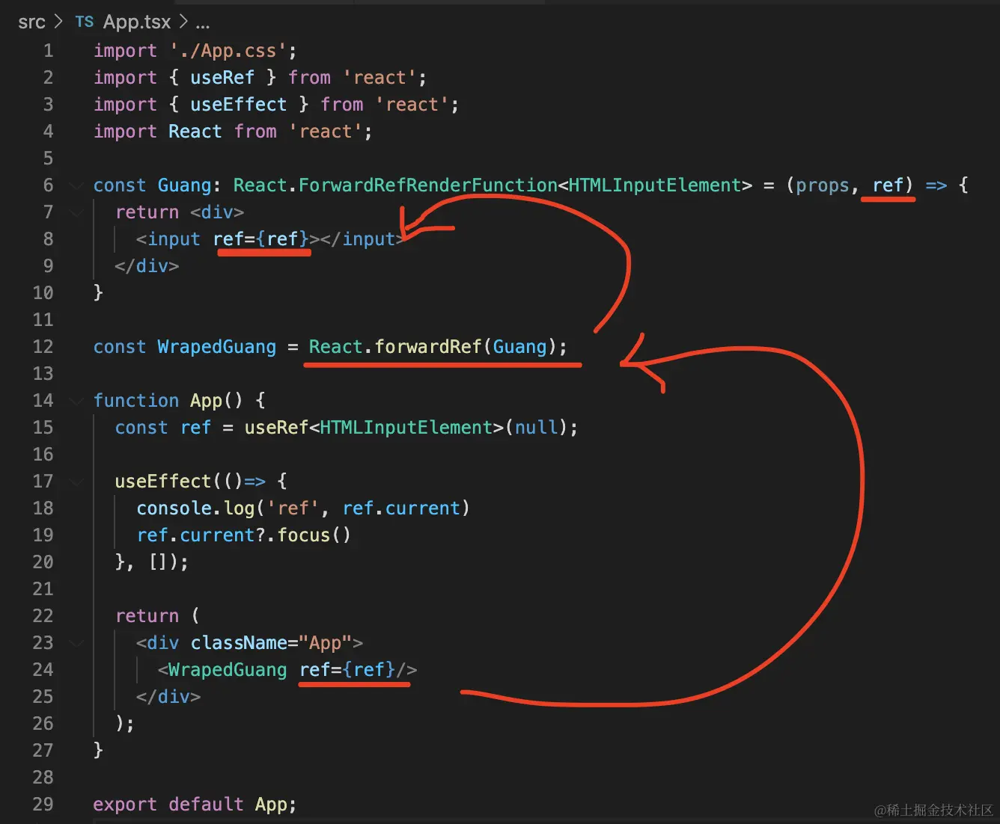
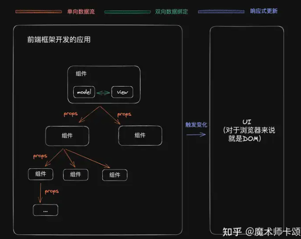

# 2025前端最新面试题-框架篇react

[扩展]

[React基础](https://www.yuque.com/fechaichai/qeamqf/xbai87#e3638cf5-2)


## 环境配置

### 创建项目

`Create-React-App` 创建, 官网推荐, 比较稳定

1. 安装

如果不加 `--template typescript` 项目会默认使用 `javascript`

```shell
npx create-react-app my-app --template typescript
```


2. 进入到目录中, 运行项目即可

```shell
npm start
```


3. 安装 `prettier`规范代码风格

```shell
npm install prettier eslit-config-prettier eslint-plugin-prettier --save-dev
```


`Vite` 创建

1. 安装

```shell
npm create vite@latest react-dome-vite --template react-ts
```


2. 进行目录, 安装依赖

```shell
npm install
```


3. 运行

```shell
npm run dev
```


## 代码规范

高质量代码的特点

- **严格编码规范**（靠工具、流程，而非自觉）
- 合理、规范的注释
- 代码合理拆分

### 两者区别

eslint prettier

- eslint 编码规范，如变量未定义（语法语义）
- prettier 编码风格，如末尾是否用 `;`
- eslint 也有编码风格的功能，两者可能会有冲突


### eslint

安装插件

```shell
npm install eslint @typescript-eslint/parser @typescript-eslint/eslint-plugin -save-dev
```

初始化配置文件 `.eslint.js`

```javascript
// .eslint.js
module.exports = {
  env: {
    browser: true,
    es2021: true,
  },
  extends: [
    "eslint: recommended",
    "plugin: react/recommended",
    "plugin:@typescript-eslint/recommended",
    "plugin:prettier/recommended",
  ],
  overrides: [],
  parser: "@typescript-eslint/parser",
  parserOptions: {
    ecmaVersion: "latest",
    sourceType: "module",
  },
  plugins: ["react", "atypescript-eslint"],
  rules: {},
};
```

```shell
npx eslint --init    ## 然后根据引导一步一步走
```

解释：eslint `plugin` 与 `extend` 的区别：

- `extend` 提供的是 eslint 现有规则的一系列预设
- `plugin` 则提供了除预设之外的自定义规则，当你在 eslint 的规则里找不到合适的的时候就可以借用插件来实现了

安装 vscode 插件 `eslint` ，此时就可以看到代码 `App.txs` 中的错误提示（如定义一个未使用的变量）

在 `package.json` 中增加 scripts `"lint": " eslint 'src/**/*.+(js|ts|jsx|tsx)' "` <br>
控制台运行 `npm run lint` 也可以看到错误提示。如果要自动修复，可以加 `--fix` 参数

### prettier

```
npm install prettier eslint-config-prettier eslint-plugin-prettier -save-dev
```

- `eslint-config-prettier` 禁用所有和 Prettier 产生**冲突**的规则
- `eslint-plugin-prettier` 把 Prettier 应用到 Eslint，配合 rules `"prettier/prettier": "error"` 实现 Eslint 提醒。

在 eslint 配置文件的 `extends` **最后** 增加 `'plugin:prettier/recommended'`

安装 vscode 插件 `prettier` ，此时可以看到代码 `App.txs` 中的格式提示（如末尾是否使用 `;` ，或单引号、双引号）

在 `package.json` 中增加 scripts `"format": " prettier --write 'src/**/*.+(js|ts|jsx|tsx)' "` <br>
控制台运行 `npm run format` 可以修复所有的格式错误

设置 vscode `.vscode/settings.json` 自动保存格式，可以在文件保存时，自动保留格式

```json
{
    "editor.codeActionsOnSave": {
        "source.fixAll.eslint": true
    }
}
```

增加配置文件 `.prettierrc.js` 规定自己的编码格式，运行 `npm run format` 可以看到效果，保存文件也可以看到效果。<br>
【注意】如果此处没效果，可以**重启 vscode** 再重试。

------

一直搞不定，重启 vscode 就好了。
在 vscode 搜“prettier” 插件时，发现一个 “reload required” 的提示，于是就重启了

CRA 创建的项目，配置文件是 `js` 格式
vite 创建的项目，配置文件是 `cjs` 格式


## JSX

### JSX 与 标签的区别

1. 首字母大小写的区分，大写是自定义组件
2. 每段 JSX 只能有一个根节点 (其中为 `<></>` 空标签，空标签无法添加 `class` 等修饰)

```react
return (
	<>
  	<div>hello world</div>
  </>
)
```


### JSX 的属性

1. 类型的变化，`class` 在 react 中需要写成 `className` 

```react
return (
	<div className="App">hello world</div>
)
```

为什么？

因为 JSX 是写在 ts 或者 js 中的，那么 `class` 已经是一个关键字了 (类)

所以，只能将名称改为 `className`


2. `style` 要使用 JS 对象 (不能是 `string`) 而且 `key` 用驼峰写法


错误写法

```react
return (
  <a style="color:red; background-color:white;"></a>
)
```


正确写法

```react
return (
	<a style={{ color: 'red', backgroundColor: 'white' }}></a>
)
```

**[注意]**

有两点需要注意

- `style` 必须用 `{}` 包起来并使用 对象的方式去写

- `background-color` 这样的属性，只能在 css 中使用，JSX 或 TSX 需要写成这样 `backgroundColor`，即采用 驼峰写法

 

3. for 要改为 htmlFor


for 属性规定 label 与 哪个表单元素绑定，for 绑定的名称 与 表单 id 相同

```html
<label for="male">Male</label>
<input type="radio" name="sex" id="male" />
```


JSX 中的写法

```react
return (
  <>
  	<label htmlFor="male">Male</label>
		<input type="radio" name="sex" id="male" />
  </>
)
```


### JSX 中监听 DOM 事件

1. 使用 `onXxx` 的形式，定义事件

```react
return (
	<div>
      <button
        onClick={() => {
          console.log('clicked')
        }}
      >
        click
      </button>
   </div>
)
```

2. 必须传入一个函数 ( 是fn 而非 fn() ，fn() 是执行结果, fn 才是一个函数)

```react
const fn = () => {
  console.log('clicked...')
}
return (
	<div>
    <button onClick={fn}>click</button>
  </div>
)
```


### JSX 函数传递 额外参数

```react
const fn = (event: MouseEvent<HTMLButtonElement>, name: string) => {
  event.preventDefault()
  event.stopPropagation()
  console.log('clicked...', name)
}

return (
	<div>
    <button
      onClick={event => {
        fn(event, 'Lin')
      }}
    >
      click
    </button>
  </div>
)
```


### JSX 中变量与表达式的插入

```react
const style = { color: 'red', backgroundColor: 'white' }

return (
  <div style={ style }>{ true ? 'true' : 'false' }</div>
)
```


### JSX 中的注释

```react
{/* 这个是注释 */}
```


### JSX 中条件判断

简单使用

```react
const flag = true

return (
	<div>
  	<div>{flag && <p>Hello</p>}</div> {/* 单个元素的隐藏 */}
    <div>{flag ? <p>Hello</p> : <p>你好</p>}</div> {/* 两个元素的要显示哪个一个 */}
  </div>
)
```

函数的封装

```react
function Hello() {
  if (flag) return <p>hello1</p>
  return <p>你好1</p>
}

return (
	<div>
  	<Hello></Hello> {/* 首字母大写才是 自定义组件 */}
  </div>
)
```


### JSX 循环的使用

- 使用数组 map，来执行循环
- 每个 item 元素需要 key 属性
- key 在同级别唯一
- **[注意]** 不要使用 index 作为 key

```react
const list = [
  { userName: 'shuangyue', name: '双越' },
  { userName: 'zhangsan', name: '张三' },
  { userName: 'lisi', name: '李四' },
]

return (
	<ul>
    {list.map(user => {
      const { userName, name } = user
      return <li key={userName}>{name}</li>
    })} 
  </ul>
  {/* 不要使用 index 作为 key，下面做法是错误的 */}
  {/*<ul>
    {list.map((user, index) => {
      const { userName, name } = user
      return <li key={index}>{name}</li>
    })} 
  </ul>
  */}
)
```


### JSX 与 Vue 设计理念的区别

- 判断 Vue 采用 v-if，React 使用 三元表达式，或者 &&
- 循环 Vue 采用 v-for，React 使用 map 进行循环，但是两者同样需要 key


- React - 能用 js 的就用 js
- Vue - 自定义很多指令，方便初学者学习和记忆


**[注意]**

Vue3 也能很好的支持 JSX 语法


### JSX 中使用 html

`dangerouslySetInnerHTML` 属性能将 文本转换为 `html`

```tsx
import React, { FC, useState, ChangeEvent } from 'react'

const Demo: FC = () => {
  const [text, setText] = useState<string>('hello')

  function handleChange(event: ChangeEvent<HTMLTextAreaElement>) {
    setText(event.target.value)
  }

  function getHTML() {
    return { __html: text.replaceAll('\n', '<br>') }
  }

  return (
    <>
      <div>
        <textarea value={text} onChange={handleChange}></textarea>
        <p dangerouslySetInnerHTML={getHTML()}></p> // 将文本转化为 html
      </div>
    </>
  )
}

export default Demo
```


### JSX 显示与隐藏

`JSX` 中我们可以使用 `hidden` 属性，来控制 `JSX` 元素的显示与隐藏

`hidden` 属性实际上控制的是 `css` 中的 `display` 属性

- `true` 显示
- `false` 隐藏

```jsx
<div
  key={pathname}
  style={{
    height: "100%",
    width: "100%",
    position: "relative",
    overflow: "hidden auto",
  }}
  className="keep-alive-page"
  hidden={!matchPath(location.pathname, pathname)}
>
  {element}
</div>
```


**[重点]** 只能在元素上使用，不能在组件上使用，也就是说，你无法通过 `hidden` 属性来判断组件显示或隐藏

如果你要控制组件的显示或者隐藏，可以在顶层增加一个 `<div>`，`<div>` 控制 `hidden` 来实现


### 小结

- 标签
- 属性
- 事件


- JS 变量或表达式
- 条件判断
- 循环


## 增、删、改、查

### 基本操作的语法

增加 `concat`

删除、查询 `filter`

修改 `map`

```tsx
import React, { FC, useState } from 'react'
import QuestionCard from './components/QuestionCard'

const List2: FC = () => {
  const [questionList, setQuestionList] = useState([
    { id: 'q1', title: '问卷1', isPublished: false },
    { id: 'q2', title: '问卷2', isPublished: true },
    { id: 'q3', title: '问卷3', isPublished: false },
    { id: 'q4', title: '问卷4', isPublished: true },
  ])

  function add() {
    const r = Math.random().toString().slice(-3)
    setQuestionList(
      // 添加 concat
      questionList.concat({
        id: 'qs' + r,
        title: '问卷' + r,
        isPublished: false,
      })
    )
  }

  function deleteQuestion(id: string) {
    // 不可变数据
    setQuestionList(
      // 删除/查询 filter
      questionList.filter(q => {
        if (q.id === id) return false
        else return true
      })
    )
  }

  function publishQuestion(id: string) {
    setQuestionList(
      // 修改 map
      questionList.map(q => {
        if (q.id !== id) return q

        return {
          ...q,
          isPublished: true,
        }
      })
    )
  }

  return (
    <div>
      <h1>问卷列表页2</h1>
      <div>
        {questionList.map(question => {
          const { id, title, isPublished } = question
          return (
            <QuestionCard
              key={id}
              id={id}
              title={title}
              isPublished={isPublished}
              deleteQuestion={deleteQuestion}
              publishQuestion={publishQuestion}
            />
          )
        })}
      </div>
      <div>
        <button onClick={add}>新增问卷</button>
      </div>
    </div>
  )
}

export default List2
```


### immer

`immer` 是第三库，用来实现更方便的 增、删、改、查

增加 `push`

删除/查找 `findIndex` 、`splice`

修改 `find`，直接修改属性 `.属性名`

```tsx
import React, { FC, useState } from 'react'
import QuestionCard from './components/QuestionCard'
import { produce } from 'immer'

const List2: FC = () => {
  const [questionList, setQuestionList] = useState([
    { id: 'q1', title: '问卷1', isPublished: false },
    { id: 'q2', title: '问卷2', isPublished: true },
    { id: 'q3', title: '问卷3', isPublished: false },
    { id: 'q4', title: '问卷4', isPublished: true },
  ])

  function add() {
    const r = Math.random().toString().slice(-3)
    // setQuestionList(
    //   // 添加 concat
    //   questionList.concat({
    //     id: 'qs' + r,
    //     title: '问卷' + r,
    //     isPublished: false,
    //   })
    // )

    // immer 增加
    setQuestionList(
      produce(draft => {
        draft.push({
          id: 'q' + r,
          title: '问卷' + r,
          isPublished: false,
        })
      })
    )
  }

  function deleteQuestion(id: string) {
    // 不可变数据
    // setQuestionList(
    //   // 删除/查询 filter
    //   questionList.filter(q => {
    //     if (q.id === id) return false
    //     else return true
    //   })
    // )

    // immer 删除
    setQuestionList(
      produce(draft => {
        const index = draft.findIndex(q => q.id === id)
        draft.splice(index, 1)
      })
    )
  }

  function publishQuestion(id: string) {
    // setQuestionList(
    //   // 修改 map
    //   questionList.map(q => {
    //     if (q.id !== id) return q

    //     return {
    //       ...q,
    //       isPublished: true,
    //     }
    //   })
    // )

    // immer 修改
    setQuestionList(
      produce(draft => {
        const q = draft.find(item => item.id === id)
        if (q) q.isPublished = true
      })
    )
  }

  return (
    <div>
      <h1>问卷列表页2</h1>
      <div>
        {questionList.map(question => {
          const { id, title, isPublished } = question
          return (
            <QuestionCard
              key={id}
              id={id}
              title={title}
              isPublished={isPublished}
              deleteQuestion={deleteQuestion}
              publishQuestion={publishQuestion}
            />
          )
        })}
      </div>
      <div>
        <button onClick={add}>新增问卷</button>
      </div>
    </div>
  )
}

export default List2
```


## 合成事件

### 基本使用

`onClick、onChange、onScroll`

- `React` 事件就是在 浏览器原生事件 前面加 `on`

- `Vue` 事件是在 浏览器原生事件 前面加 `@`

```react
// onClick 使用示例，其他事件类似
const MyComponent = () => {
   return <button onClick={() => console.log('Button clicked')}>Click me</button>;
 };
```

【注意】

`React` 中的合成事件`（SyntheticEvent）`是对浏览器原生事件的跨浏览器包装。


### 为什么会有 合成事件？

1. 在传统的事件里，不同的浏览器需要兼容不同的写法，在合成事件中`React`提供统一的事件对象，抹平了浏览器的兼容性差异**（解决了什么？）**
2. `React`通过顶层监听的形式，通过事件委托的方式来统一管理所有的事件，可以在事件上区分事件优先级，优化用户体验**（如何解决？）**


### 普通事件 执行顺序？

捕获 -> 目标 -> 冒泡


### 什么是 事件委托、事件监听？

**事件委托：**在多个事件的的父元素绑定一个事件委托，通过`target`属性获取当前触发 目标阶段 的`dom`元素，来进行统一管理

**事件监听：**使用 `addEventListerner` 进行监听


### 如何阻止原生事件

`stopPropagation()` 阻止事件的 **捕获** 和 **冒泡阶段**

`preventDefault()` 阻止 **默认事件**（例如，阻止链接的默认跳转行为、阻止表单的默认提交行为等）


### 原生事件 与 合成事件 的执行顺序？


## Typescript 类型基础知识补充

[TypeScript 转 JavaScript 在线工具](https://www.tslang.cn/play/index.html)


### `<T>` 泛型的使用

```typescript
function print<T>(info: T) {
    console.log(info)
}

print<string>('hello')
```

`<T>` 的含义就是等待类型被定义，也就是说可以在使用的时候再去定义类型

通常你在 typescript 中看到 `<>` 尖括号基本都是 **泛型**


`class` 中加 泛型

```react
function print<T>(info: T) {
    console.log(info)
}

print<string>('hello')
```


### 泛型定义一个数组

```typescript
const arr: Array<string> = [] // 泛型定义 字符类型的数组

const arr: string[] = [] // 直接命名定义数组类型
```


### TS 中获取一个类型

```react
import type { MouseEvent } from 'react'

function App() {
  const fn = (event: MouseEvent<HTMLButtonElement>) => {
    event.preventDefault() // 阻止默认行为
  }
}
```

上面的例子就是引入了类型 `MouseEvent` ，并且使用


### 函数返回值类型定义

```typescript
function fn(): string {
  return 'xx'
}
```


### 解构重命名

```tsx
const [loading, run: handleCreateClick] = useRequest()

handleCreateClick() // 相当于 执行 run()
```


### Partial 的妙用

定义复杂数据类型，可用 `?:` 定义一些可能不必有的属性

这样是话，b、c 可有，也可无，都不会报错

```typescript
type ObjType = {
  a: string
  b?: number
  c?: boolean
}

const obj1: ObjType = {
  a: 'x'
}
```

但是，如果要定义的复杂数据类型过多，那就显得不灵活啦

那么，有没有什么 API 语法可以简化呢，答案是有的，`partial`


`partial` 有部分的意思

也就是说有 `partial` 用这个关键字定义后，定义的数据，只需要有预先定义的复杂数据类型的一部分即可

```typescript
type ObjType = {
  a: string
  b: number
  c: boolean
}

const obj1: Partial<ObjType> = {
  a: 'x'
}
```


### Required 的妙用

`Required` 是去掉可选用的，也就是把 可选都变成必选

`Partial` 是给属性添加可选修饰，也就是把 必选都变成可选


## 组件 与 props

### React 一切皆组件

- 组件就是一个 UI 片段
- 拥有独立的逻辑和显示
- 组件可大可小，可嵌套


react 有两种组件，class 组件 和 函数组件

React16 以后，React 推崇 函数组件 和 Hooks


组件是一个函数（执行放回 JSX 片段），组件初次渲染执行这个函数

任何 state 更新，都会触发组件的更新（重新执行函数）


### React.FC 与 JSX.Element

`React.FC` 是一个 `TypeScript` 类型，用于 `React` 函数组件

`FC` 代表 `Functional Component`（函数组件）

这个类型的使用有助于在 `TypeScript` 项目中编写类型安全的 `React` 组件

使用 `React.FC` 为组件定义类型就可以享受到 `TypeScript` 提供的类型检查和自动补全等特性，让开发过程更加高效和减少错误


1. 直接写法

```typescript
function Welcome(props) {
  return <h1>Hello, {props.name}</h1>;
}
```

2. React.FC

```typescript
import React from 'react';
 
interface Props {
  message: string;
}
 
const MyComponent: React.FC<Props> = ({ message }) => {
  return <div>{message}</div>;
};
```

3. JSX.Element

```typescript
const Welcome: React.FC<{ name: string }> = (props) => {
  return <h1>Hello, {props.name}</h1>;
}
 
// 不使用 React.FC，直接指定返回类型
const Welcome = ({ name: string }): JSX.Element => {
  return <h1>Hello, {name}</h1>;
}
```


这三种写有什么不同，为什么要这么写？

使用 `React.FC` 可以提供类型检测、IDE 语法提示，但是却会自动增加 `children` 属性（即使你并不需要）

`JSX.Element` 是 `React.FC` 的替代方案，可以完全自己定义返回类型


**【注】**`React.FC` 的函数组件会被自动添加上 `children` 属性，即此函数组件可以在包别的 `element`


### 组件通信

| 传值方式                 | 方法                        |
| ------------------------ | --------------------------- |
| 父 -> 子                 | props                       |
| 子 -> 父                 | 回调函数                    |
| 父组件 获取 子组件方法   | useImperativeHandle、useRef |
| 子组件 获取 父组件方法   | useContext                  |
| 多层级 或者 同级数据传递 | ZuStand                     |


### props 如何设置默认值

可以采用 ES6 解构的方式设置默认值

```react
const MyFunctionalComponent = ({ propName = 'defaultValue' }) => {
  return <div>{propName}</div>;
};
```


### 父组件获取子组件的方法

这样的操作，类似于 Vue 里面的 emit 自定义事件

而 React 中要实现这样的操作，需要用到 `useImperativeHandle`

```tsx
// 子组件
import { forwardRef, Ref, useImperativeHandle } from "react";

// 需要对 Ref 的类型进行定义，不然 ts 校验会不通过
export interface RefProps {
  chileMethod: () => void;
}

const ChildComponent = ({ title = 'title' }, ref: Ref<RefProps>) => {
  useImperativeHandle(ref, () => {
    return {
      chileMethod: () => {
        console.log('233');
      }
    }
  }, [])

  return <div>{title}</div>;
}

export default forwardRef(ChildComponent);
```

```tsx
// 父组件
import React, { useRef } from 'react';
import ChildComponent, { RefProps } from './component/ChildComponent';

function App() {
  const childRef = useRef<RefProps>(null);
  const handleClick = () => {
    childRef.current?.chileMethod();
  }

  return (
    <div>
      <ChildComponent ref={childRef} />
      <button onClick={handleClick}>调用子组件方法</button>
    </div>
  );
}

export default App;
```


### Props.children

【注意】类组件才有这个

Props.children 类似于 Vue 中的 `slot` 插槽

```react
// 父组件
return (
  <Child>
      <span>{ 'child node' }</span>
   </Child>
 )

// 子组件
return (
  <div>
    { props.children }
  </div>
)
```


### 状态提升

状态提升 `state`

数据源在父组件里面，每个子组件只需要执行父组件传过来的数据和方法，这就是 **状态提升**


**为什么需要状态提升？**

当多个组件需要共享状态或者需要基于相同的状态进行交互时，如果每个组件都独立管理自己的状态，会导致状态不一致和难以维护

通过将状态提升到共同的父组件，可以确保所有相关组件都能访问和更新相同的状态，从而实现更高效和一致的状态管理


### Outlet

类似于 vue 中 slot 插槽


### 受控组件 与 非受控组件

- 受控组件：值同步到 state，使用 value 属性（数据可以由代码控制）
- 非受控组件：值不同步 state，使用 defaultValue 属性（数据由用户控制）
- React 推荐使用受控组件，看似繁琐，实则更加可控


### Fragment

如果需要返回多个组件，但又不想用额外的父元素包裹，可以是使用 `Fragment`

```react
class Example extends React.Component {
  render() {
    return (
      <React.Fragment>
        <div>First div</div>
        <div>Second div</div>
      </React.Fragment>
    );
  }
}
```

或者可以使用简写（空标签）

```react
class Example extends React.Component {
  render() {
    return (
      <>
        <div>First div</div>
        <div>Second div</div>
      </>
    );
  }
}
```


### 插槽

可以使用两种方式

1. 使用 `props` 携带组件

```react
<FunctionComponent customContent1={<ChildComponent1 />} customContent2={<ChildComponent2 />} />
```

```react
 const FunctionComponent = ({ customContent1, customContent2 }) => {
   return (
     <div>
       {customContent1}
       {customContent2}
     </div>
   );
 };
```

2. 使用 `props.children`

```react
 <FunctionComponent>
   <div>Child Content</div>
 </FunctionComponent>
```

```react
 const FunctionComponent = ({ children }) => {
   return (
     <div>
       {children}
     </div>
   );
 };
```


【注】

`React.FC`（Function Component）在 `React 16` 以后确实没有默认的 `children` 属性类型定义了

如果你需要使用 `ts`，并使用 `React.FC` 声明类型，你需要自己添加 `children` 属性

```react
import React from 'react';

interface MyComponentProps {
  // 其他属性定义...
}

const MyComponent: React.FC<MyComponentProps> = ({ children,...props }) => {
  return (
    <div>
      {children}
      {/* 组件的其他内容 */}
    </div>
  );
};
```


### React 高阶组件

高阶组件，本质上是对 React 组件的进一步封装

可以接收任何外部的值，也可以不接收

```react
// 这个高阶组件为被包裹的组件添加了挂载和卸载时的日志记录功能，不需要接收任何外部的值
const withLogging = (WrappedComponent) => {
  return (props) => {
    useEffect(() => {
      console.log(`Component ${WrappedComponent.name} mounted.`);
      return () => {
        console.log(`Component ${WrappedComponent.name} will unmount.`);
      };
    }, []);

    return <WrappedComponent {...props} />;
  };
};
```

```react
// 这个高阶组件接收一个颜色参数，然后为被包裹的组件设置一个特定颜色的背景
const withBackgroundColor = (color) => (WrappedComponent) => {
  return (props) => {
    return (
      <div style={{ backgroundColor: color }}>
        <WrappedComponent {...props} />
      </div>
    );
  };
};
```


## Hooks

### 为什么 react 需要使用到 useState 这样的钩子函数呢

因为普通 js 变量，无法触发组件的更新，useState 可以触发这样的更新

触发条件就是使用，setCount 进行更新


```react
import React, { useState } from 'react'

function App() {
  const [count, setCount] = useState(0)

  function add() {
    setCount(count + 1)
  }
  // 列表页
  return (
    <>
      <div>
        <button onClick={add}>add {count}</button>
      </div>
    </>
  )
}

export default App
```


### 为什么useState返回值是数组，而不是对象？

对象解构的变量必须与属性同名、可以任意顺序

数组解构的变量可以是任意名称、必须相同顺序

所以，`useState` 返回值是数组，是为了简化写法

```react
const [state, setState] = useState(null)
const [state2, setState2] = useState(null)

const {state, setState} = useState(null)
const {state:state2, setState:setState2} = useState(null)
```


### state 有哪些特点?

1. state 的更新是异步的，所以无法拿到最新的 state 值

> [注意]
>
> 如果说一个变量 不用于 JSX 中显示，那就不要用 setState 来管理它 (因为 useState 会触发组件更新，所以没必要)，用 useRef


2. state 可能会被合并

add 函数执行结果一次的结果只加 1

因为，每次执行 `setCount(count + 1)` ，使用值进行更新，都被合并了

```react
import React, { FC, useState } from 'react'

const Demo: FC = () => {
  const [count, setCount] = useState(0)

  function add() {
    setCount(count + 1)
    setCount(count + 1)
    setCount(count + 1)
    setCount(count + 1)
    setCount(count + 1)
    // setCount(count => count + 1) setCount 的第二种写法
  }

  return (
    <div>
      <button onClick={add}>add {count}</button>
    </div>
  )
}

export default Demo
```


如果是使用函数来更新就不会被合并，因为函数是一个比较复杂的结构

add 函数执行结果一次的结果加 5

```react
import React, { FC, useState } from 'react'

const Demo: FC = () => {
  const [count, setCount] = useState(0)

  function add() {
    setCount(count => count + 1)
    setCount(count => count + 1)
    setCount(count => count + 1)
    setCount(count => count + 1)
    setCount(count => count + 1)
    // setCount(count => count + 1) setCount 的第二种写法
  }

  return (
    <div>
      <button onClick={add}>add {count}</button>
    </div>
  )
}

export default Demo
```


3. 不可变数据 ！！！

**`useState()` 的 `state` 是否可以直接修改？是否可以引起组件渲染？**

`state` 不可以直接修改，因为这个 `state` 是不可变数据，直接改，会提示它是个常数

`state` 改变会引起组件渲染


### useEffect

**经典面试题**

什么是副作用函数，什么是纯函数？[ 副作用：对函数外部进行修改 ]


纯函数：

1. 输入输出一致
2. 无副作用

副作用函数：

1. 副作用效果不一定符合我们预期
2. 依赖外部的变量

[例子] 

- 调用外部API
- 操作`DOM`
- 计时器
- 操作引用类型


`useEffect` 能监听组件的生命周期，创建、更新、销毁

函数是一个组件，`useEffect` 在函数中执行


1.  只执行一次，数组中为空，只执行一次

挂载

谁引用了 List2，谁就执行 useEffect 一次

```tsx
const List2: FC = () => {
  useEffect(() => {
    console.log('加载 ajax 网络请求')
  }, [])
}
```

2. 监听 `useState` 数据变化

更新 -> `componentDidUpdate`

```tsx
const List2: FC = () => {
  const [count, setCount] = useState(0)
  
  useEffect(() => {
      console.log('count change')
  }, [count])
  
  function add() {
    setCount(count + 1)
  }
}
```

3. 监听函数 创建 与 销毁

创建 -> `componentDidMount`

销毁 -> `componentWillUnmount`

```tsx 
useEffect(() => {
  console.log('question card mounted') // 监听创建

  return () => {
    console.log('question card unmounted', id) // 监听销毁
  }
})
```


**[注]**

`useEffect` 在开发环境下会执行两次?

先创建一次，销毁一次，再次创建

从 React 18 开始，useEffect 在开发环境下会执行两次

这样做的目的，模拟组件创建、销毁，再创建的完整流程，及早暴露问题


生产环境下会执行一次


### useRef

一般用于操作 DOM

也可传入普通 JS 变量, 但更新不会触发 `rerender`


```tsx
import React, { FC, useRef } from 'react'

const Demo: FC = () => {
  const nameRef = useRef('lin')

  function changeName() {
    nameRef.current = 'linjk' // 修改 ref 值, 不会触发 rerender (state 修改组件会触发组件的 rerender)
  }

  return (
    <>
      <p>name {nameRef.current}</p>
      <div>
        <button onClick={changeName}>change name</button>
      </div>
    </>
  )
}

export default Demo
```


### useMemo

用于返回一个记忆化的值。这个函数会在依赖项改变时重新计算这个记忆化的值。

```tsx
const Demo: FC = () => {
  const [num1, setNum1] = useState(10)
  const [num2, setNum2] = useState(20)

  const sum = useMemo(() => {
    console.log('gen sum ...')
    return num1 + num2
  }, [num1, num2]) // num1、num2 其中一个改变或者两个都改变才会重新渲染
}
```


### useCallback

用于返回一个记忆化函数，只有当这个函数项数组改变时，才会更新。

```tsx
const Demo: FC = () => {
  const [text, setText] = useState('hello')

  const fn2 = useCallback(() => {
    console.log('fn2 text:', text)
  }, [text]) // text 改变，才会重新渲染
}
```


【扩展】

`useCallback`和`useMemo`并不能保证性能优化，过度使用反而可能导致性能下降。

因为记忆化也需要消耗资源来保存记忆化的值。只有在确定性能瓶颈存在，并且可以通过记忆化来解决时，才应该使用它们。


**那什么时候才需要使用`useCallback`和`useMemo`这两个呢？**

1. 你明确知道要写的这个东西确实需要缓存了，那你就根据情况加上`useCallback`或`useMemo`
2. 平时写的时候不要使用这两个，出现了性能瓶颈了，再考虑使用`useCallback`或`useMemo`来优化


### useReducer

`reducer`函数根据不同的`action`类型来更新状态。`dispatch`函数用于触发`action`，从而更新状态

而 `useState` 只能通过 `set` 函数进行简单赋值，如果要实现 `reducer` 那种处理多种情况，可以封装成一个自定义 `Hook`

**实例**

```react
import React, { FC, useReducer } from 'react'

type StateType = { count: number }
type ActionType = { type: string }

const initialState: StateType = { count: 100 } // 初始值

// 根据传入的 action 返回新的 state (不可变数据)
function reducer(state: StateType, action: ActionType) {
  switch (action.type) {
    case 'increment':
      return { count: state.count + 1 }
    case 'decrement':
      return { count: state.count - 1 }
    default:
      throw new Error()
  }
}

const CountReducer: FC = () => {
  // const [count, setCount] = useState(100)
  const [state, dispatch] = useReducer(reducer, initialState)

  return (
    <>
      <span>count: {state.count}</span>
      {/* <button onClick={() => setCount(count + 1)}>+</button>
      <button onClick={() => setCount(count - 1)}>-</button> */}
      <button onClick={() => dispatch({ type: 'increment' })}>+</button>
      <button onClick={() => dispatch({ type: 'decrement' })}>-</button>
    </>
  )
}

export default CountReducer
```


### forwardRef

父组件想拿到子组件的 ref

也就是从子组件传递 ref 到父组件，就需要 forwardRef 了，也就是把组件内的 ref 转发一下




### 自定义 hooks

类似于，定义一个外部函数，可以引入使用

外部 hooks

```typescript
// hooks/useTitle.ts
import { useEffect } from 'react'

function useTitle(title: string) {
  useEffect(() => {
    document.title = title
  }, [])
}

export default useTitle
```


调用 hooks

```tsx
// index.tsx
import React from 'react'
import useTitle from './hooks/useTitle'

function App() {
  useTitle('App page 2')
  return (
    <>
      <p>App page</p>
    </>
  )
}

export default App
```


1. **自定义 hooks (获取鼠标位置)**

外部 hooks

下面 `mouseMoveHandler` 每次执行这个函数都会创建一次，我们鼠标移动一次就会创建一次，可以使用 `useCallback` 进行缓存起来

比较大量的计算可以使用 `useCallback`，比较小的计算可以不同，根据具体情况而定

```tsx
// hooks/useMouse.ts
import { useState, useEffect, useCallback } from 'react'

// 获取鼠标位置
function useMouse() {
  const [x, setX] = useState(0)
  const [y, setY] = useState(0)

  const mouseMoveHandler = useCallback((event: MouseEvent) => {
    setX(event.clientX)
    setY(event.clientY)
  }, [])

  useEffect(() => {
    // 监听鼠标事件
    window.addEventListener('mousemove', mouseMoveHandler)

    // 组件销毁时，一定要解绑 DOM 事件 !!! 可能出现内存泄漏问题
    return () => {
      window.removeEventListener('mousemove', mouseMoveHandler)
    }
  }, [])

  return { x, y }
}

export default useMouse
```


引用 hooks

```tsx
// index.ts
import React from 'react'
import useMouse from './hooks/useMouse'

function App() {
  const { x, y } = useMouse()
  // 列表页
  return (
    <>
      <p>
        App page {x} {y}
      </p>
    </>
  )
}

export default App
```


2. **模拟 hooks 异步加载数据**

外部 hooks

```typescript
// hooks/getInfo.ts
import { useState, useEffect } from 'react'

function getInfo(): Promise<string> { // Promsie 模拟请求
  return new Promise(resolve => {
    setTimeout(() => {
      resolve(Date.now().toString())
    }, 1500)
  })
}

const useGetInfo = () => {
  const [loading, setLoading] = useState(true)
  const [info, setInfo] = useState('')

  useEffect(() => {
    getInfo().then(info => {
      setLoading(false)
      setInfo(info)
    })
  }, [])

  return { loading, info }
}

export default useGetInfo
```


引用 hooks

```tsx
import React from 'react'
import useGetInfo from './hooks/useGetInfo'

function App() {
  const { loading, info } = useGetInfo()
  return (
    <>
      <p>App page</p>
      <p>{loading ? '加载中...' : info}</p>
    </>
  )
}

export default App
```


### react 中 hooks 的命名

**useLoad 开头**

通常用于 ajax 请求获取数据


**useGet 开头**

通常用于获取前端 redux 信息


### 文件中 引入的先后顺序

**顺序**

第三方插件往前面放，自定义插件往后面放


### 组件生命周期

函数组件生命周期有三个

- 挂载
- 更新
- 销毁


函数组件 挂载阶段

```react
useEffect(() => {
  console.log('挂载阶段')
}, [])
```


函数组件 更新阶段

```react
const [count, setCount] = useState(0)

useEffect(() => {
  // x 变化，下面函数就会触发，首次进入 x 没有变化也会触发
  console.log('更新阶段');
}, [x])
```

如果你需要，只在更新阶段，执行副作用，要怎么做呢？

```react
const [count, setCount] = useState(0)
const [isMounted, setIsMounted] = useState(false);

useEffect(() => {
  	if (!isMounted) {
      	setIsMounted(true);
    } else {
      	// 只有 count 变化且不是首次渲染时执行
      	console.log('更新阶段');
    }
}, [count, isMounted])
```


函数组件的 销毁阶段

下面例子的组件销毁阶段，就在于 `useEffect` 中 return 返回的函数，就是组件销毁阶段要执行的东西

```tsx
import { useState, useEffect, useCallback } from 'react'

// 获取鼠标位置
function useMouse() {
  const [x, setX] = useState(0)
  const [y, setY] = useState(0)

  const mouseMoveHandler = useCallback((event: MouseEvent) => {
    setX(event.clientX)
    setY(event.clientY)
  }, [])

  useEffect(() => {
    // 监听鼠标事件
    window.addEventListener('mousemove', mouseMoveHandler)

    // 组件销毁时，一定要解绑 DOM 事件 !!! 可能出现内存泄漏问题
    return () => {
      window.removeEventListener('mousemove', mouseMoveHandler)
    }
  }, [])

  return { x, y }
}

export default useMouse
```


### 第三方 Hooks 的使用


- 国内流行 [ahooks](https://ahooks.gitee.io/zh-CN/guide)
- 国外流行 [React Hooks](https://github.com/streamich/react-use)


`ahooks` 的使用案例，`useTitle`、`useMouse` 的使用

```tsx
import React from 'react'
import { useTitle, useMouse } from 'ahooks'

function App() {
  useTitle('App page 3')
  const { clientX, clientY } = useMouse()
  // 列表页
  return (
    <>
      <p>App page</p>
      {clientX} {clientY}
    </>
  )
}

export default App
```


### Hooks 使用规则


- 必须用 useXxxx 格式来命名
- 只能在两个地方调用 Hook (组件内，其他 Hook 内)
- 必须保证每次的调用顺序一致 (不能放在 if for 普通函数内部)


**为什么不能放普通函数内部？**

因为，普通函数没有 React 执行上下文


### Hooks 闭包陷阱


- 当异步函数获取 state 时，可能不是当前最新的 state

```tsx
import React, { FC, useState } from 'react'

const Demo: FC = () => {
  const [count, setCount] = useState(0)

  function add() {
    setCount(count + 1)
  }

  function alertFn() {
    setTimeout(() => {
      alert(count) // count 5 闭包
    }, 3000)
  }

  return (
    <>
      <p>闭包陷阱</p>
      <p>{count}</p>
      <button onClick={add}>add</button>
      <button onClick={alertFn}>alert</button>
    </>
    // 点击 alert 后，多次点击 add，弹窗出来的接口，不等于 count
    // 也就所谓的 闭包陷阱
  )
}

export default Demo
```


解决的办法，使用 `useRef`，因为它的值是引用类型，根据原值的改变而改变

原先用 `useState` 定的值是值类型，所以点击 `alert` 的时候，`count` 是 5 的话，那么弹窗的值也是 5

```tsx
import React, { FC, useState, useRef, useEffect } from 'react'

const Demo: FC = () => {
  const [count, setCount] = useState(0)

  const countRef = useRef(0)

  useEffect(() => {
    countRef.current = count
  }, [count])

  function add() {
    setCount(count + 1)
  }

  function alertFn() {
    setTimeout(() => {
      // alert(counr) // count 值类型
      alert(countRef.current) // ref 引用类型
    }, 3000)
  }

  return (
    <>
      <p>闭包陷阱</p>
      <p>{count}</p>
      <button onClick={add}>add</button>
      <button onClick={alertFn}>alert</button>
    </>
    // 点击 alert 后，多次点击 add，弹窗出来的接口，不等于 count
    // 也就所谓的 闭包陷阱
  )
}

export default Demo
```


### React Hook 的使用规范

**React Hook 的使用限制有什么（官方规则）？**

为了保证 React 能正确地追踪到各个 hook 之间的状态，需要注意以下规则

1. **只在最顶层使用 hook：** 不可以在 判断语句、循环语句、子函数中调用 Hook
2. **只在 React 函数、自定义 Hook 中调用 Hook：** 不要在普通函数中调用 Hook


如果调用了会报错，这样使用会导致 React Hook 正确追踪到 Hook 之间的状态


**React Hook 与 普通函数有什么不同？**

普通函数，不涉及任何与 React 组件相关的状态管理（数据）或副作用


**React Hook 平时开发时需要注意什么？**

除了 `React Hooks` 官方提出的使用规则外，还需注意以下事项

1. 自定义 `Hook`，使用 `use` 开头

2. 避免过度使用 `useEffect`


```react
// 错误的使用
import React, { useState, useEffect } from 'react';

const OveruseEffectExample = () => {
  const [count, setCount] = useState(0);
  const [name, setName] = useState('');

  useEffect(() => {
    console.log(`Count is ${count}`);
    console.log(`Name is ${name}`);
  }, [count, name]);

  return (
    <div>
      <p>Count: {count}</p>
      <button onClick={() => setCount(count + 1)}>Increment Count</button>
      <p>Name: {name}</p>
      <input value={name} onChange={(e) => setName(e.target.value)} />
    </div>
  );
};

export default OveruseEffectExample;
```

```react
// 正确的使用
import React, { useState, useEffect } from 'react';

const CorrectUseEffectExample = () => {
  const [count, setCount] = useState(0);
  const [name, setName] = useState('');

  useEffect(() => {
    // 只有当 count 变化时执行这个副作用
    console.log(`Count is ${count}`);
  }, [count]);

  useEffect(() => {
    // 只有当 name 变化时执行这个副作用
    console.log(`Name is ${name}`);
  }, [name]);

  return (
    <div>
      <p>Count: {count}</p>
      <button onClick={() => setCount(count + 1)}>Increment Count</button>
      <p>Name: {name}</p>
      <input value={name} onChange={(e) => setName(e.target.value)} />
    </div>
  );
};

export default CorrectUseEffectExample;
```

3. 闭包陷阱

成因

```react
import { useEffect, useState } from 'react';

function App() {

    const [count,setCount] = useState(0);

    useEffect(() => {
        setInterval(() => {
            console.log(count);
            setCount(count + 1);
        }, 1000);
    }, []);

    return <div>{count}</div>
}

export default App;
```

`count` 并不会每秒加 1，一直是 0

闭包陷阱就是 `effect` 函数等引用了 `state`，形成了闭包，但是并没有把 `state` 加到依赖数组里，导致执行 `effect` 时用的 `state` 还是之前的


三种解决方案

- 使用 `setState` 的函数的形式，从参数拿到上次的 `state`，这样就不会形成闭包了，或者用 `useReducer`，直接 `dispatch action`，而不是直接操作 `state`，这样也不会形成闭包
- 把用到的 `state` 加到依赖数组里，这样 `state` 变了就会重新跑 `effect` 函数，引用新的 `state`
- 使用 `useRef` 保存每次渲染的值，用到的时候从 `ref.current` 取


[Hook 的闭包陷阱的成因和解决方案](https://juejin.cn/book/7294082310658326565/section/7298292751051784230#heading-0)

4. 注意清除副作用

使用 `useEffect` 处理订阅事件、网络请求、定时器等副作用操作时，别忘了在 `effect` 返回函数中清理，防止可能出现的内存泄露

```react
import React, { useState, useEffect } from 'react';

const NetworkRequestExample = () => {
  const [data, setData] = useState(null);

  useEffect(() => {
    const fetchData = async () => {
      const response = await fetch('https://api.example.com/data');
      const result = await response.json();
      setData(result);
    };

    fetchData();

    // 返回清理函数
    return () => {
      // 如果有需要，可以在这里取消正在进行的网络请求或进行其他清理操作
    };
  }, []);

  return <div>{data? `Received data: ${JSON.stringify(data)}` : 'Loading data...'}</div>;
};

export default NetworkRequestExample;
```


### 扩展

[一网打尽常见 Hook](https://juejin.cn/book/7294082310658326565/section/7295617117938778149)


## CSS

### 内联样式条件判断怎么写

基础写法

```tsx
const Demo: FC = () => {
  let isPublished = true
  let itemClassName = 'list-item'
  if (isPublished) itemClassName += ' published'
  return (
    <div className={itemClassName}>
  )
}
```

使用第三方插件 `classnames` 进行条件判断

```tsx
const Demo: FC = () => {
  let isPublished = true
  
  const itemClassName = classnames('list-item', { published: isPublished })
  const itemClassName = classnames({
    'list-item': true,
    published: isPublished,
  })
  
  return (
    <div className={itemClassName}>
  )
}
```


### 解决 clasName 可能重复的问题

使用 `CSS Module` 进行解决

- 每个 CSS 文件都当做单独的模块，命令 `xxx.module.css`
- 为每个 `className` 增加后缀名，不让它们重复
- `Create-React-App` 原生支持 `CSS Module`


使用方法就是 将需要引入的 css 命名后缀 `.css` 改为 `.module.css`

那么在构建的是时候，就会为该组件的类名等，添加前后缀来进行区别！


### CSS-in-JS

使用 js 的方式写 css

```tsx
import React, { FC } from 'react'
import styled, { css } from 'styled-components'

// Button 组件
type ButtonPropsType = {
  primary?: boolean // 定义属性类型
}

// 定义组件
const Button = styled.button`
  background: transparent;
  border-radius: 3px;
  border: 2px solid palevioletred;
  color: palevioletred;
  margin: 0 1em;
  padding: 0.25em 1em;

  ${(props: ButtonPropsType) =>
    props.primary && // 当属性 primary 存在的时候，css 中的内容生效
    css`
      background: palevioletred;
      color: white;
    `}
`

// Container 组件，定义 div 的元素居中显示
const Container = styled.div`
  text-align: center;
`

const Demo: FC = () => {
  return (
    <div>
      <p>style-component</p>
      <Container>
        <Button>Normal Button</Button>
        <Button primary>primary Button</Button>
      </Container>
    </div>
  )
}

export default Demo
```


**[注]**

关于 `div` 这个语法的解释

`div` 类似一个函数执行

```tsx
const Container = styled.div`
  text-align: center;
`
```

可以看到 类似函数的调用，但是返回的是一个数组，且有一些属性信息


### 关于 flex 布局的写法

三列布局，两变固定大小，中间自适应

外层可以用 `display: flex`

中间层可以用 `flex: auto`

为了不让 中间 和 左右因为缩放被挤压，可以设置最小宽高 `min-width`、`min-height`


三列布局 按比例划分 3份, 中间 2 份，左右各一份

可以使用中间 `flex: 2`

左右使用 `flex: 1`


### class 类有 横杠 如何写入 className

```tsx
<div className={styles['component-wrapper']}>
  <div className={styles.component}>
    <QuestionInput placeholder={''} />
  </div>
</div>
```


### 多个 className

```react
// 动态判断添加单类名
<div className={detail.applyStatus == 1 ? styles.class : styles.class2 }>HELLO WORLD</div>
 
// 已有多类名，动态判断再添加类名
// ( 数组法)
<div className{[classA,'box',index===this.state.currentState?"active":null].join('')}>HELLO WORLD</div>

// （模板字符串法）
<div className={`box${classA}${index===this.state.currentState?"active":null}`}>HELLO WORLD</div>
```

可以通过插件`classnames`，快速合并

```react
import React from 'react';
import c from 'classnames';
 
class MyComponent extends React.Component {
    render() {
        return (
            <div className={c('set-color', 'set-font-size')}>1234567890</div>
        )
    }
}
```

`classNames` 的原理

```javascript
function classNames() {
	var classes = []; //一个专门存储最后类名合集的数组
  	//传入参数不限制数量，自然是用到参数对象 arguments 这个东西
    for (var i = 0; i < arguments.length; i++) {
        var arg = arguments[i]; //遍历 arguments 拿到每一项
        if (!arg) continue; //如果该项的值为 undefined、null之类的就直接跳过
		//获取该项的类型
        var argType = typeof arg;
  		//字符串或者数字之类的直接加入 classes 中就完事了
        if (argType === 'string' || argType === 'number') {
            classes.push(arg);
        } else if (Array.isArray(arg)) {
            if (arg.length) {
                var inner = classNames.apply(null, arg); 
                //针对数组中的每一项都需要进行判断是否能够加入 classes 中，所以利用 递归+apply 达到数组扁平化的效果
                if (inner) { //递归调用返回的不是空字符串 '' 的话就加入 classes
                    classes.push(inner);  //放入
                }
            }
        } else if (argType === 'object') {//对象的情况下
    		//如果自带的 toString 方法 和 Object 的一样
            if (arg.toString === Object.prototype.toString) { //'[object object]'的情况
                for (var key in arg) {//用 for in 遍历对象中的可枚举属性
                    if (hasOwn.call(arg, key) && arg[key]) {//如果该属性是自身的 && value 为 true（或者说 可以转变为 true）
                        classes.push(key);//就将 key 放入 classes 中，注意是key
                    }
                }
            } else {//否则就用自身自定义的 toString 方法
                classes.push(arg.toString());  
            }
        }
    }
		return classes.join(' ');//用 join 方法将数组变为字符串，用' '隔开
	}
	//用于支持各种导出方式
	if (typeof module !== 'undefined' && module.exports) {// CommonJS
		classNames.default = classNames;
		module.exports = classNames;
	} else if (typeof define === 'function' && typeof define.amd === 'object' && define.amd) {
        // AMD, 通过判断是否又 define 方法以及 define.amd 	是否为 object
		// register as 'classnames', consistent with npm package name
		define('classnames', [], function () {
			return classNames;
		});
	} else {
    	//浏览器环境
		window.classNames = classNames;
	}
}());
```

实现步骤：

1. 创建一个空数组 `classes`，用于存储最终的类名集合。
2. 遍历传入的参数，对于每个参数：
   - 如果参数是 `undefined`、`null` 或其他假值，则跳过。
   - 如果参数是字符串或数字，则直接将其添加到 `classes` 数组中。
   - 如果参数是数组，则递归调用 `classNames` 函数，将数组中的每个元素作为参数传入，然后将返回的类名字符串添加到 `classes` 数组中。
   - 如果参数是对象，则遍历对象的每个属性：
     - 如果属性是对象自身的属性，并且属性的值是 `true`，则将属性的键（即类名）添加到 `classes` 数组中。
     - 如果对象的 `toString` 方法不是 `Object.prototype.toString`，则使用对象的 `toString` 方法生成类名字符串，并将其添加到 `classes` 数组中。
3. 使用 `join(' ')` 方法将 `classes` 数组中的所有类名连接成一个字符串，用空格分隔。
4. 如果是在 Node.js 环境中，将 `classNames` 函数导出为一个模块。
5. 如果是在浏览器环境中，将 `classNames` 函数挂载到 `window` 对象上。


### 一些特殊属性

```scss
// 屏蔽鼠标行为，组件不让被点击到
.component {
  pointer-events: none; 
}

// 动画 暂停 与 恢复
.container {
  animation: rotate 20s linear infinite;
  animation-play-state: paused;
}

.container: hover {
  animation-play-state: running;
}
```


## 路由

### 路由跳转的三种方式

1. 直接通过 函数的方式 跳转

```tsx
import React, { FC } from 'react'
import { useNavigate } from 'react-router-dom'

const Home: FC = () => {
  const nav = useNavigate()

  return (
    <div>
       <button onClick={() => nav(-1)}>返回</button> // 返回上一级
    </div>
  )
}

export default Home
```

2. 通过 `nav` 进行 跳转

```tsx
import React, { FC } from 'react'
import { useNavigate } from 'react-router-dom'

const Home: FC = () => {
  const nav = useNavigate()

  function clickHandler() {
    // nav('/login?b=20')
    nav({
      pathname: '/login',
      search: 'b=21',
    })
  }

  return (
    <div>
       <button onClick={clickHandler}>登录</button>
    </div>
  )
}

export default Home
```


3. 通过 `Link` 插件进行 跳转

```tsx
import React, { FC } from 'react'
import { Link } from 'react-router-dom'

const Home: FC = () => {
  return (
    <div>
       <Link to="/register?a=10">注册</Link>
    </div>
  )
}

export default Home
```


### 获取参数

1. 获取动态路由的动态参数

```tsx
import React, { FC } from 'react'
import { useParams } from 'react-router-dom' // 通过 useParams 获取

const Edit: FC = () => {
  const { id = '' } = useParams()

  return (
    <>
      <p>Edit {id}</p>
    </>
  )
}

export default Edit
```


2. 获取当前 `url` 的参数

```tsx
import React, { FC } from 'react'
import { useSearchParams } from 'react-router-dom'

const List: FC = () => {
  const [searchParams] = useSearchParams()
  console.log('keyword', searchParams.get('keyword'))

  return <></>
}

export default List
```


3. 获取当前路由路径的方法

```tsx
import { useLocation } from 'react-router-dom'

const ManageLayout: FC = () => {
  const { pathname } = useLocation()
		
  console.log('pathname', pathname) // /manage/list
  
  return (
  	<Button
      type={pathname.startsWith('/manage/list') ? 'default' : 'text'} // pathname.startsWith('/manage/list') 用于判断路径是匹配
      size="large"
      icon={<BarsOutlined rev={undefined} />}
      onClick={() => nav('/manage/list')}
    >
  )
}
```


### React-Router的三种形式 

1. **BrowserRouter**：这是最常用的路由方式，适用于大多数web应用。它使用HTML5的history API（pushState、replaceState和popstate事件）来保持UI和URL的同步。在`BrowserRouter`中，React Router将URL的路径部分作为应用的UI状态。

```javascript
import { BrowserRouter as Router, Route } from 'react-router-dom';

<Router>
  <Route path="/about" component={About} />
</Router>
```

2. **HashRouter**：这种路由方式使用URL的哈希部分（#后面的部分）来作为应用的状态。这种方式在很早的浏览器版本中比较常见，因为这些浏览器不支持HTML5的history API。但现在大多数情况下，我们会优先选择`BrowserRouter`。

```javascript
import { HashRouter as Router, Route } from 'react-router-dom';

<Router>
  <Route path="/about" component={About} />
</Router>
```

3. **MemoryRouter**：这种路由方式使用内存来保存应用的状态，不与URL进行同步。这在非web环境中非常有用，例如React Native，或者在测试和非浏览器环境中。

```javascript
import { MemoryRouter as Router, Route } from 'react-router-dom';

<Router>
  <Route path="/about" component={About} />
</Router>
```

需要注意的是，除非你有特殊的需求，否则一般推荐使用`BrowserRouter`


## Mock

### 主要功能

mock.js 两大功能：劫持 Ajax + 全面的 Random 能力

把 mock.js 用于 nodejs 服务端，使用 Random 能力


### 应用场景

通常使用的话，主要使用另开一个服务运行 `mockjs` 

如果使用原项目的话，请求路径被劫持，如果这个 mock 上线了，会导致相同的线上接口返回的是 mock 数据，而无法得到真实数据

重新写一个 mock 服务花不了多少时间，能重新开一个服务就开一个服务


## 跨域

使用 `craco` 进行跨域代理


### 具体使用方法

1. 安装

```shell
npm i -D @craco/craco
```


2. 使用方法、根目录下建一个 `craco.config.js` 文件

```javascript
// 根目录下建一个 
module.exports = {
  // common.js
  devServer: {
    proxy: {
      '/api': 'http://localhost:3001',
    },
  },
}
```


## Restful API

### 设计规范

- method 按照，对资源的操作类型，get、post、patch (或者 put 修改)、delete，进行操作
- path 按照，每个路径代表某一类资源，加上 id 就代表这一类资源 `/api/question/:id`


> 下面就 用户功能、问卷管理 的两个 Restful API 设计实例


### 用户功能

#### 获取用户信息

- method `get`
- path `/api/user/info`
- response `{ errno: 0, data: {...} }` 或 `{ errno: 10001, msg: 'xxx' }`

#### 注册

- method `post`
- path `/api/user/register`
- request body `{ username, password, nickname }`
- response `{ errno: 0 }`

#### 登录

- method `post`
- path `/api/user/login`
- request body `{ username, password }`
- response `{ errno: 0, data: { token } }` —— **JWT** 使用 token

### 问卷功能

#### 创建问卷

- method `post`
- path `/api/question`
- request body - 无 （点击一个按钮即可创建，title 自动生成）
- response `{ errno: 0, data: { id } }`

#### 获取单个问卷

- method `get`
- path `/api/question/:id`
- response `{ errno: 0, data: { id, title ... } }`

#### 获取问卷列表

- method `get`
- path `/api/question`
- response: `{ errno: 0, data: { list: [ ... ], total } }`

#### 更新问卷信息

- method `patch`
- path `/api/question/:id`
- request body `{ title, isStar ... }` （之前忘记了，现补上）
- response: `{ errno: 0 }`

PS：删除是`假删除`，实际是更新 `isDeleted` 属性

#### 批量彻底删除问卷

- method `delete`
- path `/api/question`
- request body `{ ids: [ ... ] }`
- response: `{ errno: 0 }`

#### 复制问卷

- method `post`
- path `/api/question/duplicate/:id`
- response: `{ errno: 0, data: { id } }`


[HTTP 响应状态码 参考](https://developer.mozilla.org/zh-CN/docs/Web/HTTP/Status)


## JWT

### 简叙

中小型网站用于，用户登录，或者说用于 用户信息验证的一种方式

- JWT (JSON Web Token)

- 登录成功之后，服务端返回一个 token (令牌，一段字符串)
- 以后每次请求都带这个 token, 以表明自己的身份


## DOM 操作

### 场景

滚动到底部加载


### 实现

使用 `useRef` 进行操作

获取元素到顶部的距离 `getBoundingClientRect`

[Element.getBoundingClientRect)](https://developer.mozilla.org/zh-CN/docs/Web/API/Element/getBoundingClientRect)

```tsx
import React, { FC, useRef } from 'react'
import { useDebounceFn } from 'ahooks'

const List: FC = () => {

  // 触发加载的函数 - 防抖
  const containerRef = useRef<HTMLDivElement>(null)
  const { run: tryLoadMore } = useDebounceFn(
    () => {
      const elem = containerRef.current
      if (elem == null) return

      const domRect = elem.getBoundingClientRect() // 获取 底部元素到顶部的距离
      if (domRect == null) return

      const { bottom } = domRect
      if (bottom <= document.body.clientHeight) { // document.body.clientHeight 获取 body 的高度
        console.log('tryLoadMore...')
      }
    },
    {
      wait: 1000,
    }
  )

  // 当页面加载，或者 url 参数 (keyword) 变化时，触发加载
  useEffect(() => {
    tryLoadMore() // 加载第一页
  }, [searchParams])

  return (
    <>
      <div className={styles.footer}>
        <div ref={containerRef}>loadMore... 上划加载更多...</div>
      </div>
    </>
  )
}

export default List
```


## createPortal

### 功能

`createPortal` 允许你将 JSX 作为 children 渲染至 DOM 的不同部分

比如我要把一个元素渲染到 body，而不是在当前dom下


### 示例

```react
import { createPortal } from 'react-dom';

// ...

<div>
  <p>这个子节点被放置在父节点 div 中。</p>
  {createPortal(
    <p>这个子节点被放置在 document body 中。</p>,
    document.body
  )}
</div>
```


## Context

### 实例

目录结构；

.
|-- ThemeButton.tsx
|-- Toolbar.tsx
`-- index.tsx

```tsx
// 第一层 index.tsx
import React, { FC, createContext, useState } from 'react'
import { ThemeContext } from 'styled-components'
import Toolbar from './Toolbar'

const themes = {
  light: {
    fore: '#000',
    background: '#eee',
  },
  dark: {
    fore: '#fff',
    background: '#222',
  },
}

// 定义 ThemeContext
export const ThemeContect = createContext(themes.light)

const Demo: FC = () => {
  const [theme, setTheme] = useState(themes.light)
  function toDark() {
    setTheme(themes.dark)
  }

  return (
    <ThemeContext.Provider value={theme}>
      <div>
        <div>
          <span>Context Demo</span>
          <button onClick={toDark}>dark</button>
        </div>
      </div>
      <Toolbar />
    </ThemeContext.Provider>
  )
}

export default Demo
```


```tsx
// 第二层 Toolbar.tsx
import React, { FC } from 'react'
import ThemeButton from './ThemeButton'

const Toolbar: FC = () => {
  return (
    <>
      <p>Toolbar</p>
      <div>
        <ThemeButton />
      </div>
    </>
  )
}

export default Toolbar

```


```tsx
// 第三层 ThemeButton.tsx
import React, { FC, useContext } from 'react'
import { ThemeContext } from 'styled-components'

const ThemeButton: FC = () => {
  const theme = useContext(ThemeContext)

  // 根据 theme 设置 button 样式
  const style = { color: theme.fore, background: theme.background }

  return <button style={style}>theme button</button>
}

export default ThemeButton
```


**[注]**

- 类似于 Vue 的 provide/inject
- 可跨层级传递，而不像 props 层层传递
- 场景：切换主题、切换语言 (场景比较单一)


## Zustand

redux 的使用过于繁琐，可以使用 Zustand 进行代替


【注】Zustand 祖斯坦德

### 如何使用

```react
// 计数器 Demo 快速上手
import React from "react";
import { create } from "zustand";

// create（）：存在三个参数，第一个参数为函数，第二个参数为布尔值
// 第一个参数：(set、get、api)=>{…}
// 第二个参数：true/false 
// 若第二个参数不传或者传false时，则调用修改状态的方法后得到的新状态将会和create方法原来的返回值进行融合；
// 若第二个参数传true时，则调用修改状态的方法后得到的新状态将会直接覆盖create方法原来的返回值。

const useStore = create(set => ({
  count: 0, // 初始值
  setCount: (num: number) => set({ count: num }), // 设置值函数
  inc: () => set((state) => ({ count: state.count + 1 })), // 计算函数
}));

export default function Demo() {
  // 在这里引入所需状态
  const { count, setCount, inc } = useStore();

  return (
    <div>
      {count}
      <input
        onChange={(event) => {
          setCount(Number(event.target.value));
        }}
      ></input>
      <button onClick={inc}>增加</button>
    </div>
  );
}
```

### 持久化

可以直接使用 `persist` 函数将状态保存到 `localStorage` 中

```react
// store.js
import create from 'zustand';
import { persist } from 'zustand-persist';

const initialState = {
  count: 0,
  increment: () => {},
  decrement: () => {},
};

const useStore = create(
  persist(
    (set) => ({
      ...initialState,
      increment: () => set((state) => ({ count: state.count + 1 })),
      decrement: () => set((state) => ({ count: state.count - 1 })),
    }),
    {
      name: 'my-store', // 唯一名称
      getStorage: () => localStorage, // 可选，默认使用 localStorage
    }
  )
);

export default useStore;
```


```typescript
// 第三方插件
import React from 'react'
import { createBrowserRouter } from 'react-router-dom'

// 自定义插件 (hook)
import MainLayout from '../layouts/MainLayout'
import ManageLayout from '../layouts/ManageLayout'
import QuestionLayout from '../layouts/QuestionLayout'
import Home from '../pages/Home'
import Login from '../pages/Login'
```


## 原理

### 1. VDOM、Fiber、Diff

#### VDOM

**性能优化：**虚拟 `DOM` 的优势，性能优化主要体现 `diff` 算法的节点复用上，提升的也没那么多实际上

**跨平台性：**虚拟 `DOM` 是一个与平台无关的概念，可以渲染成浏览器的 `DOM`，像 `React Native` 就可以渲染成 `APP` 


#### Fiber

**目的：**为了解决 `React15` 在大组件更新时产生的卡顿现象，将同步无法中断更新，重构为异步可中断更新

**实现目标：**

1. 可中断渲染
2. 优先级调度
3. 双缓存树
4. 任务切片


#### Diff

**React 的 diff 过程**

1. **同一层级的比较：**React 只会在同一层级的节点之间进行比较，如果在不同层级发现差异，React 会直接销毁旧的节点及其子节点，然后创建并插入新的节点及其子节点
2. **元素类型的比较：**React 首先查看两个元素的类型
   - 如果元素类型不同，React 会销毁旧的元素及其子元素，并创建并插入新的元素及其子元素。
   - 如果元素类型相同，React 会保留 DOM 节点并比较两个元素的属性，然后根据需要更新属性。
3. **组件类型的比较：**如果元素是用户自定义的组件，React 会比较它们的类型：
   - 如果组件类型不同，进行类似元素类型不同的处理。
   - 如果组件类型相同，组件实例会被保留，React 会调用其 `render` 方法获取新的子元素，然后再对子元素进行 diff。
4. **列表元素的比较：**对于列表元素，React 无法知道列表中的哪些元素被添加、移动或删除，因此默认情况下，React 会逐个地比较列表中的每个子元素。为了优化这个过程，我们可以使用 key 属性来帮助 React 识别哪些元素可以被保留

总的来说，React 的 diff 算法通过三种策略（同层比较、类型比较和 key 属性）来降低比较的复杂度，从而在更新 DOM 时保持高性能


【扩展】

[React第六章(实现vdom，fiber，diff)虚拟DOM 小满zs](https://juejin.cn/post/7412539585823981608#heading-3)


### 2. 单向数据流、双向数据绑定、响应式更新的区别

	

- **「双向数据绑定」**描述的是**「组件内逻辑与视图的关系」**
- **「单向数据流」**描述的是**「组件之间的关系」**
- **「响应式更新」**描述的是**「状态与UI之间的关系」**


【注】

**单向数据流：**数据的流动是单向的，从父组件流向子组件

**双向数据绑定：**react 并没有提供像 `v-model` 这样的双向绑定语法糖，但是可以采用**受控组件**进行实现类似的功能


## 错误处理

因为**函数组件**没有**类组件**的相关错误边界的概念

因此**函数组件**要处理错误问题可以采用下面三种方式


### 使用 try ... catch 块

在函数组件内部，如果有异步操作或者可能抛出错误的代码，可以使用`try...catch`块来捕获错误并进行处理。

```react
import React from 'react';

const MyFunctionComponent = () => {
  try {
    // 可能会抛出错误的代码
    const result = someFunctionThatMightThrowError();
    return <div>{result}</div>;
  } catch (error) {
    // 处理错误
    return <div>An error occurred: {error.message}</div>;
  }
};

export default MyFunctionComponent;
```


### 使用错误边界组件包裹函数组件

可以创建一个错误边界组件，将函数组件包裹在其中。错误边界组件可以捕获子组件抛出的错误，并显示一个备用的 UI

```react
import React, { Component } from 'react';

class ErrorBoundary extends Component {
  constructor(props) {
    super(props);
    this.state = { hasError: false };
  }

  static getDerivedStateFromError(error) {
    return { hasError: true };
  }

  componentDidCatch(error, errorInfo) {
    console.error('Error caught by error boundary:', error, errorInfo);
  }

  render() {
    if (this.state.hasError) {
      return <div>Something went wrong.</div>;
    }
    return this.props.children;
  }
}

const MyFunctionComponent = () => {
  // 函数组件的正常内容
  return <div>Some content</div>;
};

const WrappedComponent = () => (
  <ErrorBoundary>
    <MyFunctionComponent />
  </ErrorBoundary>
);

export default WrappedComponent;
```


### 使用全局错误处理机制

```react
window.onerror = (message, source, lineno, colno, error) => {
  console.error('Global error:', error);
};

const MyFunctionComponent = () => {
  // 函数组件的正常内容
  return <div>Some content</div>;
};

export default MyFunctionComponent;
```


### react-error-boundary

其他几种方式都是比较麻烦的，第三方插件提供的错误处理，是采用 React Hooks 和函数组件

与当前 React 开发的趋势更加一致。它使用了一个简单的组件叫做 ErrorBoundary，可以用它来包裹潜在的容易出错的代码

[React error boundary | React 错误处理方式](https://illacloud.com/zh/blog/react-error-boundary/#使用-react-error-boundary-库)


## 安全

### 如何防范 XSS 攻击（跨站脚本攻击）

React对于XSS（跨站脚本攻击）有内置的防御机制。默认情况下，React在插入数据到DOM前会对所有的内容进行转义，这意味着如果你使用JSX来插入用户输入的内容，React会确保这些内容在插入到页面前被正确的转义，从而避免XSS攻击。


```react
<div dangerouslySetInnerHTML={{__html: userInput}} />
```

总的来说，React的默认行为可以防止大部分的XSS攻击，但是我们仍然需要对特殊情况（如使用`dangerouslySetInnerHTML`）保持警惕。


