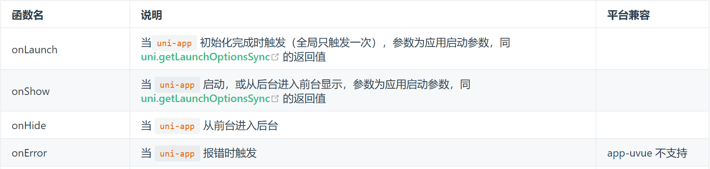
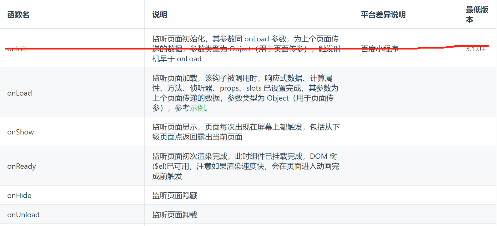
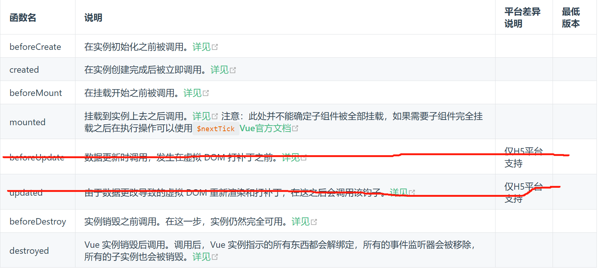
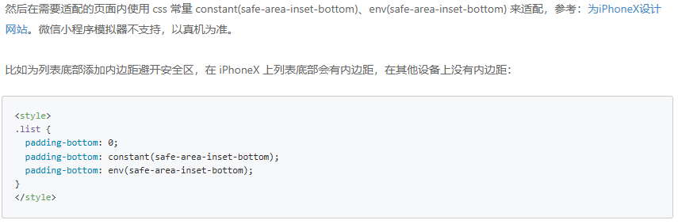

# 2025前端最新面试题-框架篇uniapp

## 1. 如何获取上一个页面的方法并执行？

使用 `getCurrentPages()` 获取当前页面栈（数组）

当前页面栈长度 - 2，获取上一个页面

通过 `$vm` 获取实例，从而调用其方法

```js
const page = getCurrentPages()[0];
const vm = page.$vm;
// 监听生命周期，小程序端部分其他生命周期需在页面选项中配置过才可生效
vm.$on('hook:onHide', () => {
  console.log('onHide');
});
// 获取页面数据
console.log(vm.$data.title);
// 调用页面方法
vm.test()
```

## 2. uniapp 的常用路由跳转有哪些？

页面跳转：

| uni.navigateTo   | 保留当前页面，跳转到应用内的某个页面 |
| ---------------- | ------------------------------------ |
| uni.redirectTo   | 关闭当前页面，跳转到应用内的某个页面 |
| uni.reLaunch     | 关闭所有页面，打开到应用内的某个页面 |
| uni.navigateBack | 关闭当前页面，返回上一页面或多级页面 |

tabBar跳转：uni.switchTab


## 3. 微信登录的实现流程？

- 通过 uni.login 获取 code
- 通过按钮点击获取手机号授权，拿到手机号后
- 将 code、手机号发给后端获取 token
- 之后需要权限的接口都带这个 token 即可


## 4. 微信支付的实现流程？

1. wx.login 获取 code，加上一些用户信息，传给后端，后端返回订单号，签名，随机字符串等下信息
2. 使用 uni.requestPayment，填入对应参数，调起微信支付就可以了


## 4. 微信小程序的生命周期？

应用生命周期



页面生命周期



组件生命周期



类似 vue 生命周期，但是没有 `beforUpdate`、`updated`


## 5. 组件/页面传值

**组件传值**

父子组件：props emit 

兄弟组件：eventBus (uni.$on注册全局事件、uni.$emit触发全局事件)

页面间传值：路由跳转传值


## 6. 微信小程序页面栈最多是多少个？

10个


## 7. uniapp 安卓、IOS 兼容？

微信小程序自定义顶部导航栏

- 胶囊高度、状态栏高度

微信小程序 IOS 底部安全区域适配，就是苹果底部有一个小黑条

- wx.getSystemInfo 获取设备类型，根据这个值来判断是否是需要给底部 tabBar
  - 	

微信小程序 ipad 上的字体适配

- 本来是都使用 rpx，但是有个问题，ipad 屏幕大之后，字就大了，这是不合理的
- 所有我们对一些特殊文本信息，采用 px 的方案，而不是直接用 rpx

[uni-app官网 跨度适配 (dcloud.net.cn)](https://uniapp.dcloud.net.cn/matter.html)


## 8. uniapp 上架问题

1. uniapp 微信小程序上架流程


2. uniapp 微信小程序上架遇到什么问题了吗？


3. uniapp 安卓上架的流程，以及如何发布到应用商店，会遇到什么问题？

