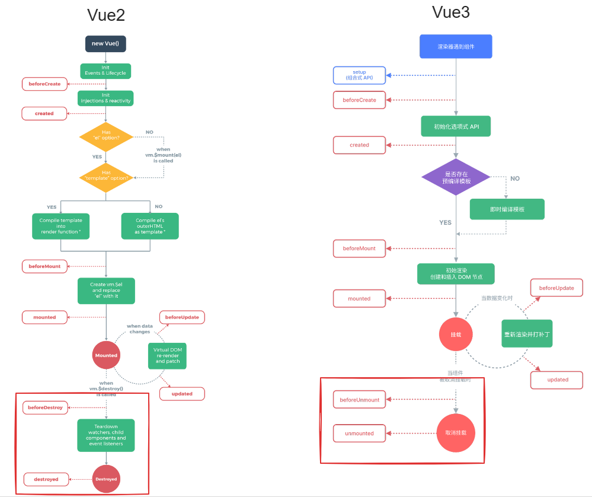

# 2025前端最新面试题-框架篇vue.md

## 1. Vue2、Vue3 生命周期及其钩子函数相关面试题




Vue2、Vue2 从整体上来说都是 8个 生命周期，网上也有很多这么说，但是真是这样吗？稍后会讲到的


左边 Vue2 - 右边 Vue3 `before（在 ... 之前）`

创建前 -> 创建   `beforeCreate` -> `created`     `beforeCreate` -> `created`

挂载前 -> 挂载   `beforeMount` -> `mounted`      `beforeMount` -> ``mounted`      `

更新前 -> 更新   `beforeUpdated` -> `update`     `beforeUpdated` -> `update`

销毁前 -> 销毁   **`beforeDestroy`** -> **`destroy`**    **`beforeUnmount`** -> **`unmount`**


Vue3 有两种 API，组合式API 和 选项式API

销毁阶段，Vue2的 `beforeDestroy`、`destroy` 替换成 `beforeUnmount`、`unmount`


好，接下来我们来看下每个生命周期都干了什么？

**beforeCreate**

- 创建一个空白的 Vue 实例
- data method 尚未被初始化，不可使用

**created**

- Vue 实例初始化完成，完成响应式绑定
- data method 都初始化完成，可调用
- 尚未开始渲染模板

**beforeMount**

- 编译模板，调用 render 生成 vdom
- 还没有开始渲染 DOM

**mounted**

- 完成 DOM 渲染
- 组件创建完成
- 开始由 “创建阶段” 进入 “运行阶段”

**beforeUpdate**

- data 发生变化之后
- 准备更新 DOM (尚未更新 DOM)

**updated**

- data 发生变化，且 DOM 更新完成
- 不要在 updated 中修改 data，可能会导致死循环（ updata 中修改 data，重新 updata, 又修改 data ）

**beforeDestroy/beforeUnmount**

- 组件进入销毁阶段（尚未销毁，可正常使用）
- 可移除、解绑一些全局事件、自定义事件

**destroy/unmounted**

- 组件被销毁了
- 所有子组件也都被销毁了


## 1.1 父子组件的生命周期执行顺序是怎么样的？

`created`、`mounted` 父子组件更新顺序 (创建、挂载阶段)

```javascript
created (父)
created (子)
mounted (子)
mounted (父)
```


`beforeUpdaate`、`update` 父子组件更新顺序 (更新阶段)

```javascript
beforeUpdaate (父)
beforeUpdaate  (子)
update (子)
parent update (父)
```


`beforeDestroy`、`destroy` 父子组件更新顺序 (销毁阶段)

```javascript
beforeDestroy (父)
beforeDestroy (子) 
destroy (子)
destroy (父)
```


> **小结**
>
> 从上面的例子不难看出，父子组件的生命周期，都是呈现 父在外层，子在内层 的结构
>
> 父子组件生命周期执行过程中，无论是哪个生命周期，都是由**父组件先开始，然后子组件再开始，直到子组件结束，父组件才结束**。


接下来我们来了解一个特殊的组件 ` <keep-alive>`，缓存组件，最常见的就是在做页面权限控制（`keep-alive` 实际开发中运用场景）时，我们就需要定义这样一个缓存组件。

```javascript
<div class="app-main">
    <router-view v-slot="{ Component, route }">
      <transition name="fade-transform" mode="out-in">
        <keep-alive>
          <component :is="Component" :key="route.fullPath" />
        </keep-alive>
      </transition>
    </router-view>
</div>
```

`keep-alive` 组件生命周期（`created`中只创建一次，不难理解，都被缓存了，当然就不会再被创建了嘛）

- `onActivated` 缓存组件被激活
- `onDeactivated` 缓存组件被隐藏


## 1.2 Vue2、Vue3、React 三者 diff 算法有何区别？

diff 算法

- diff 算法很早就有

- diff 算法应用广泛，例如 github 的 Pull Request 中的代码 diff

- 如果要严格 diff 两棵树，时间复杂度 O(n^3)，不可用

  

Tree diff 的优化，优化后时间复杂度降为 O(n)

- 只比较同一层级，不跨级比较
- tag 不同则删除重建 (不再去比较内部的细节)
- 子节点通过 key 区分 (key 的重要性)


学习技巧

- diff 算法非常复杂，不要深究细节
- 既然是三者的比较，说出他们最大的不同即可


React diff - 仅右移


Vue2 - 双端比较（减少移动开销）


Vue3 - 最长递增子序列（减少 DOM 操作）


> diff 算法原理的核心在于 减少 DOM 操作


连环问

Vue React 为何循环时必须使用 key ?

- vdom diff 算法会根据 key 判断元素是否删除？
- 匹配了 key, 则只移动元素 - 性能较好
- 为匹配 key, 则删除重建 - 性能较差


## 2. 组件传值

| 组件间传值方式 | Vue2                       | Vue3                            |
| -------------- | -------------------------- | ------------------------------- |
| 父子传值       | props/$emit                | props/emit                      |
| 兄弟传值       | EventBus                   | mitt(官方插件) 是 eventbus 插件 |
| 多层传值       | provide/inject（依赖注入） | provide/inject（依赖注入）      |
| 全局状态       | vuex                       | pinia                           |


>获取子组件属性与方法：ref
>
>获取父组件属性与方法：$parent


## 3. Vuex 与 Pinia 的区别？

vuex有5个属性而pinia只有3个，没有modules与mutation，而且 pinia 可以使用组合式API

- vuex：
  - state: 存放数据源的地方
  - getters: 计算数据（相当于state的计算属性）
  - mutation：同步，唯一能修改state数据源的地方
  - actions：异步
  - modules：模块化
- pinia：
  - state：数据存放地
  - actions：异步（副作用操作）
  - getters: 计算数据（相当于state的计算属性）

Pinia 体积更小（性能更好）。

Pinia 可以直接修改 state 里的数据，而 vuex 只能通过 mutation 中去修改。

虽然 Pinia 去除了 mutations，但为了兼容性，仍然可以使用 mutations 来修改 state


**【扩展】**

1. Vuex 中 mutaion 和 action 区别？

   - `mutation` 是改变 Vuex store 中状态的同步方法，而 action 则是处理异步操作并最终通过 mutation 来改变状态的机制

2. Vuex 如何实现持久化？ Pinia 如何实现持久化？

   1. Vuex

      - 本地缓存 `localStorage` (`localStorage` 大小不确定，`cookie` 4kB)

      - 第三方插件 `vuex-persistedstate`

   2. Pinia

      - `pinia-plugin-persistedstate`

3. 刷新页面 vuex 数据为什么会丢失？

   在vue项目中使用vuex来做全局的状态管理，当刷新网页后，保存在vuex实例store里的数据会丢失。这是因为store里的数据是保存在运行内存中的，当页面刷新时，页面会重新加载vue实例，store里面的数据就会被重新赋值初始化。为了解决这个问题，可以将state的数据保存在 localstorage 中，这样即使页面刷新，数据也不会丢失。

4. Vuex 主要方法有哪些？

   - `state、getters、mutation、actions、modules`

5. 讲一下 Vuex 单向数据流？ 或者说为什么 Vuex 他是一个单向数据流？

   - 组件 -> dispatch -> Actions -> commit -> Mutations -> 修改 State -> 组件渲染
   - 因为，Vuex 就是设计了这样的一个数据流向，所以它是一个单向数据流

	

>cookie: 4kb
>
>localstory：永久存储
>
>sessionStorage：浏览器关闭清空


## 5. 你封装过哪些组件？

因为公司要 UI 设计的一套弹窗组件

我们根据需求，二次封装 对话框组件、消息提示组件，除了样式外，就是需要可拖拽、有二次弹窗提示等功能

还有就是封装了，后台管理系统的搜索、筛选组件，通过 JSON 配置就能快速搭建


## 6. main.js 中 new Vue() vs createApp()？

**API 变化**

`new Vue()` 是基于 `Options API`

`createApp()` 是基于 `Composition API`


**应用实例的隔离**

`createApp()`创建的应用实例具有完全隔离的环境，每个实例拥有独立的响应式系统和全局属性

`new Vue()`创建的实例不同，后者共享同一个全局上下文


## 7. Vue3 为什么可以多个父节点？

`Vue3` 可以有多个父节点，主要是因为引入了新的组件概念 - `Fragment`

`Fragment` 允许在一个模板中渲染多个根节点，这样就不需要为每个组件单独创建一个根节点，从而减少了不必要的标签元素。


## 8. 平时用过 Vue3 的 hooks 吗？有写过 hooks?


我从两方面讲吧，一个从平时常见业务、特殊业务


**常见业务：**

hooks 在写 Vue3 的时候使用比较多，平时一些业务功能的话，比如防抖、节流、请求的错误重试、状态与请求一体化

就用一些开源的 hooks 库，比如 useVue，这样去实现


**特殊业务：**

比如，国际化、换肤、Echarts图表 这些功能就会使用自定义 hooks 进行实现


- 分页 hooks，后台管理有很多 table，那不可避免就要写很多分页函数，封装一个分页 hooks 就不需要每次写一次分页功能
- 请求 hooks，减少


[【Vue3】如何封装一个超级好用的 Hook - 掘金 (juejin.cn)](https://juejin.cn/post/7299849645206781963?searchId=2024102723180924A990B2718890B97934)


【注意】

hooks 导入对象，一般使用 toRefs 导出，这样做的原因是可以产生批量的可以解构的 Ref 对象，以免在解构返回值时失去响应性


> vue3 的 hook 库 [VueUse](https://vueuse.org/)


## 9. watch 与 computed

**watch 与 computed 的区别？**

1. watch 支持异步，computed 不支持异步（⭐⭐⭐）
2. watch 监听一个值变化，执行其他操作，computed 监听依赖其他属性，再去执行其他操作
3. watch 可以接收新旧两个值
4. computed 属性是函数时，都有 get 和 set 方法，默认走 get 方法，get 必须有返回值
5. watch 没有缓存，computed 有缓存（⭐⭐⭐）


**watch 与 computed 哪个先执行？**

要根据实际情况而定

一般情况下 computed 先于 watch 执行

当 watch 添加了 immediate: true 的情况下（在组件挂载完成后，会立即触发一次回调函数，而不管被监听的数据是否发生了变化），watch 先于 computed 先执行

用户交互导致数据变化的情况，先触发 watch 再触发 computed


**watch 和 computed，那个用的比较多，平时有哪些地方用到？**

watch 用的比较多，父子组件传值的时候，用于监听父传子中值的变化，并作出变化


## 10. Vue2、Vue3 的响应式原理是什么？Vue3 的响应式解决 Vue2 的哪些痛点？

Vue2 的响应式原理

基于`Object.defineProperty ()`方法来实现的。通过它来劫持 `data` 中对象的 `getter` 和 `setter` 方法，并在读取和修改的时候触发更新机制


Vue3 的响应式原理

`Proxy` 对数据实现 `getter/setter` 代理，从而实现响应式数据，


Vue3 解决了 Vue2 的痛点

1. 对象属性新增删除无法检测，视图无法更新
   1. 原因：`object.defineProerty` 只能监听已存在的属性，为了解决这个问题，Vue2 采用 `$set` 方法进行手动监听
2. 无法通过数组索引直接赋值
   1. 原因：`object.defineProerty` 无法直接新增数组索引，解决办法就是 Vue2 重写了数组的操作方法。


[面试官的步步紧逼：Vue2 和 Vue3 的响应式原理比对在面试中难免会被问到 Vue2 和 Vue3 的相关知识点的实 - 掘金 (juejin.cn)](https://juejin.cn/post/7124351370521477128#heading-7)

[面试官：Vue2 重写了数组方法，你知道 Vue3 也重写了吗？ 我：真当我没看过源码啊？😅 - 知乎](https://zhuanlan.zhihu.com/p/689466591)


> 【扩展】js 中的 get、set

`get` 这个属性, 在 ES5 中就有了, 每个对象都有 `get`、`set` 方法

`get` 关键字将对象属性与函数进行绑定, 当属性被访问时, 对应函数被执行

```typescript
const obj = {
log: ['example','test'],
get latest() {
 if (this.log.length == 0) return undefined;
 return this.log[this.log.length - 1];
}
}
console.log(obj.latest);  // 输出："test"
```

`set` 关键字将对象属性与函数进行绑定，当改变属性值时，对应函数被执行

```typescript
const language = {
log: []
set current(name) {
 this.log.push(name);
}
};

language.current = 'EN';
language.current = 'FA';

console.log(language.log); // expected output: Array ["EN", "FA"]
```


## 11. 双向数据绑定的原理是什么？

`v-model`本质就是一个语法糖，可以看成是`value + input`方法的语法糖

可以通过 `model` 属性的`prop`和`event`属性来进行自定义

原生的 `v-model`，会根据标签的不同生成不同的事件和属性


## 12. hook 与 mixins 有什么区别？

hooks 是 Vue3 中才有的

mixins 是 Vue2 中有的

mixins 与 hooks 的作用都是为了抽离一些公共的功能


mixins 的弊端有两点

1. 组件的data、methods、filters会覆盖mixins里的同名data、methods、filters

2. 变量来源不明确（隐式传入），不利于阅读，使代码变得难以维护


## 13. hook 函数 与 普通函数的区别？


如果一个函数包含了一个能引起视图变化的变量，那么它就是一个 hook 函数，反之是 普通函数，

在开发中，我们经常会发现一些可以重复利用的代码段，于是我们将其封装成函数以供调用，

这类函数包括工具函数，但是又不止工具函数，因为我们可能也会封装一些重复的业务逻辑。


以往，在前端原生开发中，我们封装的这些函数都是“无状态”的，

为了建立数据与视图之间的联系，基于 MVC 架构的 React 框架和基于 MVVM 的 Vue 框架都引入了“状态”这一概念，

状态是特殊的 JavaScript 变量，它的变化会引起视图的变化。


在这类框架中，如果一个变量的变化不会引起视图的变化，那么它就是普通变量，如果一个变量已经被框架注册为状态，

那么这个变量的变化就会引发视图的变化，我们称之为响应式变量。如果一个函数包含了状态（响应式变量），那么它就是一个 Hook 函数。


> 在具备“状态”的框架的基础上，才有 Hook 这一说。Hook 函数与普通函数的本质区别在于是否具备“状态”。


## 14. 谈一谈你对 vue-router 的理解

### Vue Router 有哪些特点？(了解)

1. 嵌套路由：Vue Router 支持嵌套路由，可以将一个路由映射到多个组件中，实现组件的复用。
2. 路由参数：Vue Router 支持路由参数，可以通过路由参数来传递数据。
3. 路由导航：Vue Router 提供了路由导航功能，可以在路由跳转前进行拦截和处理。
4. 路由懒加载：Vue Router 支持路由懒加载，可以按需加载路由对应的组件，减少首屏加载时间。
5. 动态路由：Vue Router 支持动态路由，可以根据不同的路由参数动态生成路由。
6. 导航守卫：Vue Router 提供了导航守卫功能，可以在路由跳转前、跳转后、跳转取消时进行拦截和处理。
7. HTML5 History 模式和 Hash 模式：Vue Router 支持 HTML5 History 模式和 Hash 模式，可以根据实际需求选择合适的模式。


### Vue Router 中的路由模式有哪些？

hash、history

区别: 

**Hash模式**

1. **URL结构**：在URL中带有“#”符号，例如`[http://example.com](http://example.com)  #/路线`。
2. **实现方式**：通过在URL后添加哈希值（即#后面的部分）来模拟一个完整的URL。当URL的哈希值发生变化时，Vue Router会根据哈希值的变化来匹配相应的路由并展示相应的组件。
3. 特点
   - 不需要服务器支持，直接在客户端处理路由变化。
   - 可以利用浏览器的`hashchange`事件来检测路由变化。
   - 在某些情况下，如使用服务器端渲染`（SSR）`，可能会遇到兼容性问题。

**History模式**

1. **URL结构**：不带“#”符号，例如`[http://example.com](http://example.com)  路线`。
2. **实现方式**：利用HTML5的` history.pushState ()` 和 `history.replaceState ()` 方法来在浏览器的历史记录栈中添加或更新记录。这些操作不会触发页面的重新加载，因此可以实现真正的无刷新导航。
3. 特点
   - 需要服务器的支持，通常需要配置Nginx等代理服务器来正确处理路由变化。
   - 更符合现代Web应用的使用习惯，用户体验更好，因为用户在地址栏看到的是简洁的路径而不是带有哈希值的URL。
   - 可以完全避免浏览器的`hashchange`事件，因此在所有现代浏览器上都能正常工作。

应用场景

1. 有些第三方应用路由跳转, 不允许带 #，`history` 模式
2. 需要 `SEO` 优化，也可使用 `history` 模式


> 项目通常使用什么路由模式：


### Vue Router 中的路由钩子函数有哪些？

Vue Router 中的路由钩子函数包括全局钩子函数和组件内的钩子函数，具体如下：

1. **全局钩子函数**：
   - `beforeEach`：在任意路由跳转前都会被调用，通常用于登录验证等操作。
   - `afterEach`：在路由跳转完成后调用。
   - `beforeResolve`：在解析异步组件时调用。
2. **单一路由钩子函数**：
   - `beforeEnter`：仅在路由跳转到该路由时调用。
3. **组件内钩子函数**：
   - `beforeRouteEnter`：在路由进入前调用，用于初始化数据。
   - `beforeRouteUpdate`：在路由更新时调用，用于处理数据变化。
   - `beforeRouteLeave`：在路由离开前调用，用于清理资源。

这些钩子函数接收三个参数：`to`（目标路由对象）、`from`（当前路由对象）和`next`（用于控制路由跳转流程的函数）。`next`函数的调用方式决定了钩子函数的执行流程，例如，`next()`会继续执行下一个钩子函数或导航，而`next(false)`则会中断当前的导航。


### Vue Router 中的路由懒加载是什么?

如何实现？

将路由路径改为 返回 import() 函数的函数即可

```javascript
const Foo = () => import('./Foo.vue')
```

需要注意的是，在使用路由懒加载时，我们需要确保 Webpack 已经正确地配置了代码分割和按需加载的相关配置，以确保能够正确地进行代码分割和按需加载。在 Vue CLI 中，默认已经配置好了路由懒加载和代码分割的相关配置，因此我们可以直接在项目中使用路由


### Vue Router 中的导航守卫有哪些，它们的执行顺序是怎样的？

Vue Router 中的导航守卫有三种，它们分别是 `全局守卫`、`单个路由独享守卫` 和 `组件级守卫`。

它们的执行顺序如下：

1. 全局前置守卫（`beforeEach`）：在进入每个路由之前执行。
2. 路由独享守卫（`beforeEnter`）：在进入新路由时执行，但不会等待其解析完成就继续执行后续的导航。
3. 组件内守卫（如 `beforeRouteEnter`、`beforeRouteUpdate`、`beforeRouteLeave`）：在组件激活或更新或离开时执行。
4. 全局后置守卫（`afterEach`）：在完成路由跳转后执行。

需要注意的是，如果在导航守卫中调用了 `next` 方法，则会进入下一个守卫。如果没有调用 `next`，则导航会被中断。如果想要重定向到一个不同的地址，可以在 `next` 方法中传入一个新的路径。

下面是 `beforeEach` 钩子函数的一个完整示例：

```javascript
router.beforeEach((to, from, next) => {
  // ...
  next(); // 进入下一个守卫
});
```

在实际开发中，我们可以利用导航守卫来进行权限控制、路由拦截、页面跳转等操作。

路由守卫依赖于钩子函数来完成其任务。


### 如何在 Vue Router 中传递参数？

在 Vue Router 中，可以通过路由路径中的占位符来传递参数，也可以通过 `query` 和 `params` 属性来传递参数。

1. 使用路由路径中的占位符来传递参数

   可以在路由路径中使用冒号 `:` 定义占位符，然后在路由跳转时通过传递参数来填充占位符。例如：

   ```javascript
   const router = new VueRouter({
     routes: [
       {
         path: '/user/:id',
         name: 'user',
         component: User
       }
     ]
   })
   ```

   在上面的例子中，路由路径中使用了 `:id` 占位符表示用户的 id，当我们进行路由跳转时，可以通过传递参数来替换这个占位符：

   ```javascript
   router.push({ name: 'user', params: { id: 123 }})
   ```

   在路由组件中可以通过 `$route.params` 访问到传递的参数，例如：

   ```javascript
   export default {
     computed: {
       userId() {
         return this.$route.params.id
       }
     }
   }
   ```

2. 使用 `query` 和 `params` 属性来传递参数

   可以在路由跳转时通过 `query` 和 `params` 属性来传递参数。例如：

   ```javascript
   router.push({ path: '/user', query: { id: 123 }})
   ```

   在路由组件中可以通过 `$route.query` 访问到传递的参数，例如：

   ```javascript
   export default {
     computed: {
       userId() {
         return this.$route.query.id
       }
     }
   }
   ```

   `query` 和 `params` 的区别在于，`query` 传递的参数会被添加到 URL 中，而 `params` 传递的参数不会出现在 URL 中，因此 `params` 更适合传递一些敏感信息。


### Vue Router 中的嵌套路由是什么，如何实现？

Vue Router 中的嵌套路由可以让我们在一个路由下面，再定义多个子路由。例如，我们可以在 `/user` 路由下面，定义 `/user/profile` 和 `/user/posts` 两个子路由。

实现嵌套路由的步骤如下：

1. 在父路由下面定义子路由，可以使用 `children` 字段来定义子路由，例如：

   ```javascript
   const router = new VueRouter({
     routes: [
       {
         path: '/user',
         component: User,
         children: [
           {
             path: 'profile',
             component: UserProfile
           },
           {
             path: 'posts',
             component: UserPosts
           }
         ]
       }
     ]
   })
   ```

2. 在父组件中添加 `<router-view>` 标签，用于渲染子组件。例如：

   ```html
   <template>
     <div>
       <h2>User Page</h2>
       <router-view></router-view>
     </div>
   </template>
   ```

3. 在子组件中可以通过 `$route` 访问到父路由和子路由的信息。例如：

   ```javascript
   export default {
     computed: {
       userId() {
         return this.$route.params.id
       }
     }
   }
   ```

   在子组件中也可以通过 `$route` 访问到当前子路由的信息，例如：

   ```javascript
   export default {
     computed: {
       postId() {
         return this.$route.params.postId
       }
     }
   }
   ```

   在访问子路由时，需要在父路由的路径后面添加子路由的路径，例如 `/user/profile` 和 `/user/posts`。

需要注意的是，Vue Router 中的嵌套路由可以无限嵌套，但是在使用时要注意路由的层级关系，以免出现混淆和错误。


### Vue Router 中的动态路由是什么，如何实现？

动态路由主要通过两个函数实现。`router.addRoute()` 和 `router.removeRoute()`。它们只注册一个新的路由，也就是说，如果新增加的路由与当前位置相匹配，就需要你用 `router.push()` 或 `router.replace()` 来**手动导航**，才能显示该新路由。


### Vue Router 中的命名路由是什么，如何使用？

```javascript
const routes = [
  {
    path: '/user/:username',
    name: 'user',
    component: User,
  },
]
```

要链接到一个命名的路由，可以向 `router-link` 组件的 `to` 属性传递一个对象：


```html
<router-link :to="{ name: 'user', params: { username: 'erina' }}">
  User
</router-link>
```

这跟代码调用 `router.push()` 是一回事：


```javascript
router.push({ name: 'user', params: { username: 'erina' } })
```

在这两种情况下，路由将导航到路径 `/user/erina`。


## 15. 如何取消请求？

`AxiosV0.22.0` 前使用 `CancelToken` 取消请求

`AxiosV0.22.0` 后使用 `AbortController` 取消请求，`AbortController` 不止可以取消请求，还可以取消监听


[axios取消请求总结应用场景 取消请求在前端有时候会用到，以下是两个工作中可能会用到的场景 tab切换时刷新某个列表数 - 掘金 (juejin.cn)](https://juejin.cn/post/7153831304042119198?searchId=202408132328240728351B277373A79459)

[使用 AbortController 终止 fetch 请求在现在的浏览器中，有两种主要的方法发送请求：XML - 掘金 (juejin.cn)](https://juejin.cn/post/6844904072051425293?searchId=202408141022472A2F16170BD0D057BCDF)


## 16. 插槽

- 插值、表达式
- 指令、动态属性
- v-html: 会有 XSS 风险, 会覆盖子组件

```vue
<!-- 代码演示 -->
<template>
	<div>
        <p>文本插值 {{ message }}</p>
        <p>JS 表达式 {{ flag ? 'yes' : 'no' }}</p>
        <P :id="dynamicId">动态属性</P>
        <p v-html="rawHtml">
            <span>【注意】使用 v-html 之后, 将会覆盖子元素 (也就是 span 中的内容会被覆盖)</span>
    	</p>
    </div>
</template>
<script>
export default {
    data() {
        return {
            message: 'hello vue',
            flag: true,
            rawHtml: '指令 - 原始 html <b>加粗</b> <i>斜体</i>',
            dynamicId: 'id-${Date.now()}'
        }
    }
}
</script>
```

```vue
<!-- 插槽的使用 (具名插槽) -->
<!-- 父组件 -->
<template>
	<div>
     <子组件>
    	<template v-slot:a>a</template>
			<template v-slot:b>b</template>
			<template v-slot:c>c</template>
    	</子组件>
    </div>
</template>
<!-- 子组件 -->
<template>
	<div class="list-content">
        <slot name="a"></slot>
        <slot name="b"></slot>
        <slot name="c"></slot>
    </div>
</template>
```

```vue
<!-- 插槽的使用 (作用域插槽) -->
<!-- 子组件 -->
<template>
  <div class="child">
    <slot 
        name="heading" 
        v-bind:headingValue="heading">
        {{heading}}
    </slot>
    <!-- 为了让大家看的更清楚 已经将Child.vue组件中多余的内容删除 --> 
  </div>
</template>
<script>
export default {
  name: 'Child',
  data() {
    return {
        heading: '这里是默认的heading'
    }
  }
}
</script>
<!-- 父组件 -->
<template>
  <div id="app">
    <child>
      <template v-slot:heading="slotValue" >
        <h1>element-ui组件</h1>
        slotValue = {{slotValue}}
      </template>
    </child>
  </div>
</template>
```


> [扩展] - [Vue中的插槽用法：默认插槽、具名插槽、作用域插槽)](https://juejin.cn/post/7208015274079469627)


## 17. v-model 是谁的语法糖?

`v-model='message'` 语法糖本质上可以修改为

```vue
<child :value="message" @input="function(e){message = e}"></child>
```

在大部分情况下， `v-model='foo'` 等价于 `:value='foo'` 加上 `@input='foo=$event'`


## 18. 指令

**Vue 有哪些指令?**

 v-text、v-html、v-show、v-if、v-else、v-else-if、v-for、v-on、v-bind、v-model、v-slot、v-pre、v-cloak、v-once


**Vue 自定义指令?**

- 通过 Vue.directive() 函数注册一个全局的指令

- 通过组件的 directives 属性，对该组件添加一个局部的指令

```javascript
// 全局
Vue.directive('self_defined_name',{
  bind:function(el,binding){
  //do someting
  },
  inserted: function(el,binding){
  //do something
  },
}

// 局部
new Vue({
  el:'#app',
  directives:{
    self_defined_name1:{
        bind:function(el,binding){
           //do something
        }
        inserted:function(el,binding){
           //do something
        },
     }
  }
})              
```

```vue
<!-- 使用 -->
<div id="app">
    <div v-self_defined_name1="{ color: 'green', text: '菜鸟教程!' }"></div>
</div>
```


