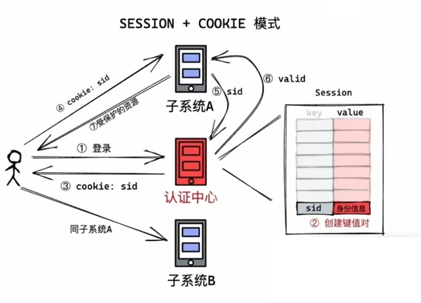
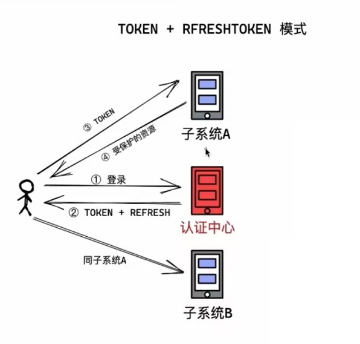
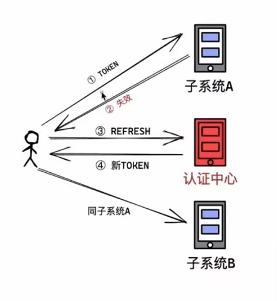

# 2025 前端最新面试题-项目篇

## 1. 从零创建一个 Vue3 项目的步骤？

1. 使用脚手架创建一个基础项目
2. 使用 axios 做接口请求封装
   1. 请求拦截器 -> 为请求添加 token
   2. 响应拦截器 -> 返回状态处理，做登录校验，无感刷新

3. 看项目情况，是否需要做动态路由，不需要的话就直接使用手脚架已经写好的默认路由即可
4. 添加 store 目录，使用状态管理 pinia 或者 vuex 也行
5. 定义自定义 hooks 目录，定义一些涉及组件变化的函数，定义 utils 目录定义一些纯函数，不具备响应式
6. 创建 components 目录用于定义一些功能组件
7. 当然啦，还是要看项目的具体情况，后台管理系统可以使用 layout 布局，以及做国际化的 locals 文件夹


**视频是用什么格式的？**

使用 `flv` 格式的，`WebSocket` 去接收

本来想直接通过视像头提供商的云平台，使用他们提供的 `m3u8` 格式播放链接即可

使用 `html5` `<video>` 标签播放的


## 3. 单点登录如何实现

 一般有两种模式

- token + cookie
- token + refreshToken


**session + cookie 模式**

优点：这种模式具有很强的控制力，只要把认证中心的 session 删除，用户就能强制下线

缺点：烧钱，如果客户端用户多，那么相对的认证中心压力也就大了，里面的 session 表也大了，得做集群

认证中心也得保证不能蹦，还得考虑做容灾

	


**token + refshToken 模式**

	

token 时间有效时间短，过期后，可以通过 refreshToken 再次获取 token

因为 token 有效时间短，就得隔一段时间使用 refreshToken 去获取 token，这样认证中心就加强了，对客户端系统的控制力了

	

优点：认证中心压力小了

缺点：没法立即让用户下线，得等用户来拿 token 的时候，不让他获取 token，从而实现用户下线


## 4. 项目框架升级

Angular 1 替换为 Vue3 框架

使用 Angular 1 是为了兼容 ie

替换的方法：

Angular 1 的 js 都是放在 scope 中，所以需要将 scope 提炼成一个个 js 文件，并导入 vue 文件中即可

并且 Angular 1 的模板语法与 vue 类似，vue 是 v-if，angular 是 ng-if，所以只要稍微改造下就能替换为 vue 模板语法


## 5. 你对接过哪些支付？

都要了解汇总

微信、支付宝、银联...


微信：

- PC（Native 扫码支付） 前端传给后端订单号 -> 后端返回二维码（前端展示二维码） -> 用户扫码后，自动调起微信支付 -> 轮询查看订单状态（直到超时 60s, 2s 查一次，订单支付完成返回原页面）
- H5 前端将订单信息发给后端 -> 后端返回一个 url 链接 -> 前端自动跳转到 url 链接调起微信支付 -> 返回原来的页面
  - 【扩展1】如果要指定支付完成后的指定页面，需要后端返回的链接中拼接指定页面的 url
  - 【扩展2】如果是用户取消支付了，也会跳转到指定页面。那么指定页面就需要轮询根据订单信息进行显示，或者弹框提示
- 微信小程序
  - 前端将订单信息发送给后端 -> 后端返回`uni.requestPayment`所需数据 -> 前端调用 `uni.requestPayment`-> 支付成功后
  - `provider：'wxpay'`
- APP
  - 前端将订单信息发送给后端 -> 后端返回`uni.requestPayment`所需数据 -> 前端调用 `uni.requestPayment`-> 支付成功后
  - `provider：'wxpay'`


支付宝：

- PC 
  1. 前置模式（生成二维码到页面里,用户进行扫码支付）
     1. 通过后端提供的接口获取支付宝的数据 ----> 调用接口获取支付宝的form数据 (最好返回一个此订单号)
     2. 使用iframe 将form数据放在页面上—生成二维码
     3. 用户扫码
     4. 展示之后就设定定时器 请求支付结果 ----> 后端出一个接口查询这个支付结果做相应处理
  2. 跳转模式（跳转到支付宝收银台,用户扫码支付，如果是移动端就使用支付宝 APP 支付）
     1. 跟第一种一样 请求接口获取form数据
     2. 跳转至支付宝支付页面
     3. 用户扫码支付
     4. 回调到原来的页面
     5. 接收支付宝回调传的值 请求支付结果接口做操作

[vue pc端支付宝支付-前端需要做的事情_vue调用支付宝-CSDN博客](https://blog.csdn.net/weixin_47284756/article/details/122602293)

- APP
  - 前端将订单信息发送给后端 -> 后端返回`uni.requestPayment`所需数据 -> 前端调用 `uni.requestPayment`-> 支付成功后
  - `provider：'alipay'`


银联

- 和支付宝一样，都是通过后端返回表单跳转

【扩展】测试时，前端跳转到银联支付的页面一直是空白页，原因是不能在打开 `DevTools` 的情况下，打开页面


## 6. 你做过哪些项目？

有亮点、难点的项目，你是怎么解决的？


## 7. 你封装过哪些组件或者 hook?

**如何封装组件？**

1. 确认动机

   比如，我想减少当前页面的复杂度（为当前页面服务，不太需要考虑通用性）

   比如，我想把这些相同的功能提出去（那就要考虑通用性）

2. 分析边界

   越通用的，边界越窄，也就是功能越少，带来的问题越少，越灵活

3. 设计接口
   - 属性
   - 插槽
   - 事件
4. 代码实现
5. 功能测试
   - 单元测试
   - 集成测试

6. 后续维护
   - 优化
   - bugfix
   - 功能更新


**组件**

像最近我们开发的那个 TF-IEMS 云平台，整个项目的所有页面风格就是类似于大屏展示那种透明化的样式

我对一些 `element plus` **常见的表单、表格、弹窗、筛选器、按钮之类的都透明化的二次封装**

并且弹窗也加入可拖拽功能，并且**筛选器也做了 json 配置化的封装**，日期、时间筛选、站点、储能柜筛选只要定好把 json 结构传入就行

因为，`element plus` 没有**年份范围选择器、季度选择器**，**时间选择器没有 24:00**,所以也自己写了一个

比较久项目，以前使用的 `element ui` **弹窗是没有拖拽功能**的，当时二次封装了一下


**Hook**

写 `three 3D` 模型的时候，经常是需要通过点击获取然后选择一个模型对象，直接点击就获取到那个模型 `threejs` 是没有这样的一个 api

所以我就封装这样的一个**模型选择 `hooks` 函数**

实现：因为模型坐标是空间坐标，所以需要通过鼠标点击**获取浏览器坐标** -> 设备坐标 -> **世界坐标** -> 序列化

然后使用射线发射器，与射线相交的第一个模型就是所点击模型


table 请求 hook、弹窗 hook、分页 hook


【扩展】

**hooks 与 mixin 有什么区别？**

Vue3 的 hooks 与 Vue2 的 mixin 的差别在于不会覆盖数据


**hooks 与 utils 有什么区别？**

hooks 能引起视图变化，也就是说包含 ref、reactive

utils 是纯函数


**hook 封装核心？**

核心在与返回值，返回值数据、与操作函数

table 请求 hook

```javascript
import { ref } from 'vue'
export function useTable(api) {
  const data = ref([])
  const refresh = () => { api().then(res => data.value = res) };
  refresh()
  return [data, refresh]
}
```


## 8. 前端项目线上出现紧急的 bug 怎么处理？

### 1. 定位 bug

- 第 1 种 通过 source map 还原线上压缩之后的代码
- 第 2 种 用本地的跟线上同版本的代码代理到线上的接口地址

### 2. 更新程序

- 第 1 种 通过 websocket 刷新客户端
- 第 2 种 通过 轮询 根据前端打包好的 js hash 后缀判断版本是否更新


## 9. webRTC 如何解决内网穿透问题？

因为视像头需要内网穿透，设备 ip 地址一直是变化的，前端如何拿到设备 ip 地址？

通过后台返回 ip 设备地址，页面发生变化（关闭重开、刷新、404），重新请求后台获取设备 ip 地址 即可


## 10. Echart 开发过程中遇到的问题？

1. 折线图，`series` 设置 `stack` 堆放属性，且属性名一致的话，会导致 y 轴坐标与实际坐标不一样

解决办法：

- 设置 `stack` 属性为不同值
- 去掉 `stack`


## 11. 项目上你做过哪些优化？

项目优化主要是两个方面的优化

- 代码层级上的优化
- 打包层级上的优化


代码层级的优化，主要是一些规范性的东西，以及一些优化思路


打包层级上的优化

- Webpack
- Vite


**webpack4 打包优化【过时 - 用于老项目 vue2】**


> ❌ 表示比较旧的优化方式


1. 分析包大小

我们可以通过可视化工具，进行分析

比如，在 `build` 命令后加 `--report` ，那么就会在 `dist` 目录下生成一个 `report.html`，打开之后就可以用于分析各种包大小 ❌

也可以通过插件 `webpack-bundle-analyzer` 来进行分析，效果也是一样的


2. `externals` 提取依赖

像那些比较大的包，比如 vue、vue-router、axios、echarts 都可以使用，`externals` 来忽略打包

然后才用 `cdn` 的方式引入，需要注意的一点就是 `cdn` 失效问题，所以做一个 `cdn` 容灾处理，

可以采用 `document.write` 重载资源，或者说使用 `HtmlWebpackPlugin` 的一些钩子还编写重载资源插件

其本质就是替换 `cdn` 链接 

[前端 CDN 容灾（资源重载）方案 - 掘金 (juejin.cn)](https://juejin.cn/post/7275943600772644883?searchId=202408091052401EB44F4D157C53E4096D#heading-5)


3. 组件库的按需引入

element UI 可以使用 `babel-plugin-component` 

element plus 可以使用 `unplugin-vue-components` `unplugin-auto-import`


4. 第三方依赖按需引入 ❌

处理时间的一个插件 `moment.js`，可以使用 `moment-locales-webpack-plugin` 去除一些没有用到的语言包

现在的话，我基本上使用 `dayjs` 代替 `moment.js` 


【扩展】

`momentjs` 它是一个基于 `OOP API`（面向原型链编程），所有 `api` 都挂载到原型链上

导致无法使用 `Webpack` 新引入的 `Tree-shaking` 代码优化技术，无法识别哪些代码是 `dead code`

`dayjs` 体积小，6.5k

`date-fns` 纯函数，且支持 ts

| 名字                                                         | 大小(`gzip`)                        | 支持 `Tree-shaking` | 名气  | `api` 方法数 | 模式         | 时区支持                  | 支持的语言数 |
| ------------------------------------------------------------ | ----------------------------------- | ------------------ | ----- | ----------- | ------------ | ------------------------- | ------------ |
| [Moment.js](https://link.segmentfault.com/?enc=P7qviFl%2BylnuL36qvYP2ew%3D%3D.%2BFNt99ZOQQCyLBTUfTEH2ikh2%2FXyL48FrSQ%2F3Sy417L1ZJEZ6ePEq%2FxK3HYdU2YSuSzzL3n7htQbzlJdwcfxxA%3D%3D) | `329K(69.6K)`                       | No                 | `38k` | 高          | `OO`         | 非常好(`moment-timezone`) | 123          |
| [date-fns](https://link.segmentfault.com/?enc=AA2l9CDse5DG3BqOXt4kog%3D%3D.yUI%2BQREqRox5S6%2BmJjxgW5mI%2B%2BmOHkc5iLixSATQk4itAhI%2BXADTYRNgw036mH0Df91AR%2FS2kxQTKZt44SHNwQ%3D%3D) | `78.4k(13.4k) without tree-shaking` | Yes                | `13k` | 高          | `Functional` | 还不支持                  | 32           |
| [dayjs](https://link.segmentfault.com/?enc=yCM1MNi13rBKmiFWiKzIlA%3D%3D.89qTpWqOSV2Z6Jr%2BG8wQpWWtUngOu5qJ50rWdjZRDN6ahGY6ur2S2kXSSttn%2BCv%2B0HtTeZqxhKuKx1TfZFCuW%2Fho1qbvaTpgUNAW09xOG%2FM%3D) | `6.5k(2.6k) without plugins`        | No                 | `14k` | 中          | `OO`         | 还不支持                  | 23           |


5. `HappyPack` 多线程打包 ❌

开辟一个线程池，通过 `os` 拿到电脑 CPU 的核数，开启 `happypack` 将编译工作利用所有线程


6. `compression-webpack-plugin` 开启 `webpack` `gzip` 资源压缩

`html、js、css` 资源，使用 `gzip` 后通常可以将体积压缩 70%以上

【扩展】也可以使用 Nginx 配置进行 `gzip` 压缩


7. `DllPlugin` 动态链接库 ❌

与 `externals` 的作用相似

区别是 `DllPlugin` 是将依赖单独打包，这样以后每次只构建业务代码

而 `externals` 是将依赖转化为 `CDN` 的方式引入


**webpack5 打包优化【最新】**

主要从两个方面进行优化

- **时间层面** 优化打包速度，开发或者构建时优化打包速度（比如 `exclude、catch` 等）
- **体积层面 ** 优化打包后的结果，上线时的优化（比如分包处理、减小包体积、`CDN` 服务等）


**优化打包速度**

思路

1. 定向查找，优化搜索步骤

`npm install` 安装依赖后，会产生 `node_modules` 文件夹，webpack 打包的时候会一层层先向上查找文件夹 `node_modules` 并寻找其引用的第三方模块	

配置 `resolve.modules` 使用绝对路径指定第三方模块的位置，来从而减少搜索步骤

`import` 引入模块，如果不带后缀名，就得一个个根据 `resolve.extensions` 中的预设后缀名进行匹配

配置 `resolve.extensions` 减少导入语句的匹配时间


2. 减少构建模块


一些没有模块化的包，比如 `lodash`（模块化是指☞ 使用了 `import、require、export` 等模块化语句）

`noParse` 可以忽略这些包进行构建，如果项目修改起来不麻烦，可以使用 `lodash-es` 进行代替，这是模块化的包，能进行 `Tree-Shaking`


比如第三方模块的 `moment` 包，中有很多语言包，但是我们只需要中文包就行了

`IgnorePlugin` 可以忽略没用到的包进行构建


项目中有一些像 `vue、vue-router、axios、echarts` 比较大的包

`externals` 可以忽略这些包进行构建，然后我们使用 `cdn` 的方式进行引入，当然需要做一些 `cdn` 容灾


我们在编译 `js` 文件需要使用 `babel-loader` ES6 -> ES5

`loader` 中 `include、exclude` 去指定需要编译的文件夹，从而减少构建时搜索文件的范围


3. 并行构建、压缩

`HappyPack、Thread-loader`，开启多进程打包

`uglifyjs-webpack-plugin（不维护了）、terser-webpack-plugin`，开启多进程压缩


4. 合理使用缓存

如果 `loader` 时间比较长的文件可以采用 `bable-loader、cache-loader` 开启缓存，进行优化

使用 `webpakck5` 新增的 `cache.type` 来减少开发时的打包时间，生产时会禁用


**优化打包后的结果**

思路

1. 压缩

`html-webpack-plugin` 压缩 html

`css-minimizer-webpack-plugin` 压缩 css

`terser-webpack-plugin` 压缩 js

`image-webpack-loader` 压缩图片


2. 按需加载

使用 `import()` 语法进行按需加载（懒加载）


3. 预加载

`/* webpackPrefetch: true */` 浏览器有空闲时，会帮我们去下载

【扩展】上家公司是做 `PCB` 版的嘛，它需要在它的下单页面，展示一个 `3D PCB` 模型，展示这个模型需要用到一些比较大 `js` 文件

所以导致页面加载很慢，但是我就是采用先隐藏这个 `3D` 模型展示的节点并且用骨架屏替代，然后采用 `/* webpackPrefetch: true */` 这样一个魔法注释

这个一个方案编写了加载函数，等这资源加载完成后，再去显示这个模型节点。

```javascript
import (
  /* webpackPrefetch: true */ `../../3D/threeShow.js`
).then((module) => {
    this.show3DNode = module.default
})
```


4. `Code Splitting` (代码分割)

`SplitChunksPlugin` 分割 `js`

`MiniCssExtractPlugin` 分割 `css`

原理：第一就是拆出来利用浏览器并发请求特性进行快速加载，其次就是多页面如果用到了相同样式能进行复用


5. Tree Shaking

js Tree Shaking

`sideEffects: true`，这个生产环境是默认开启的

但是会导致样式缺失，我们进一步配置

```json
"sideEffects": [
  "*.less",
  "@babel/polly-fill",
]
```

css Tree Shaking

`purgecss-webpack-plugin` 插件，没有使用到的 css 会被排除


6. Gzip

`compression-webpack-plugin` 插件，进行 zip 压缩


7. `Scope Hoisting`（作用域提升）

`concatenateModules: true`，生产环境默认开启


**分析工具**

时间分析工具：` speed-measure-webpack-plugin`

构建结果产物分析工具：`webpack-bundle-analyzer `


参考资料

[webpack 进阶之性能优化(webpack5 最新版本) - 掘金 (juejin.cn)](https://juejin.cn/post/7244819106342780988?searchId=202408091446505CA6E1EA3E7795026A46#heading-27)

[学习 Webpack5 之路（优化篇）- 近 7k 字 - 掘金 (juejin.cn)](https://juejin.cn/post/6996816316875161637?searchId=202408091446505CA6E1EA3E7795026A46)

[面试官：如何进行前端性能优化？ - 掘金 (juejin.cn)](https://juejin.cn/post/7347504184068931619?searchId=202408091825049E65207453A58E13360D#heading-33)

[webpackPrefetch: true 属性-CSDN 博客](https://blog.csdn.net/alessia_wang/article/details/122864550)


## 12. Threejs 项目难点

1. 模型获取

需要创建一个城市模型 blender、blenderGIS 去生成一个城市模型

2. vite 创建 vue 项目，引入 three、tweenjs(动画)

```shell
npm init vite@latest
yarn add three
yarn add @tweenjs/tween.js
```


## 13. APP 上架流程？

云打包

1. uniapp 使用云打包，打包成 APP 包
   1. 使用自有证书
   2. 选择正式包
   3. 再配置混淆
2. 到对应的应用商城平台上传就可以了
   1. 需要软著
   2. APP 备案
   3. 名字、截图、描述
      

离线打包

1. `uniapp` 下载离线打包 `SDK`，生成本地打包资源，用 `Android Studio`打包
2. 去 `Dcloud` 后台，创建应用，获取 `AppId、Android ID`
3. 修改 `uniapp` 官方提供的 SDK 包，将 `APPID、Android ID` 与文件中一些配置进行替换
4. 然后就能打包了


【扩展】

apk 打包体积过大

可以从减少静态资源、`manifest.json` 只勾选需要的 APP 权限配置


## 14. 骨架屏实现方案

[正确使用uniapp搭配微信开发者工具自带的骨架屏功能，生成骨架屏，重点：把index.skeleton.wxml和index.skeleton.wxss文件中 - 掘金](https://juejin.cn/post/7031446143678726181?searchId=2024102811031548FEAFBEFE69C1D7C6C3)


## 15. 大屏适配方案

大小适配：采用 `display: flex; flex:1`

【注】flex 三个属性


## 16. 消息推送

websocket、MQTT、SSE


